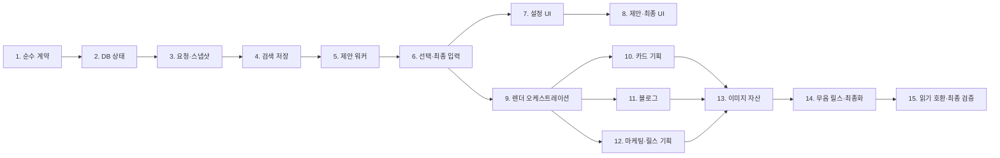

# AI Content Generation Flow and Worker Contract V2/V3 Implementation Plan

> **For agentic workers:** REQUIRED SUB-SKILL: Use superpowers:subagent-driven-development (recommended) or superpowers:executing-plans to implement this plan task-by-task. Steps use checkbox (`- [ ]`) syntax for tracking.

**Goal:** 운영 연결 최신 소스에서 콘텐츠 생성 화면과 콘텐츠 생성 워커만 개편해, Wiki·FAQ·로고 데이터 없이 승인 브랜드 코어, 하나의 소재, 조건부 제품, 고정 검색·레퍼런스, 출력 설정만으로 구성안 3개와 최종 패키지 1개를 생성한다.

**Architecture:** 기존 v1/v2 결과 읽기와 이미 큐에 들어간 레거시 작업은 보존하고 신규 쓰기만 `content-orchestration.v2 → content-proposal.v2 → content-generation-input.v3 → 형식별 상세 기획 → ImageGenerationPackageV1 → ai-content.v2`로 분기한다. API가 모든 소유권·상태를 검증하고 불변 스냅샷을 저장하며, 제안/상세 기획 모델은 네트워크 없이 그 스냅샷만 사용한다. 통제 검색은 별도 Codex `--search` 단계에서 실제 검색 이벤트를 감사해 먼저 저장하고, 이미지는 장면별 독립 작업으로 렌더링한 뒤 최종izer가 HTML·manifest·무음 릴스를 조립한다.

**Tech Stack:** React 18, TypeScript, Fastify, PostgreSQL/PGlite, Node.js 20+, Vitest, Codex CLI, built-in `image_gen`, Sharp, Python/FFmpeg/ffprobe, Vercel Blob.

---

## 0. 구현 에이전트 운영 규칙

이 절은 모든 작업에 적용된다. 각 하위 에이전트에게 작업을 줄 때 아래 내용을 그대로 포함한다.

- 기준 저장소는 오직 `C:\Users\dkskr\.config\superpowers\worktrees\main\brand-pilot-customer-shell\brand_poilot`이다.
- 작업 시작 직후 `Get-Location`과 `git status --short --branch`로 경로와 상태를 확인한다.
- `brandpoilotsourcearchive`, OneDrive의 별도 복사본, 다른 worktree와 이전 버전 소스를 열거나 복사하지 않는다.
- 새 worktree나 브랜치를 만들지 않는다. 현재 `codex/onboarding-worker-v2-port`에서 계획 순서대로 작업한다.
- 한 번에 하위 에이전트 한 명만 실행한다. 병렬 작업, 병렬 커밋, 같은 파일의 동시 편집을 금지한다.
- 각 에이전트는 배정된 Task의 `Files`에 적힌 파일만 편집한다. 추가 파일이 꼭 필요하면 편집하지 말고 상위 에이전트에게 호출 이유와 파일명을 보고한다.
- Task를 시작할 때 바로 앞 Task의 커밋이 존재하고 worktree가 깨끗한지 확인한다.
- 테스트를 먼저 RED로 만들고, 최소 구현으로 GREEN을 만든다. 실패를 mock proposal·mock 이미지·샘플 결과로 숨기지 않는다.
- 기존 v1/v2 parser와 레거시 worker 분기를 삭제하지 않는다. 신규 쓰기에서만 v2/v3 계약을 사용한다.
- Wiki·FAQ 기능 자체, 온보딩 워커, DM 워커, 게시 워커는 편집하지 않는다.
- 관련 없는 공통화, 파일 이동, 이름 변경, 포매팅, 전체 리팩터링을 하지 않는다.
- 전체 테스트, 전체 migration suite, 전체 workspace build를 실행하지 않는다. 각 Task에 적힌 직접 테스트와 수정 workspace build만 실행한다.
- 운영 배포, migration 운영 적용, push, PR 생성은 하지 않는다. 로컬 검증 후 반드시 멈춘다.
- 각 Task를 GREEN으로 만든 뒤 명시된 파일만 stage하고 Task별 커밋을 만든다.

구현 시작 전 읽을 기준 문서:

- `docs/superpowers/specs/2026-07-31-ai-content-generation-flow-worker-contract-design.md`
- 이미지 관련 Task 12와 13에서는 추가로 `workers/brand-pilot-image-worker/AGENTS.md` 전체를 읽는다.

## 1. 고정 계약

구현 중 이름과 의미를 다시 해석하지 않도록 이 절을 권위 있는 계약으로 사용한다.

### 1.1 신규 요청

```ts
export type ContentPurposeV2 = "informational" | "marketing";
export type ContentOutputFormatV2 =
  | "card_news"
  | "blog"
  | "reel"
  | "marketing_content";
export type ContentChannelTargetV2 =
  | "instagram"
  | "threads"
  | "x"
  | "linkedin"
  | "youtube"
  | "tiktok"
  | "blog_export";
export type ReferenceRoleV2 =
  | "planning"
  | "copy_pattern"
  | "visual_composition";
export type ContentAspectRatioV2 = "1:1" | "4:5" | "16:9" | "9:16";

export type ContentSeedV2 =
  | { kind: "topic_text"; title: string }
  | { kind: "topic_url"; url: string }
  | {
      kind: "reference";
      items: Array<{
        referenceId: string;
        roles: ReferenceRoleV2[];
      }>;
    };

export interface ContentOrchestrationV2 {
  contractVersion: "content-orchestration.v2";
  brandId: string;
  purpose: ContentPurposeV2;
  seed: ContentSeedV2;
  contentInstruction: string | null;
  productId: string | null;
  outputSettings: {
    outputFormat: ContentOutputFormatV2;
    channelTargets: [ContentChannelTargetV2];
    aspectRatio: ContentAspectRatioV2 | null;
    outputCount: 1;
  };
}
```

파서는 exact-key 방식으로 동작한다.

- `topic_text`, `topic_url`, `reference` 중 정확히 하나만 받는다.
- body의 `brandId`는 route `:brandId`와 정확히 같아야 하며 UUID가 아니거나 서로 다르면 거부한다.
- `reference.items`는 1~5개이고 ID가 중복되지 않으며 각 항목은 역할을 한 개 이상 가진다.
- `오늘의 주제`는 UI의 비활성 버튼일 뿐 API enum에 넣지 않는다.
- 정보성은 `productId === null`, 마케팅성은 UUID 제품 하나가 필수다.
- 채널은 tuple 길이 1만 허용하고 `outputCount`는 literal `1`만 허용한다.
- `blog`는 `blog_export`와 `aspectRatio: null`만 허용한다.
- `reel`은 `aspectRatio: "9:16"`만 허용한다.
- 원격 채널은 API의 현재 capability가 `catalogStatus=available`, `enabled=true`, `connectionStatus=connected`, `canGenerate=true`, `readiness=ready`, 선택 형식 호환을 모두 만족해야 한다.
- 현재 신규 형식 호환은 Instagram의 `card_news | reel | marketing_content`, 로컬 대상의 `blog`다. 향후 catalog가 늘어나면 같은 capability 규칙으로 자동 확장한다.
- `wikiItemIds`, `wikiSnapshots`, Wiki 본문, `faqData`, FAQ 본문, 로고 파일/URL/배치 지시, 클라이언트 제공 브랜드·제품·레퍼런스 본문은 unknown key로 거부한다.

### 1.2 서버 스냅샷

```ts
export interface ApprovedBrandCoreSnapshotV2 {
  versionId: string;
  companyOverview: string;
  businessDescription: string;
  primaryCategory: string;
  detailedCategory: string;
  primaryTarget: string;
  differentiator: string;
  coreAppeal: string;
}

export interface ApprovedProductSnapshotV2 {
  id: string;
  versionId: string;
  kind: "product" | "service";
  name: string;
  description: string;
  features: string[];
  benefits: string[];
  cautions: string[];
  evergreenPurchaseInfo: string;
  images: Array<{
    assetId: string;
    role: "hero" | "detail";
    storageUrl: string;
    storagePath: string;
    mimeType: string;
    checksum: string;
  }>;
}

export interface FrozenReferenceSnapshotV2 {
  referenceItemId: string;
  snapshotId: string;
  roles: ReferenceRoleV2[];
  title: string;
  sourceUrl: string;
  capturedAt: string;
  contentHash: string;
  text: string;
  image: null | {
    storageUrl: string;
    storagePath: string;
    mimeType: "image/png" | "image/jpeg" | "image/webp";
    checksum: string;
  };
}

export interface ResearchEvidenceSnapshotV1 {
  contractVersion: "research-evidence.v1";
  decision: "searched" | "not_needed";
  reason: string;
  queries: string[];
  capturedAt: string;
  items: Array<{
    id: string;
    title: string;
    url: string;
    publisher: string | null;
    publishedAt: string | null;
    capturedAt: string;
    claimSummary: string;
    contentHash: string;
  }>;
}

export interface ProposalInputSnapshotV2 {
  contractVersion: "proposal-input.v2";
  brandCore: ApprovedBrandCoreSnapshotV2;
  subject:
    | { kind: "topic_text"; title: string }
    | {
        kind: "topic_url";
        requestedUrl: string;
        canonicalUrl: string;
        title: string | null;
        text: string;
        contentHash: string;
        capturedAt: string;
      }
    | { kind: "reference"; referenceIds: string[] };
  contentInstruction: string | null;
  product: ApprovedProductSnapshotV2 | null;
  references: FrozenReferenceSnapshotV2[];
  researchEvidence: ResearchEvidenceSnapshotV1;
  outputSettings: ContentOrchestrationV2["outputSettings"] & {
    purpose: ContentPurposeV2;
  };
  capturedAt: string;
}
```

스냅샷 규칙:

- 브랜드 코어는 현재 active이면서 `approved`인 버전만 읽고 위 8개 값으로 정규화한다.
- 제품은 같은 workspace/brand의 active item과 그 item의 active approved version만 허용한다.
- 제품 이미지 중 `role=logo`와 document는 제외하고 `hero | detail`만 포함한다.
- 레퍼런스 ID는 반드시 canonical `reference_items.id`다.
- 레퍼런스 이미지가 모델 입력으로 허용되고 checksum이 있는 소유 Blob으로 보관된 경우에만 `image`를 넣는다. 외부 live URL 이미지를 최종 워커에서 다시 다운로드하지 않는다. 이미지 바이트가 고정되지 않은 레퍼런스는 텍스트·패턴 스냅샷만 사용한다.
- 정보성 검색은 반드시 `decision=searched`, 검색 항목 1~8개다.
- 마케팅성은 `searched` 또는 `not_needed`다. `not_needed`이면 `queries=[]`, `items=[]`다.
- 마케팅 검색 근거에는 시장 상황, 고객 니즈, 구매 장벽만 허용한다. 제품 기능·가격·장점·한계는 제품 스냅샷만 권위 있는 근거로 사용한다.

### 1.3 구성안 3개

```ts
export type InformationalProposalTypeV2 =
  | "problem_solution"
  | "how_to"
  | "checklist"
  | "comparison"
  | "trend_insight"
  | "q_and_a"
  | "myth_fact";

export interface ContentProposalSetV2 {
  contractVersion: "content-proposal.v2";
  proposals: [
    ContentProposalV2,
    ContentProposalV2,
    ContentProposalV2,
  ];
}

export interface ContentProposalV2 {
  conceptKey: string;
  title: string;
  informationalType: InformationalProposalTypeV2 | null;
  oneLineIntent: string;
  differentiator: string;
  differentiationAxes: Array<
    "target" | "situation" | "question" | "appeal" | "narrative" | "informational_type"
  >;
  target: string;
  customerContext: string;
  keyMessage: string;
  hook: string;
  selectionReason: string;
  evidenceIds: string[];
  referenceIds: string[];
  outputFormat: ContentOutputFormatV2;
  channelTargets: [ContentChannelTargetV2];
  assetCount: number | null;
  outline: Array<{
    index: number;
    role: string;
    headline: string;
    purpose: string;
  }>;
  purposeDetails:
    | {
        kind: "informational";
        question: string;
        value: string;
        whyNow: string;
        learningPoints: string[];
      }
    | {
        kind: "marketing";
        campaignObjective: string;
        situationAndNeed: string;
        productId: string;
        targetSegment: string;
        strengths: string[];
        limitations: string[];
        appeal: string;
        buyingBarriers: string[];
        cta: string;
      };
}
```

검증 규칙:

- proposal은 정확히 3개이고 `conceptKey`가 모두 다르다. DB proposal UUID는 API가 부여한다.
- 세 안은 제목·말투만 다른 것이 아니라 `differentiationAxes` 중 하나 이상의 실질 축이 다르고 `differentiator`에 사용자에게 보여줄 차이를 설명한다.
- 차별화 축과 정보성 유형 조합은 LLM이 고른다. A/B/C 고정 프레임이나 결정 규칙을 만들지 않는다.
- 세 안은 같은 `ProposalInputSnapshotV2`와 같은 검색 근거를 사용한다.
- `card_news | reel | marketing_content`의 `assetCount`는 1~5, outline 길이는 assetCount와 같고 index는 1부터 연속이다.
- `blog`의 `assetCount`는 null이다. outline은 글 구조만 표현하고 최종 이미지 수를 잠그지 않는다.
- 마케팅 목적의 `purposeDetails.productId`는 고정 제품 ID와 같아야 한다.
- 정보성의 `informationalType`은 필수이고 마케팅성은 null이다.
- rationale이나 내부 추론 과정은 계약에 넣지 않는다.

### 1.4 최종 입력과 이미지 패키지

```ts
export interface ContentGenerationInputV3 {
  contractVersion: "content-generation-input.v3";
  generationId: string;
  brandCore: ApprovedBrandCoreSnapshotV2;
  subject: ProposalInputSnapshotV2["subject"];
  contentInstruction: string | null;
  product: ApprovedProductSnapshotV2 | null;
  researchEvidence: ResearchEvidenceSnapshotV1;
  references: {
    selected: FrozenReferenceSnapshotV2[];
    brandStyleImages: FrozenStyleImageSnapshotV1[];
    avatarStyleImageId: string | null;
    attachments: FinalAttachmentSnapshotV1[];
  };
  selectedProposal: ContentProposalV2 & { id: string };
  userImageInstruction: string | null;
  outputSettings: ContentOrchestrationV2["outputSettings"] & {
    purpose: ContentPurposeV2;
  };
  capturedAt: string;
}

export interface FrozenStyleImageSnapshotV1 {
  referenceItemId: string;
  description: string;
  tags: string[];
  storageUrl: string;
  storagePath: string;
  mimeType: "image/png" | "image/jpeg" | "image/webp";
  checksum: string;
}

export interface FinalAttachmentSnapshotV1 {
  id: string;
  role: "product_image" | "visual_reference" | "supporting_image";
  fileName: string;
  mimeType: "image/png" | "image/jpeg" | "image/webp";
  sizeBytes: number;
  checksum: string;
  storageUrl: string;
  storagePath: string;
}

export interface ImageGenerationPackageV1 {
  contractVersion: "image-generation-package.v1";
  generationId: string;
  outputFormat: "card_news" | "reel" | "marketing_content" | "blog";
  purpose: ContentPurposeV2;
  assetCount: number;
  aspectRatio: ContentAspectRatioV2;
  channelTargets: [ContentChannelTargetV2];
  assets: Array<{
    index: number;
    role: string;
    copy: string;
    visualDirection: string;
    productImageAssetIds: string[];
    attachmentIds: string[];
  }>;
  product: ApprovedProductSnapshotV2 | null;
  references: FrozenReferenceSnapshotV2[];
  brandStyleImages: FrozenStyleImageSnapshotV1[];
  avatarStyleImageId: string | null;
  attachments: FinalAttachmentSnapshotV1[];
  userImageInstruction: string | null;
  logoPolicy: {
    allowGeneratedLogo: false;
    allowReservedLogoArea: false;
    allowExternalReferenceLogo: false;
    allowExistingProductPackagingLogo: true;
  };
}
```

최종 입력 규칙:

- 제안 때 사용한 브랜드 코어·제품·레퍼런스·검색 스냅샷을 byte-equivalent JSON으로 복사한다.
- 최종 시작 시 새 버전으로 갈아끼우지 않고 현재 자격만 재검증한다. 승인 취소, 제품 비활성, 레퍼런스 archive는 차단한다.
- 최신 approved Brand Rules의 `designRules.referenceImages`만 스타일 이미지로 스냅샷한다. 색상·폰트·메모는 신규 이미지 계약에 넣지 않는다.
- 아바타는 이 스타일 이미지 집합 중 하나의 `referenceItemId`이거나 null이다. 별도 아바타 library와 일회성 avatar upload는 사용하지 않는다.
- 모든 이미지에 공통인 사용자 프롬프트는 `userImageInstruction` 하나다. 블로그는 실제 이미지가 필요한 경우에만 적용한다.
- 이미지 지시 우선순위는 강제 사실·수량·비율·no-logo → 사용자 공통 지시 → 브랜드 스타일 이미지 → 역할별 레퍼런스 → 장면 지시다.
- 모든 이미지 프롬프트는 로고, 워드마크, 심볼, 워터마크, 가짜 로고, 로고용 빈 공간과 외부 레퍼런스 로고 복제를 금지한다. 선택한 실제 제품 사진/포장에 이미 인쇄된 로고만 유지할 수 있다.

### 1.5 최종 artifact

신규 manifest는 `version: "ai-content.v2"`를 사용한다. 기존 `ai-content.v1` parser는 수정하되 삭제하거나 의미를 바꾸지 않는다.

```ts
export type AiContentV2AssetRole =
  | "slide"
  | "inline"
  | "html"
  | "creative"
  | "scene"
  | "video";

export interface AiContentManifestV2 {
  version: "ai-content.v2";
  type: "card_news" | "blog" | "marketing";
  purpose: ContentPurposeV2;
  outputFormat: ContentOutputFormatV2;
  title: string;
  assets: Array<{
    role: AiContentV2AssetRole;
    index: number;
    url: string;
    fileName: string;
    mimeType: "image/png" | "text/html" | "video/mp4";
    width?: number;
    height?: number;
    durationSeconds?: number;
    videoCodec?: "h264";
    fps?: 30;
    audioCodec?: null;
  }>;
  content: Record<string, unknown>;
}
```

형식별 manifest 조건:

- 카드뉴스: `type=card_news`, slide 1~5개, 선택 proposal의 수와 순서 일치.
- 블로그: `type=blog`, HTML 1개, inline image 0~5개, cover 필수 아님.
- 마케팅 콘텐츠: `type=marketing`, creative 1~5개.
- 릴스: `type=marketing`, scene 1~5개와 video 1개. 첫 scene이 cover이며 MP4는 H.264, 1080×1920, 30fps, audio 없음, 길이 `sceneCount*4`초 ± 1/30초다.

## 2. 의존성 및 파일 소유권 순서

Task는 반드시 1부터 15까지 순서대로 실행한다. 뒤 Task는 앞 Task 커밋을 전제로 한다.



중앙 파일인 `apps/api/src/aiContentRepository.ts`, `apps/api/src/httpServer.ts`, UI `types.ts`는 여러 Task가 순차적으로 다시 편집한다. 이것은 의도된 순서다. 에이전트는 자신의 Task에서 지시된 부분만 추가하고 앞 Task 코드를 재구성하지 않는다.

---

### Task 1: 버전 계약과 exact-key validator를 추가한다

**Files:**

- Inspect only, do not modify: `apps/api/src/aiContentGenerationInput.ts`
- Create: `apps/api/src/aiContentGenerationInputV3.ts`
- Create: `apps/api/src/aiContentGenerationInputV3.test.ts`
- Modify: `apps/api/src/aiContentContracts.ts`
- Modify: `apps/api/src/aiContentManifest.ts`
- Modify: `apps/api/src/aiContentManifest.test.ts`
- Create: `workers/brand-pilot-worker-runtime/src/aiContentV3.ts`
- Create: `workers/brand-pilot-worker-runtime/src/aiContentV3.test.ts`
- Modify: `workers/brand-pilot-worker-runtime/src/index.ts`

- [ ] **Step 1: 기존 버전 보존 테스트를 먼저 고정한다**

`aiContentManifest.test.ts`와 새 V3 테스트에 다음을 추가한다.

```ts
it("keeps v1 parsing unchanged", () => {
  expect(parseAiContentManifest("card_news", legacyV1Manifest).version)
    .toBe("ai-content.v1");
});

it("rejects forbidden knowledge and logo fields in v2 orchestration", () => {
  for (const forbidden of [
    { wikiItemIds: ["wiki-1"] },
    { faqData: [{ question: "q", answer: "a" }] },
    { logoUrl: "https://cdn.example/logo.png" },
    { brandCore: { companyOverview: "client supplied" } },
  ]) {
    expect(() => parseContentOrchestrationV2({
      ...validInformationalRequest,
      ...forbidden,
    })).toThrow("content_orchestration_v2_invalid");
  }
});
```

V3 worker-runtime 테스트는 `ContentGenerationInputV3`와 `ImageGenerationPackageV1`의 exact keys, 연속 index, 수량, purpose/product 규칙을 검증한다.

- [ ] **Step 2: RED를 확인한다**

Run:

```powershell
npm run test --workspace @brand-pilot/api -- src/aiContentGenerationInputV3.test.ts src/aiContentManifest.test.ts
npm run test --workspace @brand-pilot/worker-runtime -- src/aiContentV3.test.ts
```

Expected: 새 parser와 파일이 없어 FAIL한다. 기존 v1 테스트 실패는 없어야 한다.

- [ ] **Step 3: API 순수 parser를 구현한다**

`contentOrchestration.ts`의 v1 코드는 건드리지 않고, `aiContentContracts.ts`에 V2 타입을 export하며 `aiContentGenerationInputV3.ts`에 다음 함수들을 구현한다.

```ts
export function parseContentOrchestrationV2(value: unknown): ContentOrchestrationV2;
export function parseResearchEvidenceSnapshotV1(value: unknown): ResearchEvidenceSnapshotV1;
export function parseProposalInputSnapshotV2(value: unknown): ProposalInputSnapshotV2;
export function parseContentProposalSetV2(value: unknown): ContentProposalSetV2;
export function parseContentGenerationInputV3(value: unknown): ContentGenerationInputV3;
export function parseImageGenerationPackageV1(value: unknown): ImageGenerationPackageV1;
```

구현 조건:

- object마다 허용 key 배열을 갖는 `exactObject`를 사용한다.
- 문자열 trim과 상한을 적용한다: 주제 500자, 지시문 4,000자, 검색 요약 4,000자, URL 본문 50,000자.
- URL은 `http:` 또는 `https:` 요청만 parser에서 허용하고 SSRF 검사는 Task 3 resolver에서 한다.
- informational/product null, marketing/product non-null 규칙을 orchestration, proposal snapshot, final input 세 경계에서 각각 확인한다.
- 시각 proposal/package는 count 1~5와 연속 index를 확인한다.
- blog proposal은 `assetCount:null`, image package는 최종 worker가 필요하다고 판단한 경우에만 0~5를 별도 plan 계약에서 허용한다. `ImageGenerationPackageV1` 자체는 이미지가 실제 필요한 경우만 생성하므로 `assetCount`는 1~5다.

- [ ] **Step 4: worker-runtime에 같은 wire 계약 parser를 구현한다**

API 내부 타입을 import하지 않는다. `@brand-pilot/worker-runtime`에서 worker가 받는 wire JSON을 독립적으로 fail-closed 검증한다. API와 worker-runtime 테스트에 같은 golden JSON fixture를 복제하지 말고, 각 테스트에서 위 1절의 literal을 작게 생성해 양쪽 validator가 같은 허용/거부 결과를 내는지 검증한다.

기존 `parseWorkerContentOrchestration` v1과 attachment parser는 그대로 export한다.

기존 `apps/api/src/aiContentGenerationInput.ts`의 `content-generation-input.v2` parser/build 함수는 읽어 호환 경계를 확인하되 편집하지 않는다. 신규 V3는 새 파일에만 두고 V2 테스트/queued job을 깨지 않는다.

- [ ] **Step 5: `ai-content.v2` manifest parser를 추가한다**

`parseAiContentManifest`는 `value.version`으로 분기한다.

```ts
if (value.version === "ai-content.v1") return parseV1(expectedType, value);
if (value.version === "ai-content.v2") return parseV2(expectedType, value);
throw new Error("ai_content_manifest_version_invalid");
```

v2에서 `outputFormat`과 legacy `type` 매핑, asset role/mime/dimension/index, 블로그 0 image, 릴스 video metadata를 검증한다. v1의 blog cover 필수 규칙은 유지한다.

- [ ] **Step 6: GREEN과 수정 workspace build를 확인한다**

Run:

```powershell
npm run test --workspace @brand-pilot/api -- src/aiContentGenerationInputV3.test.ts src/aiContentManifest.test.ts
npm run test --workspace @brand-pilot/worker-runtime -- src/aiContentV3.test.ts src/index.test.ts
npm run typecheck --workspace @brand-pilot/api
npm run build --workspace @brand-pilot/worker-runtime
```

Expected: 모두 PASS. `rg -n "wiki|faq|logo" apps/api/src/aiContentGenerationInputV3.ts workers/brand-pilot-worker-runtime/src/aiContentV3.ts` 결과는 금지-field 검사명과 no-logo 정책 literal 외에 데이터 필드가 없어야 한다.

- [ ] **Step 7: 커밋한다**

```powershell
git add apps/api/src/aiContentContracts.ts apps/api/src/aiContentGenerationInputV3.ts apps/api/src/aiContentGenerationInputV3.test.ts apps/api/src/aiContentManifest.ts apps/api/src/aiContentManifest.test.ts workers/brand-pilot-worker-runtime/src/aiContentV3.ts workers/brand-pilot-worker-runtime/src/aiContentV3.test.ts workers/brand-pilot-worker-runtime/src/index.ts
git commit -m "feat(content): add v2 v3 generation contracts"
```

---

### Task 2: 불변 스냅샷과 장면별 렌더 작업 DB 상태를 추가한다

**Files:**

- Create: `db/migrations/073_ai_content_generation_v2_render_pipeline.sql`
- Create: `apps/api/src/aiContentV2Migration.pglite.test.ts`
- Modify: `apps/api/src/contentOrchestrationRepository.pglite.test.ts`

- [ ] **Step 1: migration RED 테스트를 작성한다**

새 PGlite 테스트가 다음을 검증하게 한다.

```ts
expect(columns("ai_content_proposal_batches")).toContain("input_snapshot_json");
expect(tables()).toContain("ai_content_proposal_research_snapshots");
expect(tables()).toContain("ai_content_generation_input_snapshots");
expect(tables()).toContain("ai_content_output_research_snapshots");
expect(tables()).toContain("ai_content_generation_render_jobs");
```

추가 사례:

- `ai_content_generations.output_format`이 `reel`, `marketing_content`를 허용한다.
- 기존 `single_image`, `channel_text` row도 계속 허용한다.
- attachment와 upload session은 기존 5개 role과 신규 `product_image`, `visual_reference`, `supporting_image`를 모두 허용한다.
- proposal base snapshot, proposal research snapshot, final input snapshot은 생성 후 JSON 변경/삭제이 거부된다.
- output plan은 null → object 1회만 저장할 수 있고 두 번째 다른 값은 거부된다.
- render image job은 `(output_id, asset_index)`가 유일하고 asset index는 1~5다.
- output당 finalizer job은 하나뿐이다.
- 레거시 generation/output/job row는 migration 뒤 그대로 조회된다.

- [ ] **Step 2: RED를 확인한다**

Run:

```powershell
npm run test --workspace @brand-pilot/api -- src/aiContentV2Migration.pglite.test.ts src/contentOrchestrationRepository.pglite.test.ts
```

Expected: migration 072와 신규 테이블이 없어 FAIL한다.

- [ ] **Step 3: forward-only migration을 작성한다**

아래 형태를 그대로 사용한다.

```sql
alter table ai_content_proposal_batches
  add column input_snapshot_json jsonb null
    check (input_snapshot_json is null or jsonb_typeof(input_snapshot_json) = 'object');

create table ai_content_proposal_research_snapshots (
  id uuid primary key default gen_random_uuid(),
  workspace_id uuid not null,
  brand_id uuid not null,
  batch_id uuid not null,
  evidence_json jsonb not null,
  created_at timestamptz not null default now(),
  unique (batch_id),
  foreign key (batch_id, workspace_id, brand_id)
    references ai_content_proposal_batches(id, workspace_id, brand_id)
    on delete restrict
);

create table ai_content_generation_input_snapshots (
  id uuid primary key default gen_random_uuid(),
  workspace_id uuid not null,
  brand_id uuid not null,
  generation_id uuid not null,
  input_json jsonb not null,
  content_hash text not null check (content_hash ~ '^[0-9a-f]{64}$'),
  created_at timestamptz not null default now(),
  unique (generation_id),
  foreign key (generation_id, workspace_id, brand_id)
    references ai_content_generations(id, workspace_id, brand_id)
    on delete restrict
);

create table ai_content_output_research_snapshots (
  id uuid primary key default gen_random_uuid(),
  workspace_id uuid not null,
  brand_id uuid not null,
  generation_id uuid not null,
  output_id uuid not null,
  evidence_json jsonb not null,
  created_at timestamptz not null default now(),
  unique (output_id),
  foreign key (output_id, generation_id, workspace_id, brand_id)
    references ai_content_generation_outputs(id, generation_id, workspace_id, brand_id)
    on delete restrict
);
```

`ai_content_generation_outputs`에는 nullable `plan_json jsonb`를 추가한다.

render table:

```sql
create table ai_content_generation_render_jobs (
  id uuid primary key default gen_random_uuid(),
  generation_id uuid not null,
  output_id uuid not null,
  workspace_id uuid not null,
  brand_id uuid not null,
  job_kind text not null check (job_kind in ('image_asset', 'package_finalize')),
  asset_index integer null,
  status text not null default 'queued'
    check (status in ('queued', 'processing', 'succeeded', 'failed')),
  payload_json jsonb not null check (jsonb_typeof(payload_json) = 'object'),
  result_json jsonb null check (result_json is null or jsonb_typeof(result_json) = 'object'),
  attempt_count integer not null default 0,
  max_attempts integer not null default 3,
  available_at timestamptz not null default now(),
  worker_id text null,
  lease_token uuid null,
  lease_expires_at timestamptz null,
  error_code text null,
  error_message text null,
  created_at timestamptz not null default now(),
  updated_at timestamptz not null default now(),
  completed_at timestamptz null,
  check (
    (job_kind='image_asset' and asset_index between 1 and 5)
    or (job_kind='package_finalize' and asset_index is null)
  ),
  foreign key (output_id, generation_id, workspace_id, brand_id)
    references ai_content_generation_outputs(id, generation_id, workspace_id, brand_id)
    on delete cascade
);
```

부분 unique index 두 개를 사용한다.

```sql
create unique index ai_content_render_asset_unique
  on ai_content_generation_render_jobs(output_id, asset_index)
  where job_kind='image_asset';

create unique index ai_content_render_finalizer_unique
  on ai_content_generation_render_jobs(output_id)
  where job_kind='package_finalize';
```

proposal/input/research snapshot 테이블에는 update/delete를 거부하는 trigger를 둔다. proposal batch 자체는 status 갱신이 필요하므로 `input_snapshot_json` 값 변경만 거부하는 trigger를 둔다. `plan_json`도 최초 non-null 저장 이후 변경을 거부한다.

- [ ] **Step 4: migration을 기존 데이터 보존 방식으로 완성한다**

- 기존 row에 새 nullable column을 backfill하지 않는다.
- 기존 generation brief, Wiki snapshot, one-time avatar row를 삭제하거나 변환하지 않는다.
- 기존 attachment role을 check constraint에서 유지한다.
- 기존 job table의 job_type/content_type을 변경하지 않는다. 상세 기획은 계속 `ai_content_generation_jobs.job_type='generate'`이고, 후속 이미지/최종화만 새 render table을 쓴다.
- `output_format` check만 old + new 값의 합집합으로 교체한다.

- [ ] **Step 5: GREEN을 확인한다**

Run:

```powershell
npm run test --workspace @brand-pilot/api -- src/aiContentV2Migration.pglite.test.ts src/contentOrchestrationRepository.pglite.test.ts
```

Expected: PASS. 루트 `npm run test:migrations`는 실행하지 않는다.

- [ ] **Step 6: 커밋한다**

```powershell
git add db/migrations/073_ai_content_generation_v2_render_pipeline.sql apps/api/src/aiContentV2Migration.pglite.test.ts apps/api/src/contentOrchestrationRepository.pglite.test.ts
git commit -m "feat(content): persist v2 snapshots and render jobs"
```

---

### Task 3: 신규 요청 검증, URL 수집, 브랜드·제품·레퍼런스 스냅샷을 구현한다

**Files:**

- Create: `apps/api/src/aiContentSeedResolver.ts`
- Create: `apps/api/src/aiContentSeedResolver.test.ts`
- Create: `apps/api/src/aiContentSnapshotRepository.ts`
- Create: `apps/api/src/aiContentSnapshotRepository.test.ts`
- Create: `apps/api/src/aiContentSnapshotRepository.pglite.test.ts`
- Create: `apps/api/src/aiContentSnapshotBlob.ts`
- Create: `apps/api/src/aiContentSnapshotBlob.test.ts`
- Modify: `apps/api/src/sourceCrawler.ts`
- Modify: `apps/api/src/sourceCrawler.test.ts`
- Modify: `apps/api/src/contentOrchestration.ts`
- Modify: `apps/api/src/contentOrchestration.test.ts`
- Modify: `apps/api/src/aiContentRepository.ts`
- Modify: `apps/api/src/aiContentRepository.test.ts`
- Modify: `apps/api/src/httpServer.ts`
- Create: `apps/api/src/server.aiContentV2Customer.test.ts`
- Modify: `apps/api/src/types.ts`
- Modify: `apps/api/src/channelCatalog.ts`
- Modify: `apps/api/src/channelCatalog.test.ts`
- Modify: `apps/api/src/channelCapabilities.ts`
- Modify: `apps/api/src/channelCapabilities.test.ts`
- Modify: `apps/api/src/instagramTrendRepository.ts`
- Modify: `apps/api/src/instagramTrendRepository.test.ts`
- Modify: `apps/customer-ui/src/types.ts`
- Modify: `apps/customer-ui/src/lib/apiClient.ts`
- Modify: `apps/customer-ui/src/lib/apiClient.test.ts`

- [ ] **Step 1: HTTP와 저장소 거부 테스트를 먼저 작성한다**

`server.aiContentV2Customer.test.ts`에 최소 다음 table test를 작성한다.

```ts
it.each([
  ["informational product", { ...info, productId: productId }, 400],
  ["marketing without product", { ...marketing, productId: null }, 400],
  ["topic and reference unknown field", { ...info, referenceIds: [referenceId] }, 400],
  ["wiki", { ...info, wikiItemIds: [wikiId] }, 400],
  ["faq", { ...info, faqData: [] }, 400],
  ["logo", { ...info, logoUrl: "https://example.test/logo.png" }, 400],
  ["two channels", {
    ...info,
    outputSettings: { ...info.outputSettings, channelTargets: ["instagram", "threads"] },
  }, 400],
  ["two outputs", {
    ...info,
    outputSettings: { ...info.outputSettings, outputCount: 2 },
  }, 400],
])("%s is rejected", async (_name, request, status) => {
  const response = await createBatch(request);
  expect(response.statusCode).toBe(status);
});
```

다른 브랜드 제품/레퍼런스, archived 제품, draft 제품 version, archived reference는 모두 404/409 대신 동일한 public error `RESOURCE_NOT_AVAILABLE`을 반환하는지 검증한다.

- [ ] **Step 2: URL resolver RED 테스트를 작성한다**

`aiContentSeedResolver.test.ts`에서 기존 crawler를 주입해 다음을 검증한다.

- URL은 안전성 검사와 redirect 재검증을 거친다.
- 최대 응답 bytes, 최대 본문 길이와 timeout이 적용된다.
- normalized canonical URL, title, text, SHA-256, capturedAt만 반환한다.
- 실패하면 topic_text로 조용히 대체하지 않고 안정된 오류로 실패한다.
- client가 보낸 crawl body/snapshot은 exact-key parser에서 거부된다.

- [ ] **Step 3: snapshot repository RED 테스트를 작성한다**

PGlite fixture로 두 브랜드, 승인/초안/archived 제품, active/draft core, canonical reference를 만든다.

검증:

- 승인 active core 8개 필드만 반환한다.
- 정보성에서 제품 lookup 함수가 한 번도 호출되지 않는다.
- 마케팅 제품은 active item + active approved version만 반환한다.
- 제품 `role=logo|document` asset은 snapshot에 없다.
- 제품/스타일/reference image는 외부 URL이 아니라 checksum으로 주소화한 owned immutable snapshot Blob을 사용한다.
- selected reference ID는 `reference_items.id`로 조회된다.
- 신규 seed 목록은 approved core의 `primaryCategory`와 같은 업종의 active reference만 반환하고, 비교 가능한 노출·좋아요·댓글 지표 내림차순으로 정렬한다.
- 외부 live media URL만 있고 archive checksum/storage path가 없으면 reference `image:null`이다.
- 다른 브랜드 리소스는 모두 `RESOURCE_NOT_AVAILABLE`이다.
- SQL/반환 JSON에 `wiki`, FAQ question/answer가 없다.

- [ ] **Step 4: RED를 확인한다**

Run:

```powershell
npm run test --workspace @brand-pilot/api -- src/contentOrchestration.test.ts src/aiContentSeedResolver.test.ts src/aiContentSnapshotBlob.test.ts src/aiContentSnapshotRepository.test.ts src/aiContentSnapshotRepository.pglite.test.ts src/server.aiContentV2Customer.test.ts src/channelCatalog.test.ts src/channelCapabilities.test.ts
```

Expected: 신규 resolver/repository/route 분기가 없어 FAIL한다.

- [ ] **Step 5: URL resolver를 기존 안전 crawler 위에 구현한다**

`sourceCrawler.ts`의 안전한 fetch/redirect/size 제한을 재사용하고 기존 caller 의미는 바꾸지 않는다.

```ts
export async function resolveAiContentSeed(
  seed: ContentSeedV2,
  deps: { crawlUrl: typeof crawlSourceUrl; now: () => Date },
): Promise<ResolvedAiContentSubjectV2>;
```

`topic_text`는 trim한 title, `topic_url`은 실제 crawl snapshot, `reference`는 ID 목록만 반환한다. reference 본문은 snapshot repository가 별도로 읽는다.

- [ ] **Step 6: 전용 snapshot repository를 구현한다**

`aiContentSnapshotRepository.ts`에 다음 경계를 둔다.

```ts
export interface AiContentSnapshotRepository {
  loadApprovedCore(scope: BrandScope): Promise<ApprovedBrandCoreSnapshotV2>;
  loadApprovedProduct(scope: BrandScope, productId: string): Promise<ApprovedProductSnapshotV2>;
  freezeReferences(
    scope: BrandScope,
    selected: Array<{ referenceId: string; roles: ReferenceRoleV2[] }>,
  ): Promise<FrozenReferenceSnapshotV2[]>;
  revalidateFrozenResources(input: {
    scope: BrandScope;
    coreVersionId: string;
    product: ApprovedProductSnapshotV2 | null;
    references: FrozenReferenceSnapshotV2[];
  }): Promise<void>;
  loadApprovedStyleImages(scope: BrandScope): Promise<FrozenStyleImageSnapshotV1[]>;
}
```

`loadApprovedCore`는 `getAiContentBrandContext`를 호출하지 않는다. 그 기존 함수는 Wiki를 함께 읽으므로 신규 V2 경로에서 금지한다.

레퍼런스 snapshot은 기존 immutable `reference_snapshots`와 최신 compatible pattern을 사용한다. `permittedUse.modelInput`과 `derivativeInspiration`을 확인한다. owned archived media가 아니면 이미지 필드를 null로 만든다.

`aiContentSnapshotBlob.ts`는 DB가 소유한 Blob storage path만 읽고 최대 크기/MIME을 검증한 뒤 SHA-256으로 주소화한 경로에 보관한다.

```ts
ai-content/snapshots/<brandId>/<sha256>.<ext>
```

같은 hash는 idempotent하게 재사용한다. 외부 `sourceUrl`/`mediaUrl`을 직접 fetch하지 않는다. 제품 asset table에 checksum이 없으므로 proposal snapshot 시 owned Blob bytes에서 계산하며, style/reference도 최종 worker에 이미지로 넣을 때 같은 immutable path/checksum을 사용한다.

- [ ] **Step 7: proposal batch V2 생성 route를 구현한다**

기존 `POST /brands/:brandId/ai-content/proposal-batches`에서 `request.contractVersion`으로 분기한다.

V2 순서:

1. exact-key parse.
2. 사용자/브랜드 scope 확인.
3. 선택 output target의 현재 capability 확인.
4. URL seed이면 route/service 계층에서 crawl 완료.
5. 승인 core, 조건부 제품, reference snapshot 읽기.
6. `input_snapshot_json`에 검색 전 base snapshot 저장.
7. 같은 transaction에서 proposal job 생성.

클라이언트 본문을 snapshot으로 신뢰하지 않는다. route가 resolve한 내부 snapshot은 repository의 별도 trusted parameter로 전달한다.

route 검증 전에 API channel catalog를 신규 형식으로 갱신한다. Instagram generation formats는 `card_news | reel | marketing_content`, blog는 remote catalog가 아닌 `blog_export` local target이다. capability DTO에 실제 channel row의 `enabled`를 포함한다. Threads/planned channel의 generation/publish capability를 임의 활성화하지 않는다.

- [ ] **Step 8: canonical reference ID와 Trend Explorer save 응답을 바로잡는다**

`listAiContentReferences`의 세 union query가 underlying `channel_outputs.id`, `brand_trend_saved_media.id`, `source_urls.id` 대신 반드시 joined `reference_items.id`를 `id`로 반환하게 한다.

신규 화면용 route를 기존 범용 목록과 분리한다.

```text
GET /brands/:brandId/ai-content/reference-seeds?format=<format>
```

이 route는 client가 category를 지정하게 하지 않는다. 서버가 approved core의 `primaryCategory`를 읽고 `reference_items`/pattern metadata의 같은 업종 항목만 조회한다. archived/unavailable reference를 제외하고 comparable performance가 있는 항목을 높은 값부터 정렬한 뒤 최근 항목으로 안정적으로 tie-break한다. category가 없는 레퍼런스를 임의로 같은 업종으로 간주하지 않고 결과 0개를 허용한다.

`saveInstagramTrendSource`에서 함수 결과를 보존한다.

```ts
const referenceResult = await client.query(
  "select upsert_brand_trend_saved_reference($1, $2) as reference_item_id",
  [savedId, actorUserId],
);
const referenceItemId = String(referenceResult.rows[0].reference_item_id);
return { source: mapSource(source), referenceItemId, alreadySaved };
```

API/UI DTO에 `referenceItemId: string`을 추가한다. 기존 `source`, `alreadySaved`는 유지한다. 이 ID로 트렌드 검색 결과를 저장한 직후 콘텐츠 소재로 선택할 수 있다.

- [ ] **Step 9: GREEN을 확인한다**

Run:

```powershell
npm run test --workspace @brand-pilot/api -- src/contentOrchestration.test.ts src/sourceCrawler.test.ts src/aiContentSeedResolver.test.ts src/aiContentSnapshotBlob.test.ts src/aiContentSnapshotRepository.test.ts src/aiContentSnapshotRepository.pglite.test.ts src/aiContentRepository.test.ts src/server.aiContentV2Customer.test.ts src/channelCatalog.test.ts src/channelCapabilities.test.ts src/instagramTrendRepository.test.ts
npm run test --workspace @brand-pilot/customer-ui -- src/lib/apiClient.test.ts
npm run typecheck --workspace @brand-pilot/api
```

Expected: PASS. 네트워크를 실제 호출하지 않고 crawler를 주입한 테스트만 사용한다.

- [ ] **Step 10: 커밋한다**

```powershell
git add apps/api/src/aiContentSeedResolver.ts apps/api/src/aiContentSeedResolver.test.ts apps/api/src/aiContentSnapshotBlob.ts apps/api/src/aiContentSnapshotBlob.test.ts apps/api/src/aiContentSnapshotRepository.ts apps/api/src/aiContentSnapshotRepository.test.ts apps/api/src/aiContentSnapshotRepository.pglite.test.ts apps/api/src/sourceCrawler.ts apps/api/src/sourceCrawler.test.ts apps/api/src/contentOrchestration.ts apps/api/src/contentOrchestration.test.ts apps/api/src/aiContentRepository.ts apps/api/src/aiContentRepository.test.ts apps/api/src/httpServer.ts apps/api/src/server.aiContentV2Customer.test.ts apps/api/src/types.ts apps/api/src/channelCatalog.ts apps/api/src/channelCatalog.test.ts apps/api/src/channelCapabilities.ts apps/api/src/channelCapabilities.test.ts apps/api/src/instagramTrendRepository.ts apps/api/src/instagramTrendRepository.test.ts apps/customer-ui/src/types.ts apps/customer-ui/src/lib/apiClient.ts apps/customer-ui/src/lib/apiClient.test.ts
git commit -m "feat(content): freeze validated proposal inputs"
```

---

### Task 4: 감사 가능한 통제 검색과 검색 스냅샷 저장을 추가한다

**Files:**

- Create: `workers/brand-pilot-worker-runtime/src/controlledSearch.ts`
- Create: `workers/brand-pilot-worker-runtime/src/controlledSearch.test.ts`
- Modify: `workers/brand-pilot-worker-runtime/src/index.ts`
- Modify: `apps/api/src/contentProposalJobs.ts`
- Modify: `apps/api/src/contentProposalJobs.test.ts`
- Modify: `apps/api/src/aiContentRepository.ts`
- Modify: `apps/api/src/aiContentRepository.test.ts`
- Modify: `apps/api/src/httpServer.ts`
- Modify: `apps/api/src/server.contentProposalWorker.test.ts`
- Modify: `apps/api/src/types.ts`

- [ ] **Step 1: 검색 runtime RED 테스트를 작성한다**

테스트용 child process event stream으로 다음을 증명한다.

```ts
expect(args).toContain("--search");
expect(args).toContain("--json");
expect(args).not.toContain("--enable");
expect(observedUrls).toEqual(["https://source.example/article"]);
expect(() => acceptModelSource("https://invented.example")).toThrow(
  "controlled_search_unobserved_source",
);
```

추가 검증:

- HTTPS URL만 허용한다.
- 실제 `web_search` event에서 본 URL만 결과 item에 사용할 수 있다.
- 중복 제거 후 최대 8개다.
- shell/image tool event가 나오면 실패한다.
- stdout/stderr 상한, timeout, abort와 process tree 종료를 적용한다.
- informational required search가 event/source 0개이면 실패한다.
- marketing automatic decision이 `not_needed`이면 `--search` child 자체를 호출하지 않는다.
- model이 반환한 product claim 필드는 계약에 존재하지 않는다.

- [ ] **Step 2: proposal research persistence RED 테스트를 작성한다**

새 worker endpoint:

```text
POST /worker/content-proposal-jobs/:jobId/research-complete
```

body:

```ts
{
  workerId: string;
  leaseToken: string;
  evidence: ResearchEvidenceSnapshotV1;
}
```

검증:

- 유효 lease에서 한 번만 저장되고 composed `ProposalInputSnapshotV2`를 반환한다.
- 동일 evidence 재전송은 idempotent하다.
- 다른 evidence로 두 번째 전송은 `content_proposal_research_snapshot_conflict`.
- expired/wrong lease는 409.
- informational `not_needed`, 9 sources, unobserved/invalid URL은 거부.
- batch V1은 endpoint를 사용할 수 없다.
- claim retry 시 이미 저장된 research를 payload에 포함해 검색을 다시 하지 않게 한다.
- V2 complete는 `ContentProposalSetV2` 정확히 한 개를 받고 proposal row 정확히 3개를 position 1~3으로 저장한다.
- V1 complete의 `proposals: ContentProposalV1[]` body는 그대로 허용한다.

- [ ] **Step 3: RED를 확인한다**

Run:

```powershell
npm run test --workspace @brand-pilot/worker-runtime -- src/controlledSearch.test.ts
npm run test --workspace @brand-pilot/api -- src/contentProposalJobs.test.ts src/aiContentRepository.test.ts src/server.contentProposalWorker.test.ts
```

Expected: controlled runner와 research endpoint가 없어 FAIL한다.

- [ ] **Step 4: controlled search runner를 구현한다**

브랜드 인텔리전스 워커를 수정하지 않는다. 그 워커의 `run-codex-brand-intelligence.mjs`에 있는 JSONL 검색 이벤트 감사 패턴만 참고해 runtime에 좁은 구현을 추가한다.

```ts
export async function runControlledSearch(input: {
  purpose: ContentPurposeV2;
  mode: "required" | "automatic" | "blog_supplement";
  context: Record<string, unknown>;
  signal?: AbortSignal;
}): Promise<ResearchEvidenceSnapshotV1>;
```

동작:

1. informational은 최대 4개 query를 만들고 search를 반드시 실행한다.
2. marketing automatic은 먼저 network-disabled 판단 호출로 `searched | not_needed`와 query만 얻는다.
3. searched일 때만 별도 ephemeral `codex --search --json` 프로세스를 실행한다.
4. 모든 filesystem/shell/image 도구를 비활성화한다.
5. 실제 web search event URL set과 모델 결과 URL set을 대조한다.
6. title, publisher, publishedAt, claimSummary를 정규화하고 item별 SHA-256을 계산한다.
7. marketing prompt에는 제품 사실을 검색·추론하지 말라는 제한을 넣는다.

- [ ] **Step 5: API 연구 snapshot 저장을 구현한다**

`ContentProposalJobsRepository`에 다음을 추가한다.

```ts
completeContentProposalResearch(input: {
  jobId: string;
  workerId: string;
  leaseToken: string;
  evidence: ResearchEvidenceSnapshotV1;
}): Promise<ProposalInputSnapshotV2>;
```

한 transaction에서:

- job/batch/tenant와 lease를 lock한다.
- batch가 V2인지 확인한다.
- evidence를 parse한다.
- `ai_content_proposal_research_snapshots`에 insert한다.
- conflict이면 기존 JSON deep equality만 idempotent 허용한다.
- base snapshot + evidence를 조합해 V2 parser로 다시 검증한 뒤 반환한다.

V2 claim record에는 `inputSnapshot`과 `researchEvidence`를 optional/versioned field로 넣고, V1 worker payload shape는 그대로 유지한다.

V2 complete body는 다음으로 고정한다.

```ts
{
  workerId: string;
  leaseToken: string;
  proposalSet: ContentProposalSetV2;
}
```

API는 batch의 format/channel/purpose/product/reference/evidence와 proposal set을 교차 검증한 뒤 정확히 3개 row를 저장한다. V1 endpoint body의 `proposals` 배열은 기존 parser로 계속 처리한다.

V2 `GET proposal-batches/:batchId` 응답에는 UI 표시용으로 research item의 id/title/url/publisher와 selected reference의 id/title/preview metadata를 포함한다. URL crawl 본문, 브랜드 코어 본문, 제품 본문과 긴 reference text는 client로 다시 내리지 않는다.

- [ ] **Step 6: GREEN을 확인한다**

Run:

```powershell
npm run test --workspace @brand-pilot/worker-runtime -- src/controlledSearch.test.ts src/index.test.ts
npm run test --workspace @brand-pilot/api -- src/contentProposalJobs.test.ts src/aiContentRepository.test.ts src/server.contentProposalWorker.test.ts
npm run build --workspace @brand-pilot/worker-runtime
npm run typecheck --workspace @brand-pilot/api
```

Expected: PASS.

- [ ] **Step 7: 커밋한다**

```powershell
git add workers/brand-pilot-worker-runtime/src/controlledSearch.ts workers/brand-pilot-worker-runtime/src/controlledSearch.test.ts workers/brand-pilot-worker-runtime/src/index.ts apps/api/src/contentProposalJobs.ts apps/api/src/contentProposalJobs.test.ts apps/api/src/aiContentRepository.ts apps/api/src/aiContentRepository.test.ts apps/api/src/httpServer.ts apps/api/src/server.contentProposalWorker.test.ts apps/api/src/types.ts
git commit -m "feat(content): persist audited proposal research"
```

---

### Task 5: 제안 워커를 검색 선행·정확히 3안·1회 보정 방식으로 전환한다

**Files:**

- Modify: `workers/brand-pilot-content-proposal-worker/src/contracts.ts`
- Modify: `workers/brand-pilot-content-proposal-worker/src/contracts.test.ts`
- Modify: `workers/brand-pilot-content-proposal-worker/src/client.ts`
- Modify: `workers/brand-pilot-content-proposal-worker/src/client.test.ts`
- Modify: `workers/brand-pilot-content-proposal-worker/src/codexModel.ts`
- Modify: `workers/brand-pilot-content-proposal-worker/src/codexModel.test.ts`
- Create: `workers/brand-pilot-content-proposal-worker/src/research.ts`
- Create: `workers/brand-pilot-content-proposal-worker/src/research.test.ts`
- Modify: `workers/brand-pilot-content-proposal-worker/src/promptBuilder.ts`
- Modify: `workers/brand-pilot-content-proposal-worker/src/promptBuilder.test.ts`
- Modify: `workers/brand-pilot-content-proposal-worker/src/worker.ts`
- Modify: `workers/brand-pilot-content-proposal-worker/src/worker.test.ts`
- Modify: `workers/brand-pilot-content-proposal-worker/src/main.ts`
- Modify: `workers/brand-pilot-content-proposal-worker/package.json`
- Modify: `package-lock.json`

- [ ] **Step 1: V1 회귀와 V2 RED 테스트를 함께 작성한다**

기존 V1 claim/job 테스트는 삭제하지 않는다. V2 테스트는 다음 순서를 검증한다.

```ts
expect(search.run).toHaveBeenCalledTimes(1);
expect(client.completeResearch).toHaveBeenCalledBefore(model.generate);
expect(model.generate).toHaveBeenCalledWith(
  expect.stringContaining('"contractVersion": "proposal-input.v2"'),
  expect.any(AbortSignal),
);
expect(client.complete).toHaveBeenCalledWith(
  job,
  expect.objectContaining({
    contractVersion: "content-proposal.v2",
    proposals: expect.toHaveLength(3),
  }),
);
```

추가 사례:

- informational은 search가 필수다.
- marketing `not_needed`는 research snapshot을 저장하지만 search process를 실행하지 않는다.
- retry claim에 frozen research가 있으면 search를 반복하지 않는다.
- 세 안이 same format/channel/evidence set을 사용한다.
- 시각 형식은 각 안이 LLM이 고른 1~5 count를 가질 수 있고 deterministic count 규칙은 없다.
- blog proposal은 `assetCount:null`.
- 2개 또는 4개 proposal, 중복 conceptKey, 제목/톤 외 내용 fingerprint가 같은 세 안은 거부한다.
- `q_and_a`는 허용하지만 FAQ source/body가 prompt에 없다.

- [ ] **Step 2: 1회 targeted repair RED 테스트를 작성한다**

첫 응답이 잘못된 경우:

```ts
model.generate
  .mockResolvedValueOnce(invalidProposalSet)
  .mockResolvedValueOnce(validProposalSet);

expect(model.generate).toHaveBeenCalledTimes(2);
expect(model.generate.mock.calls[1][0]).toContain(
  "content_proposal_result_not_distinct",
);
```

두 번째도 invalid이면:

- 세 번째 호출은 없다.
- 결과를 slice하거나 default proposal을 넣지 않는다.
- job fail은 non-retryable contract error다.

- [ ] **Step 3: RED를 확인한다**

Run:

```powershell
npm run test --workspace @brand-pilot/content-proposal-worker -- src/contracts.test.ts src/client.test.ts src/codexModel.test.ts src/research.test.ts src/promptBuilder.test.ts src/worker.test.ts
```

Expected: V2 contract/search/repair가 없어 FAIL한다.

- [ ] **Step 4: version-dispatch contract와 client를 구현한다**

`parseContentProposalJob`은 V1과 V2를 구분한다. V2 claim은 `inputSnapshot`이 research 완료 전이면 base snapshot을 포함하고, research 완료 후에는 완성된 `ProposalInputSnapshotV2`를 포함한다.

client에 추가:

```ts
completeResearch(
  job: ContentProposalJobV2,
  evidence: ResearchEvidenceSnapshotV1,
): Promise<ProposalInputSnapshotV2>;
```

기존 V1 complete/fail endpoint와 payload는 유지한다.

- [ ] **Step 5: prompt를 목적별로 구현한다**

공통 prompt 요구:

- 제공 JSON만 데이터로 사용하고 URL을 열지 않는다.
- 이미지 생성, shell, filesystem, web search를 호출하지 않는다.
- proposal JSON exactly 3.
- 세 안은 고정 라벨 대신 타깃·상황·질문·소구·서사·정보 유형 중 적절한 축으로 실질적으로 구분한다.
- 각 카드에 보여줄 `differentiator`를 작성한다.
- 장수는 LLM이 1~5에서 고르되 한 장이 내용 없이 비지 않도록 압축하고, 과도한 밀도로 가독성을 해치지 않는다.
- `contentInstruction`을 세 안 모두에 적용한다.
- Wiki, FAQ dataset, 로고를 사용하지 않는다.

정보성 prompt:

- 업종·브랜드 맥락과 소재/검색 근거로 독자에게 도움이 되는 안을 제안한다.
- informational type 7개 중 적합한 것을 각 안에 고른다.
- 제품 ID/사실/CTA 중심 판매 전략을 만들지 않는다.

마케팅성 prompt:

- 목적, 상황·니즈, 승인 제품 분석, 강점·한계, 고효율 타깃 세그먼트, 소구점, 구매 장벽, CTA를 포함한다.
- 검색은 시장/고객 맥락만 보조하며 제품 사실은 product snapshot만 사용한다.

- [ ] **Step 6: proposal model의 네트워크 금지를 고정한다**

`codexModel.ts`의 proposal 호출 args는 다음 성질을 테스트로 고정한다.

```ts
expect(args).toContain("exec");
expect(args).toContain("--ephemeral");
expect(args).not.toContain("--search");
expect(serializedConfig).toContain("network.enabled=false");
expect(args).toContain("--disable");
expect(args).not.toContain("image_generation");
```

검색은 `research.ts`가 Task 4 runtime만 호출한다. proposal model adapter에서 어떤 URL도 직접 읽지 않는다.

- [ ] **Step 7: worker 순서와 repair를 구현한다**

V2:

1. claim에 research가 없으면 `runControlledSearch`.
2. `client.completeResearch`로 저장하고 API가 반환한 composed snapshot을 받는다.
3. network-disabled proposal model 호출.
4. parse/validate.
5. contract error면 오류 코드와 첫 raw output을 포함한 correction prompt로 한 번만 재호출.
6. 유효 set만 complete.

V1은 기존 한 번의 model 호출 경로를 보존한다.

- [ ] **Step 8: GREEN을 확인한다**

Run:

```powershell
npm run test --workspace @brand-pilot/content-proposal-worker -- src/contracts.test.ts src/client.test.ts src/codexModel.test.ts src/research.test.ts src/promptBuilder.test.ts src/worker.test.ts
npm run build --workspace @brand-pilot/content-proposal-worker
```

Expected: PASS. `rg -n "wiki|faqData|wikiItemIds|OPENAI_API_KEY" workers/brand-pilot-content-proposal-worker/src`에서 V2 prompt/input 사용은 없어야 한다. V1 compatibility type/test 문자열은 허용한다.

- [ ] **Step 9: 커밋한다**

```powershell
git add workers/brand-pilot-content-proposal-worker package-lock.json
git commit -m "feat(content): generate three researched proposals"
```

---

### Task 6: 선택 proposal의 동일 스냅샷으로 V3 최종 입력을 봉인한다

**Files:**

- Modify: `apps/api/src/aiContentContracts.ts`
- Modify: `apps/api/src/aiContentGenerationInputV3.ts`
- Modify: `apps/api/src/aiContentGenerationInputV3.test.ts`
- Modify: `apps/api/src/aiContentAttachmentRepository.ts`
- Modify: `apps/api/src/aiContentAttachmentRepository.test.ts`
- Modify: `apps/api/src/aiContentAttachmentRepository.pglite.test.ts`
- Modify: `apps/api/src/aiContentUpload.ts`
- Modify: `apps/api/src/aiContentUpload.test.ts`
- Modify: `apps/api/src/aiContentSnapshotRepository.ts`
- Modify: `apps/api/src/aiContentSnapshotRepository.test.ts`
- Modify: `apps/api/src/aiContentRepository.ts`
- Modify: `apps/api/src/aiContentRepository.test.ts`
- Modify: `apps/api/src/aiContentRepository.postgres.integration.test.ts`
- Modify: `apps/api/src/httpServer.ts`
- Modify: `apps/api/src/server.aiContentCustomer.test.ts`
- Modify: `apps/api/src/server.aiContentV2Customer.test.ts`
- Modify: `apps/api/src/types.ts`

- [ ] **Step 1: snapshot 동일성 RED 테스트를 작성한다**

proposal 선택 후 생성 시작까지 DB의 active 버전을 바꾸는 테스트를 만든다.

```ts
expect(finalInput.brandCore).toEqual(proposalInput.brandCore);
expect(finalInput.product).toEqual(proposalInput.product);
expect(finalInput.references.selected).toEqual(proposalInput.references);
expect(finalInput.researchEvidence).toEqual(proposalInput.researchEvidence);
```

추가 사례:

- 새 approved core/product version이 생겨도 기존 frozen snapshot을 유지한다.
- 원래 core version 승인 취소, 제품 archive/비승인, reference archive면 시작을 차단한다.
- 다른 브랜드 스타일 avatar ID와 style set 밖 ID는 `RESOURCE_NOT_AVAILABLE`.
- style image가 0개면 `brandStyleImages=[]`, avatar null로 정상 진행한다.
- style에는 현재 approved rules의 registered image만 있고 colors/fonts/notes는 없다.
- generation에 속하지 않은 attachment ID는 `RESOURCE_NOT_AVAILABLE`.
- V3 input에 `wiki`, `faq`, `logo`, avatar library/upload body가 없다.
- idempotency key가 같으면 같은 generation/output을 반환한다.

- [ ] **Step 2: attachment role RED 테스트를 작성한다**

신규 V3 화면/route는 세 역할만 허용한다.

```ts
const allowed = ["product_image", "visual_reference", "supporting_image"];
```

레거시 V1/V2 upload route/read는 기존 5개 역할을 계속 허용한다. 신규 role은 image MIME만 허용하고 PDF/document는 거부한다.

- [ ] **Step 3: RED를 확인한다**

Run:

```powershell
npm run test --workspace @brand-pilot/api -- src/aiContentGenerationInputV3.test.ts src/aiContentAttachmentRepository.test.ts src/aiContentAttachmentRepository.pglite.test.ts src/aiContentUpload.test.ts src/aiContentSnapshotRepository.test.ts src/aiContentRepository.test.ts src/server.aiContentCustomer.test.ts src/server.aiContentV2Customer.test.ts
```

Expected: V3 final sealing과 신규 attachment role이 없어 FAIL한다.

- [ ] **Step 4: proposal 선택 시 base snapshot을 그대로 복사한다**

V2 proposal selection transaction:

- selected proposal UUID와 proposal JSON을 approved proposal version으로 봉인한다.
- batch의 `input_snapshot_json`과 research snapshot을 읽는다.
- generation을 legacy `type` 매핑으로 생성한다.
- `card_news→card_news`, `blog→blog`, `reel|marketing_content→marketing`.
- proposal 때 선택한 canonical reference snapshot을 `ai_content_generation_references`에 같은 순서/역할/JSON으로 insert한다.
- client가 reference 본문을 다시 보내거나 API가 latest reference snapshot을 다시 선택하지 않는다.

- [ ] **Step 5: post-selection draft contract를 좁힌다**

V2 generation draft update body는 다음 ID/사용자 값만 받는다.

```ts
{
  contractVersion: "content-finalization-draft.v2";
  avatarStyleImageId: string | null;
  userImageInstruction: string | null;
  attachmentIds: string[];
}
```

레퍼런스 선택은 이미 proposal 전에 끝났으므로 이 단계에서 reference ID/role을 변경할 수 없다. `outputCount`, 제품, 주제, channel, proposal count도 변경할 수 없다.

- [ ] **Step 6: 최종 start transaction에서 V3 input을 만든다**

순서:

1. generation/proposal/batch/frozen snapshots lock.
2. 원래 core/product/reference 자격 재검증.
3. 최신 approved rules의 style `referenceItemId`를 snapshot.
4. avatar ID가 그 exact set 안인지 확인.
5. confirmed attachment가 현재 generation 소유인지 확인하고 세 역할로 정규화.
6. `ContentGenerationInputV3` 조립 및 parser 재검증.
7. canonical JSON SHA-256 계산.
8. `ai_content_generation_input_snapshots`에 insert; 같은 generation에서 다른 hash는 conflict.
9. output 한 개와 상세 기획 `generate` job 한 개 생성.

신규 path는 analyze job을 만들지 않는다. 제안 자체가 상세 전략 입력이므로 바로 output planning으로 간다. 레거시 V1/V2 create/start의 analyze → generate 흐름은 유지한다.

`claimAiContentJob`은 generation input snapshot version으로 분기한다. V3 generate job은 현재 legacy `wait-for-Wiki`/Wiki version 준비 검사를 통과하지 않고 곧바로 claim된다. legacy generation만 기존 Wiki 대기 분기를 유지한다.

- [ ] **Step 7: 직접 Postgres integration은 환경이 있을 때만 실행하도록 표시한다**

먼저 unit/PGlite를 실행한다. 로컬 Postgres가 이미 실행 중이고 별도 설정 변경이 필요 없을 때만 아래 직접 파일을 실행한다.

```powershell
npm run test --workspace @brand-pilot/api -- src/aiContentRepository.postgres.integration.test.ts
```

DB가 없으면 이 한 명령은 생략하고 최종 보고에 “Postgres integration 미실행(로컬 DB 미가동)”으로 명시한다. Docker를 임의로 기동하지 않는다.

- [ ] **Step 8: GREEN을 확인한다**

Run:

```powershell
npm run test --workspace @brand-pilot/api -- src/aiContentGenerationInputV3.test.ts src/aiContentAttachmentRepository.test.ts src/aiContentAttachmentRepository.pglite.test.ts src/aiContentUpload.test.ts src/aiContentSnapshotRepository.test.ts src/aiContentRepository.test.ts src/server.aiContentCustomer.test.ts src/server.aiContentV2Customer.test.ts
npm run typecheck --workspace @brand-pilot/api
```

Expected: PASS.

- [ ] **Step 9: 커밋한다**

```powershell
git add apps/api/src/aiContentContracts.ts apps/api/src/aiContentGenerationInputV3.ts apps/api/src/aiContentGenerationInputV3.test.ts apps/api/src/aiContentAttachmentRepository.ts apps/api/src/aiContentAttachmentRepository.test.ts apps/api/src/aiContentAttachmentRepository.pglite.test.ts apps/api/src/aiContentUpload.ts apps/api/src/aiContentUpload.test.ts apps/api/src/aiContentSnapshotRepository.ts apps/api/src/aiContentSnapshotRepository.test.ts apps/api/src/aiContentRepository.ts apps/api/src/aiContentRepository.test.ts apps/api/src/aiContentRepository.postgres.integration.test.ts apps/api/src/httpServer.ts apps/api/src/server.aiContentCustomer.test.ts apps/api/src/server.aiContentV2Customer.test.ts apps/api/src/types.ts
git commit -m "feat(content): seal final v3 generation input"
```

---

### Task 7: 1단계 콘텐츠 설정 UI를 목적·소재·형식·단일 채널 구조로 바꾼다

**Files:**

- Modify: `apps/customer-ui/src/features/ai-content/types.ts`
- Modify: `apps/customer-ui/src/types.ts`
- Modify: `apps/customer-ui/src/features/ai-content/aiContentApiGateway.ts`
- Modify: `apps/customer-ui/src/features/ai-content/aiContentApiGateway.test.ts`
- Modify: `apps/customer-ui/src/features/ai-content/mockAiContentGateway.ts`
- Modify: `apps/customer-ui/src/features/channels/channelCapabilityGateway.ts`
- Modify: `apps/customer-ui/src/features/channels/channelCapabilityGateway.test.ts`
- Modify: `apps/customer-ui/src/features/channels/channelCapabilityViewModel.ts`
- Modify: `apps/customer-ui/src/features/channels/channelCapabilityViewModel.test.ts`
- Modify: `apps/customer-ui/src/components/ai-content/ContentSubjectStep.tsx`
- Modify: `apps/customer-ui/src/components/ai-content/ContentSubjectStep.test.tsx`
- Create: `apps/customer-ui/src/components/ai-content/ContentReferenceSeedPicker.tsx`
- Create: `apps/customer-ui/src/components/ai-content/ContentReferenceSeedPicker.test.tsx`
- Modify: `apps/customer-ui/src/components/ai-content/ContentStrategyStep.tsx`
- Create: `apps/customer-ui/src/components/ai-content/ContentStrategyStep.test.tsx`
- Modify: `apps/customer-ui/src/components/ai-content/ContentProposalFlow.tsx`
- Modify: `apps/customer-ui/src/components/ai-content/ContentProposalFlow.test.tsx`
- Modify: `apps/customer-ui/src/components/channels/ChannelLogo.tsx`
- Modify: `apps/customer-ui/src/styles/content-wizard.css`

- [ ] **Step 1: UI 상태 계약 RED 테스트를 작성한다**

정보성:

```ts
expect(screen.queryByRole("combobox", { name: "제품·서비스" })).not.toBeInTheDocument();
expect(screen.queryByText(/Wiki/i)).not.toBeInTheDocument();
```

마케팅성:

```ts
expect(screen.getByRole("combobox", { name: "제품·서비스" })).toBeRequired();
expect(generateProposalButton).toBeDisabled();
await user.selectOptions(productSelect, approvedActiveProduct.id);
expect(generateProposalButton).toBeEnabled();
```

제품 목록은 아래 filter 결과만 보여준다.

```ts
products.filter((item) =>
  item.status === "active"
  && item.activeVersion?.status === "approved"
);
```

- [ ] **Step 2: 소재 상호 배타와 오늘의 주제 RED 테스트를 작성한다**

- `직접 입력`, `URL`, `레퍼런스` 중 하나를 선택한다.
- topic mode에서 reference picker는 보이지 않는다.
- reference mode에서 topic/URL input은 보이지 않는다.
- reference mode는 1~5개와 각 role 1개 이상이 있어야 valid하다.
- `오늘의 주제` 버튼은 보이고 `disabled`, `aria-disabled=true`, `준비 중` 설명이 있다.
- request JSON에는 today enum/value가 절대 없다.
- `contentInstruction`은 소재와 별도 optional textarea다.

- [ ] **Step 3: 레퍼런스 탐색 RED 테스트를 작성한다**

`ContentReferenceSeedPicker`는:

- API가 popularity-desc로 준 같은 업종 active reference를 보여준다.
- 검색 탭은 기존 Instagram Trend Explorer API를 사용한다.
- trend item을 저장하면 응답의 canonical `referenceItemId`를 즉시 선택한다.
- 저장 실패 시 샘플 reference를 만들지 않는다.
- 5개를 선택하면 여섯 번째 버튼이 비활성화된다.
- 선택 항목마다 `기획`, `카피 패턴`, `비주얼 구성` role toggle을 제공하고 최소 하나를 요구한다.
- reference 목록/역할은 proposal 생성 전에 request에 들어가며, proposal 선택 뒤 다시 조회해 최신 snapshot으로 바꾸지 않는다.

- [ ] **Step 4: 출력 형식과 단일 채널 RED 테스트를 작성한다**

두 목적에서 `카드뉴스`, `블로그`, `릴스(세로 이미지)`, `마케팅 콘텐츠` 네 항목이 모두 보인다.

원격 채널 option filter:

```ts
capability.catalogStatus === "available"
&& capability.enabled
&& capability.canGenerate
&& capability.readiness === "ready"
&& capability.connectionStatus === "connected"
&& capability.generationFormats.includes(format)
```

UI 조건:

- checkbox가 아니라 radio/pressed button으로 한 개만 고른다.
- `ChannelLogo`만 시각적으로 표시하고 텍스트 label은 visually-hidden 또는 tooltip/title로 제공한다.
- blog의 local `blog_export`는 `FileCode2` 아이콘으로 표시하며 remote 인증 대상으로 가장하지 않는다.
- format 변경 후 기존 channel이 incompatible이면 선택을 즉시 null로 지운다.
- 호환 target이 하나도 없으면 생성 버튼을 막고 채널 연결 안내를 보여준다.

- [ ] **Step 5: RED를 확인한다**

Run:

```powershell
npm run test --workspace @brand-pilot/customer-ui -- src/components/ai-content/ContentSubjectStep.test.tsx src/components/ai-content/ContentReferenceSeedPicker.test.tsx src/components/ai-content/ContentStrategyStep.test.tsx src/components/ai-content/ContentProposalFlow.test.tsx src/features/ai-content/aiContentApiGateway.test.ts src/features/channels/channelCapabilityGateway.test.ts src/features/channels/channelCapabilityViewModel.test.ts
```

Expected: 기존 Wiki/신규 제품 분석/다중 channel/old formats 때문에 UI 테스트가 FAIL한다.

- [ ] **Step 6: 타입과 gateway를 versioned write로 전환한다**

- 기존 read DTO/type은 유지한다.
- 신규 `ContentOrchestrationV2`, `ContentProposalV2`, finalization draft 타입을 추가한다.
- `createProposalBatch` V2가 client IDs/user text만 전송하는지 serialization test로 고정한다.
- 신규 reference 소재 목록은 Task 3의 `/ai-content/reference-seeds`를 호출하고, 기존 proposal 추천 목록 endpoint 의미를 바꾸지 않는다.
- gateway에서 API 오류를 mock result로 바꾸지 않는다.
- `listReferences` 반환 ID를 canonical reference ID로 취급한다.
- Trend search/save는 기존 `apiClient` 메서드를 사용하고 save 응답의 `referenceItemId`를 전달한다.

기존 `mockAiContentGateway.ts`는 test-only interface double이므로 새 메서드 signature를 맞추는 범위에서만 수정한다. production import나 실패 fallback을 추가하지 않고, 실제 화면에서 mock proposal/reference/result를 노출하지 않는다.

- [ ] **Step 7: UI capability parser와 label을 신규 API DTO에 맞춘다**

```ts
type ChannelGenerationFormat =
  | "card_news"
  | "blog"
  | "reel"
  | "marketing_content";
```

Task 3 API가 반환하는 `card_news | blog | reel | marketing_content` 형식과 `enabled` 필드를 UI 타입/parser에 반영한다. Threads 및 planned channel을 UI에서 임의 활성화하지 않는다. publishModes는 변경하지 않는다.

UI `isChannelCapability` parser와 label map을 새 형식으로 갱신한다. `canGenerate`만 보고 option을 노출하는 기존 helper는 readiness/connection/catalog 조건까지 확인하게 한다.

- [ ] **Step 8: 1단계 컴포넌트를 구현한다**

화면 순서:

1. 목적: 정보성/마케팅성.
2. 소재: 직접 입력/URL/오늘의 주제(준비 중)/레퍼런스.
3. 마케팅성일 때만 제품·서비스.
4. 선택 사항인 콘텐츠 지시.
5. 출력 형식.
6. 한 개의 output target.

Wiki list fetch와 avatar list fetch를 이 단계에서 제거한다. 정보성 purpose로 전환하면 state의 product ID도 null로 지운다.

- [ ] **Step 9: GREEN을 확인한다**

Run:

```powershell
npm run test --workspace @brand-pilot/customer-ui -- src/components/ai-content/ContentSubjectStep.test.tsx src/components/ai-content/ContentReferenceSeedPicker.test.tsx src/components/ai-content/ContentStrategyStep.test.tsx src/components/ai-content/ContentProposalFlow.test.tsx src/features/ai-content/aiContentApiGateway.test.ts src/features/channels/channelCapabilityGateway.test.ts src/features/channels/channelCapabilityViewModel.test.ts
npm run build --workspace @brand-pilot/customer-ui
```

Expected: PASS.

- [ ] **Step 10: 커밋한다**

```powershell
git add apps/customer-ui/src/features/ai-content/types.ts apps/customer-ui/src/types.ts apps/customer-ui/src/features/ai-content/aiContentApiGateway.ts apps/customer-ui/src/features/ai-content/aiContentApiGateway.test.ts apps/customer-ui/src/features/ai-content/mockAiContentGateway.ts apps/customer-ui/src/features/channels/channelCapabilityGateway.ts apps/customer-ui/src/features/channels/channelCapabilityGateway.test.ts apps/customer-ui/src/features/channels/channelCapabilityViewModel.ts apps/customer-ui/src/features/channels/channelCapabilityViewModel.test.ts apps/customer-ui/src/components/ai-content/ContentSubjectStep.tsx apps/customer-ui/src/components/ai-content/ContentSubjectStep.test.tsx apps/customer-ui/src/components/ai-content/ContentReferenceSeedPicker.tsx apps/customer-ui/src/components/ai-content/ContentReferenceSeedPicker.test.tsx apps/customer-ui/src/components/ai-content/ContentStrategyStep.tsx apps/customer-ui/src/components/ai-content/ContentStrategyStep.test.tsx apps/customer-ui/src/components/ai-content/ContentProposalFlow.tsx apps/customer-ui/src/components/ai-content/ContentProposalFlow.test.tsx apps/customer-ui/src/components/channels/ChannelLogo.tsx apps/customer-ui/src/styles/content-wizard.css
git commit -m "feat(content): rebuild proposal setup flow"
```

---

### Task 8: 구성안 3개와 선택 후 스타일·아바타·공통 이미지 지시 UI를 구현한다

**Files:**

- Modify: `apps/customer-ui/src/components/ai-content/ContentProposalComparison.tsx`
- Create: `apps/customer-ui/src/components/ai-content/ContentProposalComparison.test.tsx`
- Modify: `apps/customer-ui/src/components/ai-content/ContentProposalCard.tsx`
- Create: `apps/customer-ui/src/components/ai-content/ContentProposalCard.test.tsx`
- Modify: `apps/customer-ui/src/components/ai-content/ReferenceAvatarStep.tsx`
- Modify: `apps/customer-ui/src/components/ai-content/ReferenceAvatarStep.test.tsx`
- Modify: `apps/customer-ui/src/components/ai-content/AiContentAttachmentUploader.tsx`
- Modify: `apps/customer-ui/src/components/ai-content/AiContentAttachmentUploader.test.tsx`
- Modify: `apps/customer-ui/src/components/ai-content/ContentProposalFlow.tsx`
- Modify: `apps/customer-ui/src/components/ai-content/ContentProposalFlow.test.tsx`
- Modify: `apps/customer-ui/src/features/ai-content/types.ts`
- Modify: `apps/customer-ui/src/features/ai-content/aiContentApiGateway.ts`
- Modify: `apps/customer-ui/src/features/ai-content/aiContentApiGateway.test.ts`
- Modify: `apps/customer-ui/src/features/brand-center/brandCenterGateway.ts`
- Modify: `apps/customer-ui/src/features/brand-center/brandCenterGateway.test.ts`
- Modify: `apps/customer-ui/src/styles/content-wizard.css`

- [ ] **Step 1: proposal card RED 테스트를 작성한다**

정확히 3개를 한 화면에 보여주며 각 카드에 다음 label이 있다.

- 제목
- `이 안의 차별점`
- 목적별 상세 정보
- 대상/상황
- 핵심 메시지와 hook
- 검색 근거와 사용 레퍼런스
- 출력 형식/target
- 시각 형식이면 제안 장수와 장면별 역할·headline·purpose
- 블로그면 글 outline과 “이미지는 최종 작성 중 필요할 때 결정”
- 선택 이유

이미지 thumbnail이나 생성 이미지 placeholder를 만들지 않는다. proposal 단계는 텍스트 기획만 보여준다.

- [ ] **Step 2: 목적별 표시 RED 테스트를 작성한다**

정보성 card는 informational type, 독자 질문, 제공 가치, why now, learning points를 보여준다.

마케팅성 card는 캠페인 목적, 상황/니즈, 제품, 타깃 세그먼트, 강점, 한계, 소구점, 구매 장벽, CTA를 보여준다.

내부 chain-of-thought/rationale field는 UI type과 렌더에 없다.

- [ ] **Step 3: post-selection style/avatar RED 테스트를 작성한다**

`ReferenceAvatarStep`의 책임을 바꾼다.

- proposal 전에 이미 선택한 레퍼런스를 다시 편집하지 않는다.
- latest approved Brand Rules style image를 preview한다.
- style image가 없으면 “등록된 브랜드 스타일 이미지 없이 생성합니다”를 보여주고 진행 가능하다.
- style image 하나를 avatar 역할로 optional 선택한다.
- 선택한 style image 외 avatar library는 보이지 않는다.
- `아바타 업로드`, `이번 생성에만 사용할 아바타`, file input은 없다.
- `모든 생성 이미지에 공통 적용할 프롬프트` textarea가 있다.
- 생성 버튼은 `최종 콘텐츠 1개 생성`이고 output count UI가 없다.

- [ ] **Step 4: attachment RED 테스트를 작성한다**

신규 finalization 화면에는:

- 제품 이미지
- 시각 참고 이미지
- 보조 이미지

세 역할만 표시한다. 이미지 MIME만 허용한다. 기존 generation을 다시 열었을 때 old role attachment는 읽을 수 있으나 신규 V2 finalization selector에 노출하거나 다시 전송하지 않는다.

- [ ] **Step 5: RED를 확인한다**

Run:

```powershell
npm run test --workspace @brand-pilot/customer-ui -- src/components/ai-content/ContentProposalComparison.test.tsx src/components/ai-content/ContentProposalCard.test.tsx src/components/ai-content/ReferenceAvatarStep.test.tsx src/components/ai-content/AiContentAttachmentUploader.test.tsx src/components/ai-content/ContentProposalFlow.test.tsx src/features/ai-content/aiContentApiGateway.test.ts src/features/brand-center/brandCenterGateway.test.ts
```

Expected: 기존 post-proposal reference/avatar library UI와 old proposal schema 때문에 FAIL한다.

- [ ] **Step 6: proposal card를 새 계약으로 구현한다**

세 안을 고정 “안 A/B/C” 성격으로 설명하지 않는다. 배열 순서용 `구성안 1/2/3` 표시는 가능하지만 차이는 서버의 `differentiator`와 동적 axis를 그대로 보여준다.

검색 근거는 source title/link 수준으로 표시하고 긴 crawl 본문은 노출하지 않는다. reference는 title/preview가 있으면 보여준다.

- [ ] **Step 7: Brand Rules style 조회와 finalization draft를 연결한다**

`brandCenterGateway.getRules(brandId)`의 `active.status==="approved"`인 rules만 사용한다. client preview는 사용자를 위한 것이며 최종 권위는 Task 6 API snapshot이다.

`selectProposal` 성공으로 generation ID를 받은 후:

1. style rules 조회.
2. style image preview 조회.
3. optional avatar role 선택.
4. optional common image instruction 입력.
5. attachment upload.
6. V2 finalization draft update.
7. outputCount 없이 start endpoint 호출.

스타일 조회 실패 시 sample style로 대체하지 않는다. 오류를 보여주고 재시도를 제공한다.

- [ ] **Step 8: 최종 start serializing을 고정한다**

gateway 테스트:

```ts
expect(startBody).toEqual({
  idempotencyKey: expect.any(String),
  contractVersion: "content-generation-start.v2",
});
expect(JSON.stringify(startBody)).not.toMatch(
  /outputCount|wiki|faq|logo|avatarSnapshot|referenceIds/,
);
```

수량·reference·product·proposal은 서버의 sealed generation에서 읽는다.

- [ ] **Step 9: GREEN을 확인한다**

Run:

```powershell
npm run test --workspace @brand-pilot/customer-ui -- src/components/ai-content/ContentProposalComparison.test.tsx src/components/ai-content/ContentProposalCard.test.tsx src/components/ai-content/ReferenceAvatarStep.test.tsx src/components/ai-content/AiContentAttachmentUploader.test.tsx src/components/ai-content/ContentProposalFlow.test.tsx src/features/ai-content/aiContentApiGateway.test.ts src/features/brand-center/brandCenterGateway.test.ts
npm run build --workspace @brand-pilot/customer-ui
```

Expected: PASS.

- [ ] **Step 10: 커밋한다**

```powershell
git add apps/customer-ui/src/components/ai-content/ContentProposalComparison.tsx apps/customer-ui/src/components/ai-content/ContentProposalComparison.test.tsx apps/customer-ui/src/components/ai-content/ContentProposalCard.tsx apps/customer-ui/src/components/ai-content/ContentProposalCard.test.tsx apps/customer-ui/src/components/ai-content/ReferenceAvatarStep.tsx apps/customer-ui/src/components/ai-content/ReferenceAvatarStep.test.tsx apps/customer-ui/src/components/ai-content/AiContentAttachmentUploader.tsx apps/customer-ui/src/components/ai-content/AiContentAttachmentUploader.test.tsx apps/customer-ui/src/components/ai-content/ContentProposalFlow.tsx apps/customer-ui/src/components/ai-content/ContentProposalFlow.test.tsx apps/customer-ui/src/features/ai-content/types.ts apps/customer-ui/src/features/ai-content/aiContentApiGateway.ts apps/customer-ui/src/features/ai-content/aiContentApiGateway.test.ts apps/customer-ui/src/features/brand-center/brandCenterGateway.ts apps/customer-ui/src/features/brand-center/brandCenterGateway.test.ts apps/customer-ui/src/styles/content-wizard.css
git commit -m "feat(content): show v2 proposals and image package settings"
```

---

### Task 9: 상세 기획 완료와 장면별 render/finalizer 작업 API를 구현한다

**Files:**

- Create: `apps/api/src/aiContentPlanContracts.ts`
- Create: `apps/api/src/aiContentPlanContracts.test.ts`
- Create: `apps/api/src/aiContentRenderJobs.ts`
- Create: `apps/api/src/aiContentRenderJobs.test.ts`
- Create: `apps/api/src/aiContentRenderJobs.pglite.test.ts`
- Modify: `apps/api/src/aiContentContracts.ts`
- Modify: `apps/api/src/aiContentRepository.ts`
- Modify: `apps/api/src/aiContentRepository.test.ts`
- Modify: `apps/api/src/httpServer.ts`
- Modify: `apps/api/src/server.aiContentWorker.test.ts`
- Create: `apps/api/src/server.aiContentRenderWorker.test.ts`
- Modify: `apps/api/src/types.ts`

- [ ] **Step 1: 형식별 plan 계약 RED 테스트를 작성한다**

세 plan contract:

```ts
type ContentPlanResultV2 =
  | {
      contractVersion: "card-news-plan.v2";
      content: { caption: string; hashtags: string[]; cta: string };
      imagePackage: ImageGenerationPackageV1;
    }
  | {
      contractVersion: "blog-plan.v2";
      content: {
        title: string;
        htmlTemplate: string;
        metaTitle: string;
        metaDescription: string;
        usedEvidenceIds: string[];
      };
      imagePackage: ImageGenerationPackageV1 | null;
    }
  | {
      contractVersion: "marketing-plan.v2";
      outputFormat: "reel" | "marketing_content";
      content: {
        caption: string;
        hashtags: string[];
        cta: string;
      };
      imagePackage: ImageGenerationPackageV1;
    };
```

검증:

- package generationId/format/purpose/count가 final V3 input과 일치한다.
- visual proposal의 locked count와 assets index/role/order가 일치한다.
- planner는 count를 바꾸지 못한다.
- blog package null이면 HTML에 `asset://`가 없어야 한다.
- blog package가 있으면 1~5이고 `asset://01`부터 정확히 한 번 이상 참조하며 orphan placeholder/asset이 없다.
- 모든 package의 fixed no-logo policy가 literal false/false/false/true다.

- [ ] **Step 2: render job 상태 RED 테스트를 작성한다**

repository 테스트 시나리오:

1. planner complete에 plan을 저장한다.
2. package 3 assets이면 image jobs 3개만 queue한다.
3. 같은 planner completion 재전송은 같은 plan이면 idempotent, 다른 plan이면 conflict.
4. asset 1, 3 성공/2 실패 후 retry는 2만 queue한다.
5. 모든 image job 성공 후 finalizer job 하나만 생긴다.
6. blog package null은 finalizer 하나만 생긴다.
7. finalizer 실패 retry는 finalizer만 재queue한다.
8. finalizer 완료 전 output/generation은 completed가 아니다.
9. 잘못된 tenant/lease/asset index는 거부한다.

- [ ] **Step 3: worker HTTP RED 테스트를 작성한다**

추가 endpoint:

```text
POST /worker/ai-content-render-jobs/claim
POST /worker/ai-content-render-jobs/:jobId/heartbeat
POST /worker/ai-content-render-jobs/:jobId/complete
POST /worker/ai-content-render-jobs/:jobId/fail
POST /worker/ai-content-jobs/:jobId/research-complete
```

render complete body는 job kind로 분기한다.

```ts
type RenderJobCompletion =
  | {
      jobKind: "image_asset";
      asset: {
        index: number;
        url: string;
        storagePath: string;
        mimeType: "image/png";
        width: number;
        height: number;
        checksum: string;
      };
    }
  | {
      jobKind: "package_finalize";
      manifest: AiContentManifestV2;
      manifestUrl: string;
    };
```

blog supplemental research endpoint는 현재 generate job lease와 output ID에 묶고 immutable `ai_content_output_research_snapshots`에 한 번만 저장한다.

- [ ] **Step 4: RED를 확인한다**

Run:

```powershell
npm run test --workspace @brand-pilot/api -- src/aiContentPlanContracts.test.ts src/aiContentRenderJobs.test.ts src/aiContentRenderJobs.pglite.test.ts src/aiContentRepository.test.ts src/server.aiContentWorker.test.ts src/server.aiContentRenderWorker.test.ts
```

Expected: plan/render contracts와 endpoint가 없어 FAIL한다.

- [ ] **Step 5: plan parser와 generate completion V3 분기를 구현한다**

기존 generate completion:

- V1/V2 worker payload는 기존 manifest complete 경로.
- V3 worker payload는 `plan`을 받아 `parseContentPlanResultV2`.

V3 transaction:

1. leased generate job과 final input snapshot lock.
2. plan 검증.
3. output `plan_json`을 최초 한 번 저장.
4. output status `generating`.
5. generate job status `succeeded`.
6. image package가 있으면 asset별 render job insert.
7. 없으면 finalizer insert.
8. generation status는 `generating`.

- [ ] **Step 6: `AiContentRenderJobsRepository`를 구현한다**

```ts
export interface AiContentRenderJobsRepository {
  claim(input: { workerId: string; leaseSeconds: number }): Promise<AiContentRenderJob | null>;
  heartbeat(input: RenderLeaseInput): Promise<boolean>;
  completeAsset(input: RenderAssetCompletion): Promise<void>;
  completePackage(input: RenderPackageCompletion): Promise<AiContentGenerationRecord>;
  fail(input: RenderFailure): Promise<void>;
  retryFailedOutput(input: BrandScope & { outputId: string }): Promise<AiContentGenerationRecord>;
}
```

claim payload:

- image asset: exact `ImageGenerationPackageV1`, `assetIndex`, stable key `${generationId}:${assetIndex}`.
- finalizer: plan JSON, final input settings, 모든 successful asset result. DB/브랜드 live lookup에 필요한 ID를 넣지 않는다.

asset completion은 storage path가 해당 brand/generation/output의 deterministic prefix인지, checksum/dimensions/mime/index가 payload와 일치하는지 검증한다.

package finalizer completion도 worker 결과를 신뢰하지 않는다. API가 `ai-content.v2`를 다시 parse하고 plan/input과 교차 검증한다. 블로그는 final HTML 문자열에 `asset://`가 남지 않았고 H1·3문단 요약·길이·evidence link 규칙이 유지되는지 확인한다. 릴스는 scene 수와 video metadata를 plan/result와 대조한다.

모든 image jobs 성공 시 transaction에서 finalizer를 `on conflict do nothing`으로 생성한다.

retryable failure이고 attempt가 남으면 같은 row를 backoff 후 `queued`로 돌린다. 마지막 attempt가 실패하면 해당 render row와 output을 `failed`, generation을 `partial_failed`로 만들되 성공한 sibling `result_json`과 Blob은 유지한다. finalizer complete가 성공한 때만 output/generation을 `completed`로 전환하고 generation usage를 한 번 기록한다.

- [ ] **Step 7: retry semantics를 기존 output retry route에 연결한다**

`retryAiContentOutput` V3:

- plan이 없으면 실패한 planner generate job만 reset/requeue.
- 실패한 image job이 있으면 그것만 `queued`, attempts 0, result는 null인 실패 row만 reset.
- image가 모두 성공하고 finalizer가 failed면 finalizer만 reset.
- succeeded image row/result는 변경하지 않는다.
- 새 output/generation을 만들지 않는다.

V1/V2 retry 코드는 유지한다.

- [ ] **Step 8: blog supplemental research 저장을 구현한다**

blog worker가 검색 필요를 판단한 뒤 controlled search를 수행하고, writer 호출 전에 API endpoint로 저장한다. 같은 output에서 다른 evidence 재전송은 conflict다. retry claim은 저장된 supplement를 payload에 포함한다.

- [ ] **Step 9: GREEN을 확인한다**

Run:

```powershell
npm run test --workspace @brand-pilot/api -- src/aiContentPlanContracts.test.ts src/aiContentRenderJobs.test.ts src/aiContentRenderJobs.pglite.test.ts src/aiContentRepository.test.ts src/server.aiContentWorker.test.ts src/server.aiContentRenderWorker.test.ts
npm run typecheck --workspace @brand-pilot/api
```

Expected: PASS.

- [ ] **Step 10: 커밋한다**

```powershell
git add apps/api/src/aiContentPlanContracts.ts apps/api/src/aiContentPlanContracts.test.ts apps/api/src/aiContentRenderJobs.ts apps/api/src/aiContentRenderJobs.test.ts apps/api/src/aiContentRenderJobs.pglite.test.ts apps/api/src/aiContentContracts.ts apps/api/src/aiContentRepository.ts apps/api/src/aiContentRepository.test.ts apps/api/src/httpServer.ts apps/api/src/server.aiContentWorker.test.ts apps/api/src/server.aiContentRenderWorker.test.ts apps/api/src/types.ts
git commit -m "feat(content): orchestrate per-asset rendering"
```

---

### Task 10: 카드뉴스 워커의 V3 분기를 이미지 생성 없는 상세 기획자로 바꾼다

**Files:**

- Modify: `workers/brand-pilot-card-news-worker/src/contracts.ts`
- Modify: `workers/brand-pilot-card-news-worker/src/contracts.test.ts`
- Modify: `workers/brand-pilot-card-news-worker/src/client.ts`
- Modify: `workers/brand-pilot-card-news-worker/src/editorialPlan.ts`
- Modify: `workers/brand-pilot-card-news-worker/src/editorialPlan.test.ts`
- Modify: `workers/brand-pilot-card-news-worker/src/promptBuilder.ts`
- Modify: `workers/brand-pilot-card-news-worker/src/promptBuilder.test.ts`
- Modify: `workers/brand-pilot-card-news-worker/src/worker.ts`
- Modify: `workers/brand-pilot-card-news-worker/src/worker.test.ts`
- Modify: `workers/brand-pilot-card-news-worker/src/productionRuntime.test.ts`
- Create: `workers/brand-pilot-card-news-worker/scripts/card-news-plan-v2.schema.json`
- Create: `workers/brand-pilot-card-news-worker/scripts/run-codex-card-news-v2-plan.mjs`
- Modify: `workers/brand-pilot-card-news-worker/.agents/skills/card-news-creator/SKILL.md`

- [ ] **Step 1: legacy V2와 신규 V3 dispatch RED 테스트를 작성한다**

기존 `content-generation-input.v2` 테스트와 renderer/storage 호출은 유지한다.

V3 테스트:

```ts
expect(imageGenerator).not.toHaveBeenCalled();
expect(storage.upload).not.toHaveBeenCalled();
expect(client.complete).toHaveBeenCalledWith(job, {
  jobType: "generate",
  skillVersion: expect.any(String),
  plan: expect.objectContaining({
    contractVersion: "card-news-plan.v2",
    imagePackage: expect.objectContaining({
      contractVersion: "image-generation-package.v1",
      assetCount: selectedProposal.assetCount,
    }),
  }),
});
```

추가 검증:

- informational/marketing 목적 모두 지원한다.
- selected proposal의 count/index/role/order를 그대로 유지한다.
- planner가 1장을 2장으로 바꾸면 contract error다.
- 각 장은 headline만 있는 빈 장이 아니라 copy, 근거, visualDirection을 가진다.
- image package에 style/avatar/reference role/common prompt/attachments가 그대로 있다.
- 제품 사실은 product snapshot 안에서만 쓴다.
- V3 prompt에는 Wiki/FAQ/브랜드 룰의 colors/fonts/notes가 없다.

- [ ] **Step 2: 1회 plan repair RED 테스트를 작성한다**

첫 JSON이 invalid index/count/no-logo policy이면 validator error를 포함해 한 번만 보정한다. 두 번째 invalid면 job을 실패시키고 image job은 0개다.

- [ ] **Step 3: RED를 확인한다**

Run:

```powershell
npm run test --workspace @brand-pilot/card-news-worker -- src/contracts.test.ts src/editorialPlan.test.ts src/promptBuilder.test.ts src/worker.test.ts src/productionRuntime.test.ts
```

Expected: V3 plan branch가 없어 FAIL한다.

- [ ] **Step 4: V3 contract dispatch를 구현한다**

`parseCardNewsInput`:

- V2면 기존 parser/return.
- V3면 `parseContentGenerationInputV3`를 사용하고 `outputFormat==="card_news"`와 legacy worker type `card_news`를 확인.

V3 runner는 `run-codex-card-news-v2-plan.mjs`만 호출한다. 기존 `run-codex-card-news.mjs`는 이미 큐에 있는 V2 이미지 생성용으로 유지한다.

- [ ] **Step 5: 상세 기획 prompt와 schema를 구현한다**

schema output은 Task 9의 `card-news-plan.v2` exact shape다.

prompt 요구:

- selected proposal의 장수와 outline을 수정하지 않는다.
- 장별 copy, evidence ID, visual direction, 필요한 product/attachment ID를 구체화한다.
- 한 장이 부실하지 않게 내용을 압축하되 모바일 가독성을 해치지 않는다.
- `contentInstruction`은 카피/구조 전체에 적용한다.
- `userImageInstruction`은 image package 공통 필드로 복사하고 카피를 변경하는 근거로 사용하지 않는다.
- 스타일 이미지는 현재 등록 이미지로만 해석한다.
- 로고 금지 정책 literal을 유지한다.
- 파일·웹·image_generation을 호출하지 않는다.

CLI args는 existing `run-codex-card-news-plan.mjs`와 같이 network false, shell/image disabled, output schema 사용을 테스트로 고정한다.

- [ ] **Step 6: SKILL 문서를 V3 책임에 맞게 좁힌다**

V3 섹션에 “상세 기획과 `ImageGenerationPackageV1`만 반환하며 이미지 파일을 만들지 않는다”를 명시한다. 레거시 V2 섹션은 삭제하지 않는다. 모든 새 이미지에 no-logo, 1~5 잠금, 내용 압축 규칙을 넣는다.

- [ ] **Step 7: GREEN을 확인한다**

Run:

```powershell
npm run test --workspace @brand-pilot/card-news-worker -- src/contracts.test.ts src/editorialPlan.test.ts src/promptBuilder.test.ts src/worker.test.ts src/productionRuntime.test.ts
npm run build --workspace @brand-pilot/card-news-worker
```

Expected: PASS.

- [ ] **Step 8: 커밋한다**

```powershell
git add workers/brand-pilot-card-news-worker/src/contracts.ts workers/brand-pilot-card-news-worker/src/contracts.test.ts workers/brand-pilot-card-news-worker/src/client.ts workers/brand-pilot-card-news-worker/src/editorialPlan.ts workers/brand-pilot-card-news-worker/src/editorialPlan.test.ts workers/brand-pilot-card-news-worker/src/promptBuilder.ts workers/brand-pilot-card-news-worker/src/promptBuilder.test.ts workers/brand-pilot-card-news-worker/src/worker.ts workers/brand-pilot-card-news-worker/src/worker.test.ts workers/brand-pilot-card-news-worker/src/productionRuntime.test.ts workers/brand-pilot-card-news-worker/scripts/card-news-plan-v2.schema.json workers/brand-pilot-card-news-worker/scripts/run-codex-card-news-v2-plan.mjs workers/brand-pilot-card-news-worker/.agents/skills/card-news-creator/SKILL.md
git commit -m "feat(content): plan v3 card news packages"
```

---

### Task 11: 블로그 워커를 HTML 중심·선택 이미지·통제 보충 검색으로 전환한다

**Files:**

- Modify: `workers/brand-pilot-blog-worker/src/contracts.ts`
- Modify: `workers/brand-pilot-blog-worker/src/contracts.test.ts`
- Modify: `workers/brand-pilot-blog-worker/src/client.ts`
- Create: `workers/brand-pilot-blog-worker/src/research.ts`
- Create: `workers/brand-pilot-blog-worker/src/research.test.ts`
- Modify: `workers/brand-pilot-blog-worker/src/htmlValidator.ts`
- Modify: `workers/brand-pilot-blog-worker/src/htmlValidator.test.ts`
- Modify: `workers/brand-pilot-blog-worker/src/promptBuilder.ts`
- Modify: `workers/brand-pilot-blog-worker/src/promptBuilder.test.ts`
- Modify: `workers/brand-pilot-blog-worker/src/worker.ts`
- Modify: `workers/brand-pilot-blog-worker/src/worker.test.ts`
- Modify: `workers/brand-pilot-blog-worker/src/productionRuntime.test.ts`
- Create: `workers/brand-pilot-blog-worker/scripts/blog-plan-v2.schema.json`
- Create: `workers/brand-pilot-blog-worker/scripts/run-codex-blog-v2-plan.mjs`
- Modify: `workers/brand-pilot-blog-worker/.agents/skills/blog-writer/SKILL.md`

- [ ] **Step 1: HTML 구조 RED 테스트를 작성한다**

유효 HTML의 필수 구조:

```html
<article>
  <h1>제목</h1>
  <section data-summary="true">
    <p>요약 1</p>
    <p>요약 2</p>
    <p>요약 3</p>
  </section>
  <!-- 3,000~10,000자 본문 -->
  <section data-references="true">
    <h2>참고자료</h2>
    <ul><!-- 실제 사용한 링크만 --></ul>
  </section>
</article>
```

validator가 다음을 확인한다.

- article 정확히 하나, H1 정확히 하나.
- H1의 다음 element가 summary section.
- summary direct child `p` 정확히 3개, normalized 합계 300자 이하.
- article visible text에서 script/style/공백을 제외한 길이 3,000~10,000자.
- H2/H3 질문형 heading 뒤 첫 paragraph가 direct answer다.
- reference link는 HTTPS이고 `data-evidence-id`가 frozen evidence ID와 일치한다.
- 본문에서 사용한 evidence ID와 하단 참고자료 ID 집합이 같다.
- 이미지가 0개면 `asset://` placeholder가 없다.
- 이미지가 N개면 `asset://01`...`asset://NN`만 있고 index가 연속이다.

- [ ] **Step 2: 경험담 제거와 문체 RED 테스트를 작성한다**

prompt와 SKILL에 경험담 생성 지시가 전혀 없음을 검사한다.

```ts
expect(prompt).not.toMatch(/경험담|가상 경험|합성 경험|1인칭 체험/);
```

validator는 명시적 fabricated experience 표지만 거부한다.

```ts
const forbiddenExperience = [
  /제가 직접 (?:써|사용해) ?보니/,
  /실제 고객의 경험을 재구성/,
  /가상의 경험담/,
  /합성된 경험/,
];
```

“사용자 경험(UX)” 같은 일반 용어는 거부하지 않는다.

AI 티를 줄이는 요구는 prompt로 강제한다.

- 상투적인 “오늘은 ~ 알아보겠습니다”, “도움이 되었기를 바랍니다” 반복 금지.
- 동일한 문장 구조 반복 금지.
- 자연스러운 질문 H2/H3와 바로 이어지는 답.
- keyword stuffing 금지.
- 출처 없이 수치/최신 사실 단정 금지.

- [ ] **Step 3: optional image와 보충 검색 RED 테스트를 작성한다**

사례:

- writer 판단 `not_needed` → supplemental search 0회, imagePackage null, HTML finalizer만.
- research 필요 → controlled search 1회 → API 저장 → writer 호출. 저장 전 writer 호출 금지.
- retry payload에 supplement가 있으면 search 반복 금지.
- image 0~5는 final writer가 고르며 cover는 강제하지 않는다.
- image가 있으면 모든 자산에 common image instruction/style/avatar/reference가 전달된다.
- 블로그 search는 정보성/마케팅성 모두 가능하다.

- [ ] **Step 4: 1회 repair RED 테스트를 작성한다**

H1/summary/길이/source/placeholder 검증 실패 메시지를 넣어 network-disabled writer를 한 번만 재호출한다. 두 번째도 invalid면 자르기, 자동 문단 추가, cover 강제 없이 실패한다.

- [ ] **Step 5: RED를 확인한다**

Run:

```powershell
npm run test --workspace @brand-pilot/blog-worker -- src/contracts.test.ts src/research.test.ts src/htmlValidator.test.ts src/promptBuilder.test.ts src/worker.test.ts src/productionRuntime.test.ts
```

Expected: 기존 mandatory cover/image 생성 경로와 3,000자 validator 부재 때문에 FAIL한다.

- [ ] **Step 6: V3 blog workflow를 구현한다**

V3 순서:

1. final input parse.
2. network-disabled research need assessment.
3. 필요하면 Task 4 `runControlledSearch(mode:"blog_supplement")`.
4. `client.completeResearch`로 API에 immutable 저장.
5. original + supplemental evidence로 network-disabled writer 실행.
6. HTML/plan parse 및 validate.
7. 실패하면 error list를 포함한 targeted repair 한 번.
8. `blog-plan.v2` complete.

기존 V2 `run-codex-blog.mjs`, storage와 mandatory cover 경로는 레거시 job에만 유지한다.

- [ ] **Step 7: blog prompt/schema를 구현한다**

요구를 명시한다.

- HTML 한 개가 주 산출물.
- H1 바로 뒤 3문단/합계 300자 요약.
- visible text 3,000~10,000자.
- SEO meta title/description, GEO형 직접 답변과 semantic structure.
- 자연스러운 질문 heading.
- 필요한 경우만 image 0~5.
- 실제 사용한 검색 출처를 claim 근처 링크와 하단 참고자료에 함께 표시.
- `contentInstruction` 적용.
- Wiki/FAQ dataset/로고/경험담 미사용.

schema는 `blog-plan.v2`와 optional `ImageGenerationPackageV1`을 exact-key로 제한한다.

- [ ] **Step 8: SKILL 문서를 수정한다**

V3는 HTML writer이며 cover를 필수로 만들지 않고 image generation을 직접 호출하지 않는다고 명시한다. 레거시 V2 설명은 version label 아래 유지한다.

- [ ] **Step 9: GREEN을 확인한다**

Run:

```powershell
npm run test --workspace @brand-pilot/blog-worker -- src/contracts.test.ts src/research.test.ts src/htmlValidator.test.ts src/promptBuilder.test.ts src/worker.test.ts src/productionRuntime.test.ts
npm run build --workspace @brand-pilot/blog-worker
```

Expected: PASS.

- [ ] **Step 10: 커밋한다**

```powershell
git add workers/brand-pilot-blog-worker/src/contracts.ts workers/brand-pilot-blog-worker/src/contracts.test.ts workers/brand-pilot-blog-worker/src/client.ts workers/brand-pilot-blog-worker/src/research.ts workers/brand-pilot-blog-worker/src/research.test.ts workers/brand-pilot-blog-worker/src/htmlValidator.ts workers/brand-pilot-blog-worker/src/htmlValidator.test.ts workers/brand-pilot-blog-worker/src/promptBuilder.ts workers/brand-pilot-blog-worker/src/promptBuilder.test.ts workers/brand-pilot-blog-worker/src/worker.ts workers/brand-pilot-blog-worker/src/worker.test.ts workers/brand-pilot-blog-worker/src/productionRuntime.test.ts workers/brand-pilot-blog-worker/scripts/blog-plan-v2.schema.json workers/brand-pilot-blog-worker/scripts/run-codex-blog-v2-plan.mjs workers/brand-pilot-blog-worker/.agents/skills/blog-writer/SKILL.md
git commit -m "feat(content): write v3 blogs with optional images"
```

---

### Task 12: 마케팅 워커의 V3 분기로 릴스와 마케팅 콘텐츠를 상세 기획한다

**Files:**

- Modify: `workers/brand-pilot-marketing-worker/src/contracts.ts`
- Modify: `workers/brand-pilot-marketing-worker/src/contracts.test.ts`
- Modify: `workers/brand-pilot-marketing-worker/src/client.ts`
- Modify: `workers/brand-pilot-marketing-worker/src/promptBuilder.ts`
- Modify: `workers/brand-pilot-marketing-worker/src/promptBuilder.test.ts`
- Modify: `workers/brand-pilot-marketing-worker/src/worker.ts`
- Modify: `workers/brand-pilot-marketing-worker/src/worker.test.ts`
- Modify: `workers/brand-pilot-marketing-worker/src/productionRuntime.test.ts`
- Create: `workers/brand-pilot-marketing-worker/scripts/marketing-plan-v2.schema.json`
- Create: `workers/brand-pilot-marketing-worker/scripts/run-codex-marketing-v2-plan.mjs`
- Modify: `workers/brand-pilot-marketing-worker/.agents/skills/marketing-creative/SKILL.md`

- [ ] **Step 1: purpose와 format의 독립성 RED 테스트를 작성한다**

다음 네 조합을 모두 허용한다.

```ts
[
  ["informational", "reel"],
  ["marketing", "reel"],
  ["informational", "marketing_content"],
  ["marketing", "marketing_content"],
]
```

정보성은 product null, 정보 제공/인지/참여 중심이다. 마케팅성은 frozen product 필수, 전환/장벽/CTA 중심이다.

- [ ] **Step 2: locked asset와 no-image-generation RED 테스트를 작성한다**

- proposal 1~5 count/order를 그대로 유지한다.
- 릴스 scene은 vertical visual direction과 장면 copy를 가진다.
- 마케팅 콘텐츠 asset은 channel copy와 함께 한 패키지다.
- LLM이 count를 다시 판단하거나 deterministic “릴스는 N장” 규칙을 적용하지 않는다.
- V3 script는 image_generation을 enable하지 않는다.
- worker storage upload는 호출하지 않는다.
- `marketing-plan.v2`만 API에 complete한다.

- [ ] **Step 3: purpose별 prompt RED 테스트를 작성한다**

정보성:

- 제품 언급/판매 CTA 없이 정보, 인지도, 참여.
- 검색 evidence와 brand core를 사용.

마케팅성:

- 목적/상황/니즈, 제품 분석, 장점·알려진 한계, target segment, appeal, barrier, CTA.
- 제품 사실은 product snapshot만 사용.
- market research로 제품 사실을 보강하지 않는다.

공통:

- 각 장에 충분한 내용을 압축하되 가독성 유지.
- `contentInstruction` 전체 적용.
- Wiki/FAQ/로고 미사용.
- image package의 style/avatar/reference/common instruction 보존.

- [ ] **Step 4: repair RED와 RED 실행**

잘못된 count/index/outputFormat/no-logo policy는 한 번 보정 후 실패한다.

Run:

```powershell
npm run test --workspace @brand-pilot/marketing-worker -- src/contracts.test.ts src/promptBuilder.test.ts src/worker.test.ts src/productionRuntime.test.ts
```

Expected: V3 planner branch가 없어 FAIL한다.

- [ ] **Step 5: V3 planner와 schema를 구현한다**

기존 V2 `single_image | channel_text` renderer/storage path는 version branch 안에 유지한다.

신규 script args:

- network false.
- shell/image/snapshot tool disabled.
- output schema enabled.
- ephemeral.
- provided V3 JSON 외 파일/URL 접근 금지.

`marketing-plan.v2` parser는 `outputFormat`, selected proposal count, package count/order를 교차 검증한다.

- [ ] **Step 6: SKILL 문서를 수정한다**

“marketing worker”라는 이름이 목적을 고정하지 않으며 V3에서 `reel | marketing_content` 두 형식을 두 purpose로 처리한다고 명시한다. 이미지 생성은 image worker 책임이다.

- [ ] **Step 7: GREEN을 확인한다**

Run:

```powershell
npm run test --workspace @brand-pilot/marketing-worker -- src/contracts.test.ts src/promptBuilder.test.ts src/worker.test.ts src/productionRuntime.test.ts
npm run build --workspace @brand-pilot/marketing-worker
```

Expected: PASS.

- [ ] **Step 8: 커밋한다**

```powershell
git add workers/brand-pilot-marketing-worker/src/contracts.ts workers/brand-pilot-marketing-worker/src/contracts.test.ts workers/brand-pilot-marketing-worker/src/client.ts workers/brand-pilot-marketing-worker/src/promptBuilder.ts workers/brand-pilot-marketing-worker/src/promptBuilder.test.ts workers/brand-pilot-marketing-worker/src/worker.ts workers/brand-pilot-marketing-worker/src/worker.test.ts workers/brand-pilot-marketing-worker/src/productionRuntime.test.ts workers/brand-pilot-marketing-worker/scripts/marketing-plan-v2.schema.json workers/brand-pilot-marketing-worker/scripts/run-codex-marketing-v2-plan.mjs workers/brand-pilot-marketing-worker/.agents/skills/marketing-creative/SKILL.md
git commit -m "feat(content): plan reel and marketing packages"
```

---

### Task 13: 이미지 워커에 V3 장면별 built-in image_gen 렌더 경로를 추가한다

**Precondition:** 이 Task 에이전트는 편집 전에 `workers/brand-pilot-image-worker/AGENTS.md`와 `workers/brand-pilot-image-worker/.codex/skills/image-render/SKILL.md`를 끝까지 읽고, commentary/checkpoint에 읽었다고 기록한다.

**Files:**

- Modify: `workers/brand-pilot-image-worker/package.json`
- Modify: `package-lock.json`
- Create: `workers/brand-pilot-image-worker/src/aiContentRenderClient.ts`
- Create: `workers/brand-pilot-image-worker/src/aiContentRenderClient.test.ts`
- Create: `workers/brand-pilot-image-worker/src/aiContentAssetPrompt.ts`
- Create: `workers/brand-pilot-image-worker/src/aiContentAssetPrompt.test.ts`
- Create: `workers/brand-pilot-image-worker/src/aiContentAssetRenderer.ts`
- Create: `workers/brand-pilot-image-worker/src/aiContentAssetRenderer.test.ts`
- Create: `workers/brand-pilot-image-worker/src/aiContentFinalizer.ts`
- Create: `workers/brand-pilot-image-worker/src/aiContentFinalizer.test.ts`
- Modify: `workers/brand-pilot-image-worker/src/storage.ts`
- Modify: `workers/brand-pilot-image-worker/src/storage.test.ts`
- Modify: `workers/brand-pilot-image-worker/src/index.ts`
- Modify: `workers/brand-pilot-image-worker/src/worker.ts`
- Modify: `workers/brand-pilot-image-worker/src/worker.test.ts`
- Modify: `workers/brand-pilot-image-worker/src/productionRuntime.test.ts`
- Create: `workers/brand-pilot-image-worker/scripts/run-codex-ai-content-asset.mjs`
- Modify: `workers/brand-pilot-image-worker/.codex/skills/image-render/SKILL.md`

- [ ] **Step 1: 새 claim 우선순위와 legacy 보존 RED 테스트를 작성한다**

`index/runOnce` 순서:

1. V3 ai-content render job claim.
2. 없으면 기존 `/worker/image-jobs/claim`.
3. 없으면 기존 text job.

검증:

- V3 endpoint 204이면 legacy worker가 그대로 동작한다.
- legacy image job이 있어도 V3 code가 payload를 V3로 오인하지 않는다.
- V3 failure가 legacy job 상태를 변경하지 않는다.

- [ ] **Step 2: asset 단위 RED 테스트를 작성한다**

3장 package에서 `assetIndex=2` job을 claim하면:

```ts
expect(renderer.renderAsset).toHaveBeenCalledTimes(1);
expect(renderer.renderAsset).toHaveBeenCalledWith(
  expect.objectContaining({ assetIndex: 2 }),
);
expect(storage.uploadAsset).toHaveBeenCalledWith(
  expect.objectContaining({
    path: expect.stringMatching(/\/assets\/02\.png$/),
  }),
);
```

성공한 1/3은 호출하지 않는다. retry에서도 API가 queue한 실패 index 하나만 처리한다.

- [ ] **Step 3: prompt 우선순위와 no-logo RED 테스트를 작성한다**

모든 V3 asset prompt에 아래 문구 의미가 명시되어야 한다.

- exact index/role/aspect ratio.
- 사실·수량·순서 우선.
- 사용자 common image instruction.
- style images.
- 역할별 selected references.
- scene visual direction.
- 로고/워드마크/심볼/워터마크/가짜 로고/로고용 빈 공간/외부 로고 복제 금지.
- 실제 선택 제품 사진/포장의 기존 인쇄 로고는 유지 가능.

prompt JSON에는 Wiki/FAQ/brand colors/fonts/notes/logo URL이 없다.

- [ ] **Step 4: 입력 이미지 staging RED 테스트를 작성한다**

- product/style/reference/attachment는 API가 제공한 storage path/checksum만 사용한다.
- worker host가 소유 Blob을 읽고 checksum을 검증해 임시 read-only workspace에 stage한다.
- 외부 source URL/live media URL은 fetch하지 않는다.
- avatar ID는 style set의 exact image 하나를 가리킨다.
- Codex child는 network false다.
- 렌더 종료 후 임시 파일과 owned generated image session만 정리한다.

- [ ] **Step 5: built-in image_gen 단일 출력 RED 테스트를 작성한다**

`run-codex-ai-content-asset.mjs`:

- staged `AGENTS.md`와 image skill을 읽는다.
- `image_generation`만 활성화하고 shell은 생성 결과 복사에 필요한 현재 제한만 사용한다.
- 한 asset job에서 PNG 하나만 선택한다.
- 여러 장 합치기/collage를 금지한다.
- generated image session과 final message를 검증한다.
- 결과가 0개 또는 2개 이상이면 실패한다.
- PNG decode, aspect ratio, exact target resize를 검증한다.

production에서 fixture provider나 external image API fallback을 허용하지 않는다. 테스트 fixture renderer는 test environment 안에서만 유지할 수 있다.

- [ ] **Step 6: RED를 확인한다**

Run:

```powershell
npm run test --workspace @brand-pilot/image-worker -- src/aiContentRenderClient.test.ts src/aiContentAssetPrompt.test.ts src/aiContentAssetRenderer.test.ts src/aiContentFinalizer.test.ts src/storage.test.ts src/worker.test.ts src/productionRuntime.test.ts
```

Expected: V3 client/renderer/finalizer가 없어 FAIL한다.

- [ ] **Step 7: runtime dependency와 V3 client를 구현한다**

`@brand-pilot/worker-runtime` dependency를 추가하고 V3 package parser를 import한다. source 상대경로 import는 금지한다.

`package.json` scripts는 runtime build를 선행한다.

```json
{
  "pretest": "npm run build --workspace @brand-pilot/worker-runtime",
  "build": "npm run build --workspace @brand-pilot/worker-runtime && tsc -p tsconfig.build.json"
}
```

client endpoint는 Task 9와 정확히 맞춘다. heartbeat는 최대 5분보다 짧게 유지하고 lease loss 시 child process tree를 중단한다.

- [ ] **Step 8: 단일 asset renderer를 구현한다**

stable storage key:

```ts
const assetKey = `${job.generationId}:${job.assetIndex}`;
const storagePath =
  `ai-content/${job.brandId}/${job.generationId}/${job.outputId}/assets/`
  + `${String(job.assetIndex).padStart(2, "0")}.png`;
```

동일 job retry에서 existing object가 같은 checksum/metadata면 idempotent complete한다. 다른 checksum으로 성공 결과를 덮어쓰지 않는다.

dimensions:

- `1:1` → 1080×1080.
- `4:5` → 1080×1350.
- `16:9` → 1920×1080.
- `9:16` → 1080×1920.

- [ ] **Step 9: non-reel finalizer를 구현한다**

card/marketing:

- 성공 asset 결과를 index 순으로 manifest에 넣는다.
- planner content와 caption/hashtags/CTA를 보존한다.

blog:

- `asset://NN`을 exact successful HTTPS URL로 치환한다.
- 남은 placeholder가 있으면 실패한다.
- 치환 후 HTML validator를 다시 통과해야 한다.
- HTML을 deterministic path에 저장한다.
- image package null이면 HTML만 manifest에 넣는다.

reel finalization은 Task 14 전까지 명시적 `ai_content_reel_finalizer_not_ready`로 retryable fail한다. sample MP4를 만들지 않는다.

- [ ] **Step 10: GREEN을 확인한다**

Run:

```powershell
npm run test --workspace @brand-pilot/image-worker -- src/aiContentRenderClient.test.ts src/aiContentAssetPrompt.test.ts src/aiContentAssetRenderer.test.ts src/aiContentFinalizer.test.ts src/storage.test.ts src/worker.test.ts src/productionRuntime.test.ts
npm run build --workspace @brand-pilot/image-worker
```

Expected: PASS.

- [ ] **Step 11: 커밋한다**

```powershell
git add workers/brand-pilot-image-worker/package.json workers/brand-pilot-image-worker/src/aiContentRenderClient.ts workers/brand-pilot-image-worker/src/aiContentRenderClient.test.ts workers/brand-pilot-image-worker/src/aiContentAssetPrompt.ts workers/brand-pilot-image-worker/src/aiContentAssetPrompt.test.ts workers/brand-pilot-image-worker/src/aiContentAssetRenderer.ts workers/brand-pilot-image-worker/src/aiContentAssetRenderer.test.ts workers/brand-pilot-image-worker/src/aiContentFinalizer.ts workers/brand-pilot-image-worker/src/aiContentFinalizer.test.ts workers/brand-pilot-image-worker/src/storage.ts workers/brand-pilot-image-worker/src/storage.test.ts workers/brand-pilot-image-worker/src/index.ts workers/brand-pilot-image-worker/src/worker.ts workers/brand-pilot-image-worker/src/worker.test.ts workers/brand-pilot-image-worker/src/productionRuntime.test.ts workers/brand-pilot-image-worker/scripts/run-codex-ai-content-asset.mjs workers/brand-pilot-image-worker/.codex/skills/image-render/SKILL.md package-lock.json
git commit -m "feat(content): render v3 assets independently"
```

---

### Task 14: 릴스를 장면당 4초·짧은 페이드·정확한 총 길이·무음으로 최종화한다

**Precondition:** 이 Task 에이전트도 편집 전에 `workers/brand-pilot-image-worker/AGENTS.md`를 다시 읽는다.

**Files:**

- Modify: `workers/brand-pilot-image-worker/src/worker.ts`
- Modify: `workers/brand-pilot-image-worker/src/worker.test.ts`
- Modify: `workers/brand-pilot-image-worker/src/reelRenderer.ts`
- Modify: `workers/brand-pilot-image-worker/src/reelRenderer.test.ts`
- Modify: `workers/brand-pilot-image-worker/src/aiContentFinalizer.ts`
- Modify: `workers/brand-pilot-image-worker/src/aiContentFinalizer.test.ts`
- Modify: `workers/brand-pilot-image-worker/scripts/render-reel.py`
- Modify: `workers/brand-pilot-image-worker/scripts/verify-reel.mjs`
- Modify: `workers/brand-pilot-image-worker/src/manifest.ts`
- Modify: `workers/brand-pilot-image-worker/src/manifest.test.ts`

- [ ] **Step 1: V3 릴스 RED unit 테스트를 작성한다**

1장과 5장 입력을 모두 검증한다.

```ts
expect(probe1.duration).toBeCloseTo(4, 2);
expect(probe5.duration).toBeCloseTo(20, 2);
expect(probe5.audioCodec).toBeNull();
expect(result.video).toMatchObject({
  width: 1080,
  height: 1920,
  videoCodec: "h264",
  audioCodec: null,
  fps: 30,
});
```

추가 검증:

- scene 0/6개 거부.
- index 불연속 거부.
- first scene bytes가 cover bytes다.
- 목표 길이 허용 오차는 `1/30`초.
- audio stream이 하나라도 있으면 거부.
- FFmpeg 실패 때 image renderer/upload를 다시 호출하지 않고 finalizer job만 실패.

- [ ] **Step 2: legacy 릴스 회귀 테스트를 유지한다**

기존 `worker-reel.v3` 단일 장면/오디오 결과를 읽어야 하는 이미 큐에 든 legacy job 테스트는 유지한다. 신규 `ai-content.v2` mode만 1~5장/무음/4초를 사용한다.

- [ ] **Step 3: Python argument/filter RED 테스트를 작성한다**

V3 mode에서:

- `--audio`, volume, audio fade 인자가 필요하지 않다.
- input scene은 1~5개다.
- `-an`을 사용한다.
- `libx264`, `yuv420p`, `-r 30`, `+faststart`.
- output `-t`는 `sceneCount * 4`.

transition timeline은 다음으로 고정한다.

- fade duration 0.25초.
- scene 1..N-1 input duration 4.25초, 마지막 input 4.0초.
- xfade offsets는 4.0, 8.0, 12.0, 16.0초.
- 전환은 다음 4초 slot의 시작 0.25초 안에서 수행된다.
- 마지막 output을 정확히 `N*4`초로 trim한다.

이 방식은 페이드 시간을 추가 길이로 더하지 않으며 전체 길이를 정확히 유지한다. 1장은 xfade 없이 4초다.

- [ ] **Step 4: RED를 확인한다**

Run:

```powershell
npm run test --workspace @brand-pilot/image-worker -- src/reelRenderer.test.ts src/aiContentFinalizer.test.ts src/worker.test.ts src/manifest.test.ts
```

Expected: current renderer가 exactly 1 scene, 7초, AAC를 요구하므로 FAIL한다.

- [ ] **Step 5: versioned V3 reel renderer를 구현한다**

`reelRenderer.ts`는 legacy `createReelRenderer` 동작을 보존하고 V3 entry를 분리한다.

```ts
export function createAiContentReelRenderer(): AiContentReelRenderer;
```

V3는 music fetcher나 `reelMusic.ts`를 import/call하지 않는다. ffprobe parser는 video stream 한 개, audio stream 0개를 요구한다.

`render-reel.py`에 `--contract-version ai-content.v2` 분기를 추가하거나 동일 효과의 명시적 `--silent` 분기를 추가한다. default/legacy invocation의 audio 인자는 그대로 유지한다.

- [ ] **Step 6: 릴스 finalizer와 manifest를 연결한다**

모든 scene result가 성공한 경우에만:

1. scene을 index 순으로 로컬 staging.
2. Python/FFmpeg 한 번 실행.
3. cover와 MP4 검증.
4. deterministic video path 업로드.
5. scene assets + video asset을 가진 `ai-content.v2` manifest 작성.
6. API finalizer complete.

first scene은 별도 재렌더하지 않고 cover로 재사용한다.

- [ ] **Step 7: 실제 로컬 FFmpeg 검증 스크립트를 무음 V3로 바꾼다**

`verify-reel.mjs`는 네트워크 음악 다운로드를 제거한다. 로컬 color PNG를 만들어 1장과 5장을 각각 실행한다.

검증 출력:

```text
V3 reel verification passed:
- 1 scene: 4.000s, h264, 1080x1920, 30fps, no audio
- 5 scenes: 20.000s, h264, 1080x1920, 30fps, no audio
```

- [ ] **Step 8: GREEN unit test와 실제 FFmpeg를 확인한다**

Run:

```powershell
npm run test --workspace @brand-pilot/image-worker -- src/reelRenderer.test.ts src/aiContentFinalizer.test.ts src/worker.test.ts src/manifest.test.ts
npm run verify:reel --workspace @brand-pilot/image-worker
npm run build --workspace @brand-pilot/image-worker
```

Expected: unit PASS, 실제 ffprobe 기준 4초/20초가 각각 한 프레임 이내, audio stream 없음.

FFmpeg/ffprobe가 PATH에 없으면 설치하지 말고 검증 실패가 아니라 prerequisite 미충족으로 정확히 보고한다. 운영 배포로 검증을 대체하지 않는다.

- [ ] **Step 9: 커밋한다**

```powershell
git add workers/brand-pilot-image-worker/src/worker.ts workers/brand-pilot-image-worker/src/worker.test.ts workers/brand-pilot-image-worker/src/reelRenderer.ts workers/brand-pilot-image-worker/src/reelRenderer.test.ts workers/brand-pilot-image-worker/src/aiContentFinalizer.ts workers/brand-pilot-image-worker/src/aiContentFinalizer.test.ts workers/brand-pilot-image-worker/scripts/render-reel.py workers/brand-pilot-image-worker/scripts/verify-reel.mjs workers/brand-pilot-image-worker/src/manifest.ts workers/brand-pilot-image-worker/src/manifest.test.ts
git commit -m "feat(content): finalize silent multi-scene reels"
```

---

### Task 15: 신규 결과 조회·미리보기·다운로드와 기존 발행 호환을 검증한다

**Files:**

- Modify: `apps/api/src/aiContentRepository.ts`
- Modify: `apps/api/src/aiContentRepository.test.ts`
- Modify: `apps/api/src/aiContentDownload.ts`
- Modify: `apps/api/src/aiContentDownload.test.ts`
- Modify: `apps/api/src/aiContentPublish.ts`
- Modify: `apps/api/src/aiContentPublish.test.ts`
- Modify: `apps/customer-ui/src/features/ai-content/types.ts`
- Modify: `apps/customer-ui/src/features/ai-content/aiContentApiGateway.ts`
- Modify: `apps/customer-ui/src/features/ai-content/aiContentApiGateway.test.ts`
- Modify: `apps/customer-ui/src/components/ai-content/AiContentArtifactPreview.tsx`
- Modify: `apps/customer-ui/src/components/ai-content/AiContentArtifactPreview.test.tsx`
- Modify: `apps/customer-ui/src/components/ai-content/AiGenerationOutputList.tsx`
- Create: `apps/customer-ui/src/components/ai-content/AiGenerationOutputList.test.tsx`
- Modify: `apps/customer-ui/src/components/ai-content/AiContentPublishPanel.tsx`
- Modify: `apps/customer-ui/src/components/ai-content/AiContentPublishPanel.test.tsx`

- [ ] **Step 1: v1/v2 결과 동시 read RED 테스트를 작성한다**

fixtures:

- legacy `ai-content.v1` card 3 outputs.
- legacy `ai-content.v1` blog mandatory cover.
- legacy read-only reel.
- new `ai-content.v2` card.
- new `ai-content.v2` blog with 0 image.
- new `ai-content.v2` reel with scene/video.
- new `ai-content.v2` marketing content.

검증:

- legacy outputCount 2/3 결과도 그대로 조회된다.
- new write는 output 하나만 반환한다.
- new v2 reel만 `legacyReadOnly=false`.
- old read-only reel은 계속 `legacyReadOnly=true`.
- v2 manifest의 actual `outputFormat`이 UI artifact에 보존된다.

- [ ] **Step 2: preview/download RED 테스트를 작성한다**

UI:

- card/marketing assets는 carousel.
- blog는 sanitized HTML iframe이고 image 0개도 정상.
- reel은 `<video controls muted playsInline>`로 MP4를 재생하고 first scene cover/poster를 사용한다.
- 실패/processing partial asset은 최종 결과 preview로 노출하지 않는다.

API download:

- v2 blog는 HTML + optional images.
- v2 reel은 MP4 + cover/scene.
- manifest asset tenant/storage prefix를 재검증한다.

- [ ] **Step 3: 발행 범위 RED 테스트를 작성한다**

- 게시 워커/게시 계약은 수정하지 않는다.
- 기존 지원 v1 card/marketing publish는 그대로 된다.
- 신규 v2 card/marketing_content가 현재 publish adapter가 수용 가능한 기존 image artifact로 매핑되는 경우만 기존 발행 UI를 유지한다.
- 신규 reel은 생성·조회·다운로드는 가능하지만 publish target/UI는 숨긴다.
- blog_export는 local download이며 remote publish 대상이 아니다.
- unsupported format을 sample publish success로 처리하지 않는다.

- [ ] **Step 4: RED를 확인한다**

Run:

```powershell
npm run test --workspace @brand-pilot/api -- src/aiContentRepository.test.ts src/aiContentDownload.test.ts src/aiContentPublish.test.ts
npm run test --workspace @brand-pilot/customer-ui -- src/features/ai-content/aiContentApiGateway.test.ts src/components/ai-content/AiContentArtifactPreview.test.tsx src/components/ai-content/AiGenerationOutputList.test.tsx src/components/ai-content/AiContentPublishPanel.test.tsx
```

Expected: v2 video/blog-no-cover mapping이 없어 FAIL한다.

- [ ] **Step 5: version-aware result mapping을 구현한다**

manifest version/outputFormat을 보존해 UI DTO로 변환한다. “reel이면 항상 legacy”인 기존 조건은 다음처럼 바꾼다.

```ts
legacyReadOnly =
  manifest.version === "ai-content.v1"
  && legacyReelCondition(manifest, generation);
```

new reel은 download 가능, publish capability만 false다.

- [ ] **Step 6: preview/download/publish adapter를 최소 변경한다**

게시 worker 소스는 건드리지 않는다. `aiContentPublish.ts`에서 기존 지원 artifact에 안전하게 매핑할 수 없는 v2 output은 stable unsupported error로 막는다. UI는 해당 publish action을 숨긴다.

- [ ] **Step 7: GREEN을 확인한다**

Run:

```powershell
npm run test --workspace @brand-pilot/api -- src/aiContentRepository.test.ts src/aiContentDownload.test.ts src/aiContentPublish.test.ts
npm run test --workspace @brand-pilot/customer-ui -- src/features/ai-content/aiContentApiGateway.test.ts src/components/ai-content/AiContentArtifactPreview.test.tsx src/components/ai-content/AiGenerationOutputList.test.tsx src/components/ai-content/AiContentPublishPanel.test.tsx
npm run typecheck --workspace @brand-pilot/api
npm run build --workspace @brand-pilot/customer-ui
```

Expected: PASS.

- [ ] **Step 8: 커밋한다**

```powershell
git add apps/api/src/aiContentRepository.ts apps/api/src/aiContentRepository.test.ts apps/api/src/aiContentDownload.ts apps/api/src/aiContentDownload.test.ts apps/api/src/aiContentPublish.ts apps/api/src/aiContentPublish.test.ts apps/customer-ui/src/features/ai-content/types.ts apps/customer-ui/src/features/ai-content/aiContentApiGateway.ts apps/customer-ui/src/features/ai-content/aiContentApiGateway.test.ts apps/customer-ui/src/components/ai-content/AiContentArtifactPreview.tsx apps/customer-ui/src/components/ai-content/AiContentArtifactPreview.test.tsx apps/customer-ui/src/components/ai-content/AiGenerationOutputList.tsx apps/customer-ui/src/components/ai-content/AiGenerationOutputList.test.tsx apps/customer-ui/src/components/ai-content/AiContentPublishPanel.tsx apps/customer-ui/src/components/ai-content/AiContentPublishPanel.test.tsx
git commit -m "feat(content): read and download v2 artifacts"
```

## 3. 최종 로컬 검증 체크포인트

Task 15 커밋 뒤 상위 에이전트가 수행한다. 하위 에이전트를 동시에 실행하지 않는다.

### 3.1 범위와 diff

- [ ] 계획 문서 커밋을 기준점으로 잡는다.

```powershell
$planCommit = git log -1 --format=%H -- docs/superpowers/plans/2026-07-31-ai-content-generation-flow-worker-contract-implementation.md
git diff --name-only "$planCommit..HEAD"
git status --short --branch
```

Expected:

- 변경은 이 계획에 열거된 content UI, API, migration, worker-runtime, proposal/card/blog/marketing/image worker, 관련 package lock과 테스트뿐이다.
- `workers/brand-pilot-onboarding-worker`, `workers/brand-pilot-dm-worker`, 게시 worker 디렉터리 변경이 없다.
- 계획된 Task 커밋 외 uncommitted 파일이 없다.

### 3.2 금지 데이터 정적 검사

- [ ] 신규 계약/프롬프트에서 Wiki·FAQ 데이터 의존을 검사한다.

```powershell
rg -n "wikiItemIds|wikiSnapshots|faqData|faqQuestions|faqAnswers" apps/api/src/aiContentGenerationInputV3.ts apps/api/src/aiContentSeedResolver.ts apps/api/src/aiContentSnapshotRepository.ts workers/brand-pilot-content-proposal-worker/src workers/brand-pilot-card-news-worker/src workers/brand-pilot-blog-worker/src workers/brand-pilot-marketing-worker/src workers/brand-pilot-image-worker/src/aiContent*
```

Expected: 신규 V2/V3 payload/prompt 구현에서 0건. exact-key 거부 테스트·레거시 V1/V2 분기 파일에서만 발견된 항목은 보고서에 구분한다.

- [ ] 로고 입력과 로고 생성 허용을 검사한다.

```powershell
rg -n "logoUrl|logoFile|allowGeneratedLogo: true|allowReservedLogoArea: true|allowExternalReferenceLogo: true" apps/api/src/aiContentGenerationInputV3.ts workers/brand-pilot-content-proposal-worker workers/brand-pilot-card-news-worker workers/brand-pilot-blog-worker workers/brand-pilot-marketing-worker workers/brand-pilot-image-worker/src
```

Expected: 0건. 제품 asset filter의 `role !== "logo"`와 no-logo 금지 문구는 허용한다.

### 3.3 직접 관련 테스트만 묶어 재실행

- [ ] API pure/snapshot/orchestration 테스트:

```powershell
npm run test --workspace @brand-pilot/api -- src/aiContentGenerationInputV3.test.ts src/aiContentManifest.test.ts src/contentOrchestration.test.ts src/aiContentSeedResolver.test.ts src/aiContentSnapshotBlob.test.ts src/aiContentSnapshotRepository.test.ts src/aiContentSnapshotRepository.pglite.test.ts src/contentProposalJobs.test.ts src/aiContentPlanContracts.test.ts src/aiContentRenderJobs.test.ts src/aiContentRenderJobs.pglite.test.ts src/aiContentRepository.test.ts src/server.aiContentV2Customer.test.ts src/server.contentProposalWorker.test.ts src/server.aiContentWorker.test.ts src/server.aiContentRenderWorker.test.ts src/aiContentDownload.test.ts src/aiContentPublish.test.ts
```

- [ ] UI 직접 테스트:

```powershell
npm run test --workspace @brand-pilot/customer-ui -- src/components/ai-content/ContentSubjectStep.test.tsx src/components/ai-content/ContentReferenceSeedPicker.test.tsx src/components/ai-content/ContentStrategyStep.test.tsx src/components/ai-content/ContentProposalCard.test.tsx src/components/ai-content/ContentProposalComparison.test.tsx src/components/ai-content/ReferenceAvatarStep.test.tsx src/components/ai-content/AiContentAttachmentUploader.test.tsx src/components/ai-content/ContentProposalFlow.test.tsx src/components/ai-content/AiContentArtifactPreview.test.tsx src/components/ai-content/AiGenerationOutputList.test.tsx src/components/ai-content/AiContentPublishPanel.test.tsx src/features/ai-content/aiContentApiGateway.test.ts src/features/channels/channelCapabilityGateway.test.ts src/features/channels/channelCapabilityViewModel.test.ts
```

- [ ] worker 직접 테스트:

```powershell
npm run test --workspace @brand-pilot/worker-runtime -- src/aiContentV3.test.ts src/controlledSearch.test.ts
npm run test --workspace @brand-pilot/content-proposal-worker -- src/contracts.test.ts src/client.test.ts src/codexModel.test.ts src/research.test.ts src/promptBuilder.test.ts src/worker.test.ts
npm run test --workspace @brand-pilot/card-news-worker -- src/contracts.test.ts src/editorialPlan.test.ts src/promptBuilder.test.ts src/worker.test.ts src/productionRuntime.test.ts
npm run test --workspace @brand-pilot/blog-worker -- src/contracts.test.ts src/research.test.ts src/htmlValidator.test.ts src/promptBuilder.test.ts src/worker.test.ts src/productionRuntime.test.ts
npm run test --workspace @brand-pilot/marketing-worker -- src/contracts.test.ts src/promptBuilder.test.ts src/worker.test.ts src/productionRuntime.test.ts
npm run test --workspace @brand-pilot/image-worker -- src/aiContentRenderClient.test.ts src/aiContentAssetPrompt.test.ts src/aiContentAssetRenderer.test.ts src/aiContentFinalizer.test.ts src/reelRenderer.test.ts src/manifest.test.ts src/storage.test.ts src/worker.test.ts src/productionRuntime.test.ts
```

- [ ] 수정 workspace build:

```powershell
npm run typecheck --workspace @brand-pilot/api
npm run build --workspace @brand-pilot/customer-ui
npm run build --workspace @brand-pilot/content-proposal-worker
npm run build --workspace @brand-pilot/card-news-worker
npm run build --workspace @brand-pilot/blog-worker
npm run build --workspace @brand-pilot/marketing-worker
npm run build --workspace @brand-pilot/image-worker
```

루트 `npm test`, `npm run test:migrations`, `npm run build`는 실행하지 않는다.

### 3.4 실제 로컬 시나리오

- [ ] 정보성 직접 주제 → 검색 → proposal 3개 → card 1개 생성.
- [ ] 정보성 reference 1~5개 → 동일 frozen reference가 proposal/final worker payload에 있는지 확인.
- [ ] 정보성 request에 product를 넣어 API 거부 확인.
- [ ] 마케팅성 화면에서 product 없이는 proposal 버튼 비활성, raw API도 거부 확인.
- [ ] 다른 brand product/reference ID가 모두 `RESOURCE_NOT_AVAILABLE`인지 확인.
- [ ] URL 소재가 safe crawl snapshot으로 저장되고 worker가 URL을 다시 열지 않는지 확인.
- [ ] 채널은 active/authenticated/compatible logo 한 개만 선택되는지 확인.
- [ ] proposal 카드 정확히 3개, 각 `이 안의 차별점`, 장수/outline 표시 확인.
- [ ] style image 0개와 1개 이상 사례 모두 최종 진행 확인.
- [ ] common image instruction이 생성한 모든 image asset job prompt에 포함되는지 확인.
- [ ] 3장 중 2번 image failure를 주입하고 retry 시 2번 job만 재실행되는지 확인.
- [ ] 블로그 0 image가 HTML 하나로 완료되는지 확인.
- [ ] 블로그 H1/3문단 300자 요약/3,000~10,000자/출처 link 검사.
- [ ] `npm run verify:reel --workspace @brand-pilot/image-worker`로 1장 4초, 5장 20초, 무음 확인.
- [ ] 기존 v1 다중 결과 조회·다운로드와 기존 지원 발행 UI가 유지되는지 확인.
- [ ] 신규 reel은 preview/download 가능하고 publish UI는 없는지 확인.

실제 모델/Blob/채널 credential이 로컬에 없으면 해당 외부 연동 시나리오를 mock 성공으로 대체하지 않는다. 계약·repository·worker unit 테스트 결과와 미실행 사유를 구분해 보고한다.

## 4. 완료 보고 형식

최종 보고는 아래 순서로 작성한다.

1. 구현 결과 한 문단.
2. 변경 파일을 UI/API/worker/migration으로 묶은 목록.
3. 실행한 직접 테스트와 PASS 결과.
4. 실행하지 못한 로컬 외부 연동/FFmpeg/Postgres 검증과 정확한 이유.
5. Wiki·FAQ·로고 미전달, product 규칙, frozen reference, failed-scene-only retry 증거.
6. 기존 조회·다운로드·지원 발행 호환 결과.
7. “운영 배포는 수행하지 않았으며 별도 승인을 기다린다”는 명시.

완료 후 자동으로 deploy/push/PR을 진행하지 않는다.
