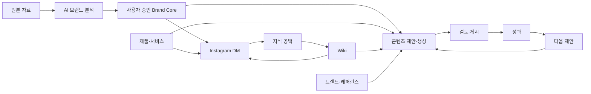

# 브랜드·레퍼런스·콘텐츠 운영체계 설계

- 상태: 사용자 방향 승인, 구현 전 설계 기준
- 작성일: 2026-07-24
- 대상: Brand Pilot 고객 앱, API, 콘텐츠 워커, Instagram 게시·DM 워커, 관리자
- 관련 문서:
  - `2026-07-21-brand-intelligence-onboarding-design.md`
  - `2026-07-20-product-service-analysis-generation-design.md`
  - `2026-07-18-ai-content-studio-ui-design.md`
  - `2026-07-16-brand-scoped-compounding-wiki-design.md`
  - `2026-07-14-instagram-dm-operations-knowledge-enhancement-design.md`

## 1. 결정 요약

Brand Pilot은 단순 콘텐츠 생성기가 아니라 다음 사이클을 하나로 연결하는 **브랜드 기반 SNS 마케팅 운영체계**로 발전시킨다.

> 브랜드를 이해한다 → 참고할 브랜드·콘텐츠를 탐색하고 보관한다 → 정보성·마케팅성 콘텐츠를 기획하고 만든다 → 검토·게시한다 → Instagram 고객응대와 성과에서 학습한다 → 다음 제안에 반영한다

이번 설계는 기존 기능을 새 구조에 재배치하고 연결하는 작업이다. 이미 작동하는 온보딩, 브랜드 분석, 콘텐츠 생성, Instagram 게시, DM 자동응답, Wiki, 성과 수집, 관리자 기능을 삭제하거나 다시 만드는 계획이 아니다.

핵심 결정은 다음과 같다.

1. 브랜드 정보는 `원본 자료`, `AI 분석`, `사용자가 승인한 Brand Core`, `실행 규칙`, `제품·서비스`, `공유 Wiki`로 역할을 분리한다.
2. 콘텐츠는 최상위에서 `정보성`과 `마케팅성`으로 나눈다. 기존 내부 타입인 `card_news | blog | marketing`은 워커 호환 계층으로 유지한다.
3. 브랜드·콘텐츠 레퍼런스는 탐색 단계에서 보관할 수 있고, 생성 과정에서는 **레퍼런스와 아바타를 합친 한 화면에서 한 번만 선택**한다.
4. 레퍼런스는 아이디어·카피 패턴·시각 구성의 근거일 뿐, 제품 사실의 근거가 아니며 Brand Core를 덮어쓰지 않는다.
5. 현재 범위의 제작물은 카드뉴스, 블로그, 단일 이미지, 채널용 텍스트다. 사용자 대상 영상·Reel 제작은 제외한다.
6. 모델·아바타는 별도 보관함에서 관리하고 현재 정적 이미지 제작에 사용한다. 미래 영상 기능도 같은 `avatar_id`를 재사용할 수 있게 경계를 둔다.
7. Instagram DM 자동응답은 콘텐츠 기능의 부가 메뉴가 아니라 Brand Core·Wiki·제품 정보를 함께 사용하는 독립 핵심 모듈로 보존한다.
8. 배포 채널 카탈로그와 실제 지원 능력을 분리해 표시한다. 현재 실제 게시 지원 범위를 과장하지 않는다.

## 2. 문제 정의

현재 구현에는 많은 기능이 있지만 사용자는 기능 간 관계를 한눈에 이해하기 어렵다.

- 원본 자료, AI 분석 결과, 사용자가 확정한 정보가 하나의 “브랜드 정보”처럼 보일 수 있다.
- 트렌드 탐색, 참고 URL, 제품 분석, 콘텐츠 생성이 각각 존재하지만 하나의 제작 흐름으로 충분히 연결되지 않는다.
- 콘텐츠 종류, 전략, 형식, 채널이 같은 레벨에서 섞여 있다.
- `/archive`는 Instagram 트렌드 북마크인데 생성 콘텐츠 보관함으로 오해될 수 있다.
- 채널 카탈로그에는 여러 채널이 있지만 실제 게시 어댑터의 지원 범위는 더 좁다.
- Reel 관련 기술 기반이 일부 존재하지만 현재 합의한 사용자 제품 범위에는 영상 제작이 없다.
- 자동 제안, 자동 생성, 자동 게시, DM 자동응답은 위험 수준이 서로 다른데 동일한 “자동화”로 보일 수 있다.

따라서 새 기능을 무조건 늘리기보다 데이터의 권한, 메뉴의 역할, 생성 흐름, 실제 지원 범위를 먼저 정리해야 한다.

## 3. 제품 원칙

### 3.1 사용자가 승인한 정보가 기준이다

AI 분석은 초안이다. 콘텐츠와 자동응답의 사실 근거는 사용자가 검토·승인한 Brand Core, 제품·서비스 정보, 공유 Wiki다.

### 3.2 근거와 영감은 분리한다

- 사실 근거: Brand Core, 제품·서비스 보관함, 공유 Wiki
- 영감 근거: 저장한 브랜드, 콘텐츠 레퍼런스, 트렌드, 외부 URL, 이전 우수 콘텐츠

경쟁사 표현이나 레퍼런스의 주장을 자사 사실처럼 사용하지 않는다.

### 3.3 한 번 입력하고 여러 기능에서 재사용한다

온보딩에서 만든 브랜드 지식은 콘텐츠와 DM이 공유한다. 제품 정보, 아바타, 저장 레퍼런스도 매번 다시 입력하지 않는다.

### 3.4 자동화는 승인 단계와 복구 경로를 가진다

제안과 생성은 자동화할 수 있지만 게시 및 고객응대는 준비도, 활성화 상태, 정책 검사, 시도 이력, 실패 복구가 필요하다.

### 3.5 화면에 보이는 기능과 기술 기반을 구분한다

기술 코드가 존재한다는 이유만으로 현재 지원 기능으로 노출하지 않는다. `구현 상태`, `운영 활성화`, `이번 변경 판단`을 각각 기록한다.

## 4. 전체 정보 구조

### 4.1 고객 앱의 7개 운영 영역

1. **대시보드**
   - 오늘의 상태, 성과, 주의 항목, 추천 작업
2. **브랜드 센터**
   - 브랜드 자료, Brand Core, 방향성, 규칙, 제품·서비스, Wiki, 모델·아바타
3. **탐색·레퍼런스**
   - Instagram 트렌드, 참고 브랜드·계정·URL, 저장 콘텐츠, 패턴 카드, 레퍼런스 보관함
4. **콘텐츠**
   - AI 제안, 정보성·마케팅성 생성, 생성 결과, 검토
5. **게시**
   - 채널 연결, 게시 준비도, 직접 게시, 예약 큐, 시도·복구
6. **Instagram 고객응대**
   - DM 연결, 자동응답, 받은 메시지, 상담 필요, 지식 보완
7. **성과·개선**
   - 콘텐츠 성과, 채널 성과, 패턴 비교, 다음 콘텐츠 제안

지원·피드백, 계정·요금, 관리자 기능은 공통 운영 영역으로 유지한다.

### 4.2 핵심 순환 구조



## 5. 브랜드 센터

브랜드 센터는 마케팅 단계 중 하나가 아니라 모든 기능이 공유하는 기반이다.

### 5.1 원본 자료

지원 자료:

- 브랜드·제품 URL
- 홈페이지와 상세페이지
- 소개서와 업로드 문서
- 로고와 제품 이미지
- 기존 SNS 게시물과 광고 소재
- 후기, FAQ, 고객 문의 자료

모든 원본은 출처, 수집 시점, 접근 결과, 최신 스냅샷을 가진다. 기존 URL 수집, 수동 크롤링, 자동 재수집 기능을 그대로 활용한다.

### 5.2 AI 브랜드 분석

AI는 원본 자료에서 브랜드 소개, 제품, 타깃, 고객 문제, 소구점, 차별점, 톤, 반복 표현, 경쟁 환경을 제안한다.

- 각 항목은 출처와 신뢰도를 표시한다.
- 경쟁사·시장 분석은 `관찰 사실`, `AI 해석`, `우리 브랜드 적용 제안`을 분리한다.
- 사용자가 검토하기 전에는 실행 기준이 아니다.

### 5.3 승인된 Brand Core

사용자가 AI 초안을 검토하고 수정·확정한 운영 기준이다.

- 브랜드 한 줄 소개와 상세 소개
- 핵심 타깃과 고객 문제
- 핵심 가치와 차별점
- 주요 소구점과 증거
- 브랜드 톤과 자주 쓰는 표현
- 브랜딩 방향성과 우선 메시지

콘텐츠 생성과 DM 자동응답은 승인된 값을 우선 사용한다. AI 재분석이 기존 승인 값을 자동 변경하지 않는다.

### 5.4 표현·운영 규칙

- 반드시 포함할 문구
- 사용 금지 문구
- 과장 표현 제한
- CTA 규칙
- 채널별 표현 규칙
- 색상, 폰트, 로고 사용 규칙
- 자동 승인 가능 조건

규칙은 생성 후 검사와 자동응답 안전성 검사에 공통 사용한다.

### 5.5 제품·서비스 보관함

기간성 오퍼는 현재 범위에서 제외한다. 장기적으로 반복 사용하는 제품과 서비스만 관리한다.

등록 흐름:

1. URL, 문서, 이미지 또는 직접 입력으로 자료 등록
2. AI가 제품·서비스 정보를 분석해 필드를 채움
3. 사용자가 수정하고 승인
4. 콘텐츠 주제 선택과 DM 답변 근거로 재사용

주요 필드:

- 이름, 유형, 설명
- 기능과 고객 효익
- 사실 근거와 주의사항
- 주요 타깃
- 타깃별 소구점
- 가격·구매·예약 정보 중 장기 유지 항목
- 관련 URL과 이미지 자산
- 활성 상태와 승인 상태

### 5.6 공유 Wiki

Wiki는 브랜드 프로필을 복제하는 별도 데이터베이스가 아니다. 콘텐츠와 DM이 함께 쓰는 설명형 지식과 운영 지침을 관리한다.

- FAQ와 자주 묻는 질문
- 제품 사용법과 정책
- 배송·예약·환불 등 운영 정보
- 답변 예시와 예외 처리
- 콘텐츠에서 재사용할 상세 지식
- DM에서 발견된 지식 공백과 보완 이력

정형 사실은 Brand Core와 제품·서비스 보관함을 우선하고, Wiki는 상세 설명과 반복되는 운영 지식을 맡는다.

### 5.7 모델·아바타 보관함

현재 정적 이미지 제작에 재사용할 사람·캐릭터 기준을 저장한다.

- 이름
- 대표 이미지
- 추가 참고 이미지 1~5장
- 외형·스타일 설명
- 기본값 여부
- 활성/비활성 상태

생성 과정에서는 `기존 아바타`, `업로드 후 저장`, `이번 생성에만 사용`, `사용 안 함` 중 하나를 선택한다.

## 6. 탐색·레퍼런스

### 6.1 탐색 범위

기존 Instagram 트렌드와 참고 URL 수집을 다음 방향으로 고도화한다.

- 참고 브랜드, Instagram 계정 또는 URL 등록
- 접근 가능한 콘텐츠 수집
- 콘텐츠 개별 저장
- AI 태그와 패턴 요약
- 브랜드별·전략별·형식별 필터
- 생성 단계로 전달

SNIPIT형 서비스에서 참고할 것은 “검색 가능한 마케팅 자산과 패턴”이다. 전 세계 광고 데이터베이스, 인플루언서 검색, 대규모 실시간 감시, 복잡한 팀 보드는 이번 제품에 넣지 않는다.

### 6.2 레퍼런스 보관함

저장 대상:

- 저장한 브랜드와 해당 브랜드 콘텐츠
- Instagram 트렌드
- 외부 URL
- 직접 업로드한 이미지·자료
- 자사 성과 우수 콘텐츠
- 이전 생성에서 사용한 레퍼런스
- 모델·아바타
- 제품·서비스 이미지

기본 보기:

- 전체
- 저장한 브랜드
- 저장한 콘텐츠
- 최근 사용
- 즐겨찾기
- 모델·아바타
- 직접 추가

기존 `/archive`는 Instagram 트렌드 북마크이므로 명칭과 역할을 분명히 한다. 생성 결과는 기존 AI 콘텐츠 목록에서 관리하고, 탐색 자료는 `레퍼런스 보관함`에서 관리한다.

### 6.3 패턴 카드

레퍼런스 분석 결과는 복제 지시가 아니라 적용 가능한 패턴으로 저장한다.

- 관찰된 사실
- AI 해석
- 우리 브랜드 적용 아이디어
- 그대로 모방하지 않을 요소
- 원본 출처
- 분석 신뢰도

## 7. 콘텐츠 분류와 생성 흐름

### 7.1 콘텐츠 분류

#### 정보성 콘텐츠

- 문제 해결·사용법
- 비교·선택 가이드
- FAQ·오해 해소
- 트렌드·시장 인사이트
- 사례·데이터

#### 마케팅성 콘텐츠

- 고객 문제·사용 상황
- 효익·USP
- 후기·신뢰
- 대안 비교
- 프로모션·CTA
- 브랜드 스토리

`카피`는 별도 콘텐츠 유형이 아니라 모든 결과물의 출력 층이다.

- 후크
- 핵심 주장 또는 인사이트
- 근거
- 본문
- CTA
- 캡션과 해시태그

현재 형식:

- 카드뉴스
- 블로그
- 단일 이미지
- 채널용 텍스트

채널 변환:

- Instagram 단일 피드, 캐러셀, 정적 스토리
- Threads용 텍스트
- 블로그 HTML

### 7.2 생성 과정

```text
콘텐츠 성격 선택
→ 주제 또는 제품·서비스 선택
→ 타깃과 소구점 선택
→ 메시지 전략과 형식 선택
→ 레퍼런스·아바타 한 번 선택
→ 생성
→ 검토·수정·게시
```

레퍼런스 선택은 여러 단계에 반복 배치하지 않는다. 앞 단계에서 고른 성격, 제품, 타깃, 전략은 마지막 선택 화면의 추천과 필터에만 사용한다.

### 7.3 단일 레퍼런스·아바타 선택 화면

탭:

- AI 추천
- 브랜드별
- 전략별
- 보관함
- 최근 사용
- 직접 추가

필터:

- 정보성·마케팅성
- 전략
- 형식
- 출처
- 시각 구성

선택 규칙:

- 레퍼런스는 선택하지 않아도 된다.
- 권장 최대 수는 5개다.
- 선택한 자료마다 `기획`, `카피 패턴`, `시각 구성` 역할을 하나 이상 지정할 수 있다.
- 아바타는 같은 화면에서 별도 슬롯으로 하나만 선택한다.
- 생성 시점에 선택 항목과 분석 결과를 스냅샷으로 남긴다.
- 이후 원본이 바뀌어도 과거 생성 결과의 근거는 재현할 수 있어야 한다.

### 7.4 기존 런타임 호환

현재 API와 워커의 내부 콘텐츠 타입 `card_news | blog | marketing`은 유지한다.

새 제품 분류는 오케스트레이션 메타데이터로 추가한다.

- `content_family`: `informational | marketing`
- `message_strategy`
- `output_format`
- `channel_targets`
- `reference_snapshot_ids`
- `avatar_id` 또는 일회성 아바타 스냅샷

새 분류를 기존 워커 타입으로 안전하게 매핑해 기존 생성 파이프라인을 깨지 않는다.

## 8. AI 자동 제안

AI는 사용자가 빈 화면에서 시작하지 않도록 다음 정보를 결합해 콘텐츠 후보를 제안한다.

- 승인된 Brand Core
- 제품·서비스
- 공유 Wiki
- 최근 트렌드와 저장 레퍼런스 패턴
- 자사 콘텐츠 성과
- 최근 사용 주제와 중복 여부

제안 카드:

- 지금 만들 이유
- 정보성·마케팅성 구분
- 주제 또는 제품
- 타깃
- 메시지 전략
- 권장 형식
- 사용 근거와 추천 레퍼런스

사용자가 제안을 승인·수정한 뒤 생성한다. 기존 예약형 일일 생성 기능은 보존하되 첫 Ubuntu 배포에서는 비활성 상태를 유지한다.

## 9. 검토·게시

### 9.1 검토

- 브랜드 톤 일치
- 제품 정보 정확성
- 필수·금지 문구
- 과장 표현
- CTA 적절성
- 이미지 텍스트 오류
- 채널 규격

승인, 거절, 재생성, 결과 교체 이력을 보존한다.

### 9.2 게시

- 채널 연결과 준비도
- 직접 게시
- 예약 큐
- 게시 시도 이력
- 재시도
- 결과를 확정할 수 없는 상태의 복구

UI는 채널별 능력을 명확히 표시한다.

- Instagram: 현재 실제 게시 어댑터
- Threads: 텍스트 변환·준비 범위
- 그 밖의 카탈로그 채널: 연결 또는 어댑터 상태에 따라 `준비 중` 표시

정적 Instagram Story는 지원 범위에 포함할 수 있지만 사용자 대상 영상·Reel 제작은 이번 범위에서 제외한다.

## 10. Instagram DM 고객응대

DM은 다음 경계를 유지한다.

1. Webhook 검증과 이벤트 중복 제거
2. 연결 준비도와 자동응답 켜기·끄기
3. 받은 메시지와 수동 답변
4. FAQ 직접 답변
5. Brand Core·제품·서비스·Wiki 근거 기반 AI 답변
6. 톤, 필수·금지 표현, 링크 검증
7. 불만, 제한 주제, 지식 부족, 시스템 오류 분류
8. 상담 필요 전환, 일시정지, 재개
9. 멱등성, 재시도, 전송 결과 불명 복구, 속도 제한
10. 응답 이력, 관리자 모니터링, 지식 공백의 Wiki 보완

콘텐츠 생성용 레퍼런스는 DM의 사실 근거로 사용하지 않는다.

## 11. 성과·학습

### 11.1 현재 보존 범위

- 콘텐츠 성과 스냅샷
- 24시간, 72시간, 7일 관찰 기반
- 도달, 조회, 저장, 공유, 댓글, 클릭 등 수집 가능한 지표
- 채널·콘텐츠·형식별 비교 기반
- 대시보드 요약과 운영 주의 항목

### 11.2 점진 고도화

향후 AI가 다음을 해석해 제안에 반영한다.

- 반응이 좋은 후크와 메시지 전략
- 효과적인 소구점
- 반응이 좋은 타깃
- 적합한 형식과 길이
- 피해야 할 표현
- 성과가 좋은 시각 패턴

성과 해석은 관측 데이터, 해석, 다음 실험 제안을 분리해 표시한다.

## 12. 개념 데이터 경계

구현 단계에서 기존 테이블을 우선 재사용하고 필요한 경계만 확장한다.

| 개념 | 책임 | 권한 |
|---|---|---|
| Source | URL·문서·이미지와 수집 스냅샷 | 원본, 읽기 전용 근거 |
| Brand Analysis | AI가 추출한 브랜드 이해 | 제안 |
| Brand Core | 사용자가 승인한 브랜드 기준 | 사실·표현의 우선 기준 |
| Brand Rule | 표현·CTA·디자인·자동화 규칙 | 실행 제약 |
| Product/Service | 반복 사용하는 제품·서비스 사실 | 사용자 승인 근거 |
| Wiki | 설명형 지식·FAQ·운영 정보 | 콘텐츠·DM 공유 근거 |
| Reference Item | 외부·내부 영감 자료 | 아이디어·패턴 |
| Reference Pattern | 자료에서 추출한 패턴 카드 | 해석·적용 제안 |
| Avatar | 재사용 모델·캐릭터 자료 | 시각 생성 입력 |
| Generation Snapshot | 생성 당시 선택과 근거 | 재현·감사 |
| Publish Attempt | 채널 게시 시도 | 복구·운영 |
| Performance Snapshot | 시점별 성과 | 비교·학습 |

## 13. 오류·안전·운영 기준

- 원본 수집 실패는 기존 승인 데이터를 삭제하지 않고 마지막 성공 스냅샷을 유지한다.
- AI 분석 실패 시 필드별 재시도와 직접 입력을 제공한다.
- 출처가 없는 제품 주장은 생성 결과의 확정 사실로 사용하지 않는다.
- 삭제되거나 비공개가 된 레퍼런스도 생성 시점 스냅샷은 보존한다.
- 아바타 원본 접근 실패 시 사용자에게 대체 또는 사용 안 함을 요청한다.
- 게시 요청은 멱등 키를 사용하고 중복 게시를 방지한다.
- 게시 결과 불명 상태를 단순 실패로 재시도해 중복 게시하지 않는다.
- DM 자동응답은 준비도 검사를 통과하기 전 활성화할 수 없다.
- 지식 부족 답변은 추측하지 않고 상담 필요 또는 지식 보완 흐름으로 전환한다.
- 브랜드별 데이터, 생성 자료, DM 원문, 게시 자격증명의 접근 범위를 분리한다.

## 14. 단계적 전환 원칙

이번 문서는 구현 순서를 확정하는 계획서가 아니지만, 전환은 다음 원칙을 따른다.

1. 기존 기능 보존표와 그 안의 `소기능 보존·회귀 체크리스트`를 회귀 기준으로 먼저 고정한다. 명시적 제외가 아닌 기존 기능은 화면에 작게 보이거나 새 구조로 이동해도 기본 보존한다.
2. 메뉴와 용어를 정리하되 기존 URL은 호환 또는 리디렉션한다.
3. Brand Core·제품·Wiki의 데이터 권한을 먼저 명확히 한다.
4. 레퍼런스 보관함과 단일 선택 스냅샷을 기존 생성 위저드에 연결한다.
5. 정보성·마케팅성 분류를 내부 워커 호환 계층 위에 추가한다.
6. 자동 제안과 성과 학습은 근거 표시가 가능한 범위부터 켠다.
7. 첫 Ubuntu 배포에서는 예약형 일일 생성과 위험한 자동화를 기본 비활성화한다.

## 15. 이번 범위에서 제외

- 사용자 대상 영상·Reel 제작
- 영상 Story 제작
- AI 모델·아바타 자체 생성
- 얼굴 합성, 음성 복제
- 인플루언서 검색, 계약, 결제, 배송 관리
- 크리에이터 마켓플레이스
- 전 세계 광고 원본 데이터베이스
- 대규모 실시간 경쟁사 감시
- 복잡한 팀 보드와 다단계 권한
- 범용 디자인·영상 편집기
- 광고 매체비 집행과 자동 최적화
- Naver 채널 확장
- 댓글을 기점으로 하는 DM 자동화
- 기간성 오퍼 관리

기존 저장소에 관련 실험 코드나 기술 기반이 있더라도 현재 제품 메뉴와 지원 범위로 선언하지 않는다.

## 16. 설계 수용 기준

다음 질문에 모두 “예”라고 답할 수 있어야 한다.

1. 사용자는 원본, AI 제안, 승인된 사실, 운영 규칙을 구분할 수 있는가?
2. 사용자는 제품·서비스를 한 번 등록하고 콘텐츠와 DM에서 재사용할 수 있는가?
3. 정보성·마케팅성 콘텐츠의 전략과 결과 형식이 혼동되지 않는가?
4. 레퍼런스와 아바타 선택은 생성 과정에서 정확히 한 번만 나타나는가?
5. 선택한 레퍼런스의 역할과 생성 당시 스냅샷을 확인할 수 있는가?
6. 외부 레퍼런스가 자사 제품 사실이나 Brand Core를 덮어쓰지 않는가?
7. 실제 게시 가능한 채널과 준비 중 채널이 명확히 구분되는가?
8. Instagram DM 기존 기능과 안전·복구 경로가 모두 보존되는가?
9. 현재 제외한 영상 기능이 사용자 기능처럼 노출되지 않는가?
10. 기존 API·워커 타입을 유지한 채 새 분류를 추가할 수 있는가?
11. 사용량·다운로드 차감·피드백·도움말·공통 상태·접근성 같은 소기능이 디자인 개편 중 누락되지 않는가?

## 17. 구현 전 검증 항목

- 기존 사용자 흐름과 URL 회귀 목록
- 기존 `card_news | blog | marketing` 요청·응답 계약 테스트
- 콘텐츠 성격·전략·형식 매핑 테스트
- 단일 레퍼런스 선택과 최대 수·역할 검증
- 생성 스냅샷 재현성 테스트
- 제품 사실과 외부 레퍼런스의 신뢰 경계 테스트
- Brand Core 재분석 시 승인 값 보존 테스트
- 게시 멱등성, 재시도, 결과 불명 복구 테스트
- DM Webhook 중복, 상담 전환, 지식 부족, 속도 제한 테스트
- 기능 플래그와 첫 Ubuntu 배포 기본값 검증
- 관리자 모니터링 및 감사 이력 검증
- 기능 보존표의 일일 사용량·다운로드 비차감·URL·해시태그·업로드 제한 검증
- 피드백·고객센터·도움말·공통 셸·상태 UI·다운로드·접근성 세부 회귀 검증
