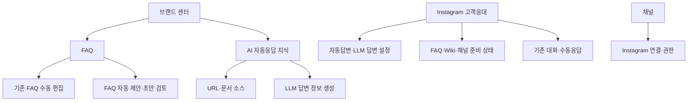
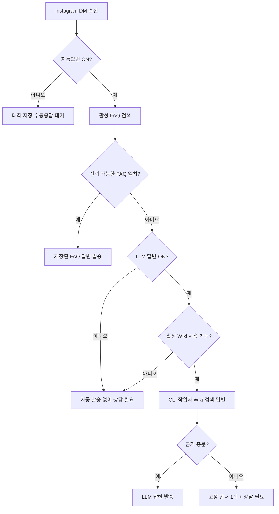

# Instagram DM FAQ-First and Explicit LLM Control Design

- 작성일: 2026-08-01
- 기준 브랜치: `codex/dm-faq-ui-latest`
- 기준 커밋: `d67f02d`
- 상태: 화면 설계 승인 대기
- 이전 문서 대체: `2026-07-31-instagram-dm-faq-wiki-auto-reply-design.md`
- 구현 원칙: 화면을 먼저 만들고 사용자 확인 전에는 기능을 연결하지 않는다.

## 1. 요약

Instagram DM 자동응답을 다음 두 단계로 분리한다.

1. 활성 FAQ에서 먼저 답을 찾고 저장된 FAQ 답변을 그대로 보낸다.
2. FAQ로 답할 수 없고 `LLM 답변`이 켜져 있을 때만 활성 Wiki를 근거로 CLI 작업자가 답변을 생성한다.

관리 위치는 중복되지 않게 나눈다.

- `브랜드 센터 > FAQ`: FAQ 수동 관리와 FAQ 자동 제안
- `브랜드 센터 > AI 자동응답 지식`: URL·문서 소스와 명시적인 LLM 답변 정보 생성
- `Instagram 고객응대`: 자동답변 설정, 준비 상태, 고객 대화, 수동응답
- `채널`: Instagram 연결과 권한 상태만 관리

운영 중 FAQ 검색은 PG MCP를 호출하지 않는다. 애플리케이션과 작업자가 PostgreSQL을 직접 조회한다. PG MCP는 개발·점검 도구일 뿐 DM 런타임 의존성이 아니다.

## 2. 사용자 요구사항

### 2.1 필수 요구사항

- FAQ 자동 제안 기능을 제공한다.
- 브랜드 코어 URL, 브랜드 코어, 제품·서비스, 사용자가 추가한 문서를 바탕으로 FAQ 후보를 만든다.
- 서비스 문의, 제품 문의, 가격, 위치, 배송, 교환·환불, 운영시간 같은 기본 카테고리를 사용한다.
- 자동 제안 결과는 즉시 활성화하지 않고 사용자가 검토할 초안으로 저장한다.
- 질문과 답변은 `textarea`에서 수정할 수 있어야 한다.
- DM 수신 시 FAQ 일치 여부를 먼저 판단한다.
- FAQ가 일치하면 저장된 FAQ 답변을 사용하며 생성형 답변을 만들지 않는다.
- FAQ가 일치하지 않고 `LLM 답변`이 켜진 경우에만 Wiki 기반 CLI 답변을 실행한다.
- LLM 답변을 사용하려면 사용자가 `LLM 답변 정보 생성`을 명시적으로 실행해야 한다.
- LLM 정보 생성은 URL과 문서 데이터를 입력으로 받을 수 있어야 한다.
- 기존 Instagram 고객응대의 대화 목록, 대화창, 상담 필요 처리, 수동응답을 유지한다.
- 자동응답 설정을 `채널`에서 제거해 중복 관리를 없앤다.
- 기능 구현 전에 화면만 먼저 만들어 사용자 확인을 받는다.
- 사용자 요청 없이는 push, 배포, 운영 DB 마이그레이션을 실행하지 않는다.

### 2.2 용어

| 용어 | 의미 |
|---|---|
| 자동답변 | Instagram DM에서 FAQ 답변과 선택적인 LLM 답변을 실행하는 마스터 설정 |
| FAQ 답변 | 활성 FAQ의 저장된 답변을 그대로 보내는 비생성형 답변 |
| LLM 답변 | 활성 Wiki 근거를 사용해 CLI 작업자가 생성하는 답변 |
| FAQ 자동 제안 | 브랜드 정보를 바탕으로 FAQ 초안을 생성하는 관리 기능 |
| LLM 답변 정보 | LLM이 답변 근거로 사용할 활성 Wiki 버전 |
| 수동응답 | 상담원이 기존 대화창에서 직접 작성해 보내는 답변 |

## 3. 목표와 비목표

### 3.1 목표

- 자주 묻는 질문은 빠르고 결정적인 FAQ 답변으로 처리한다.
- FAQ 범위를 벗어난 질문만 Wiki 기반 LLM으로 처리해 비용과 오답 가능성을 줄인다.
- FAQ와 LLM 지식의 소유 위치를 브랜드 센터로 통일한다.
- Instagram 고객응대 화면을 운영 중심으로 유지한다.
- LLM 지식 생성 시점을 사용자가 통제하게 한다.
- 자동응답이 꺼져 있어도 상담원의 수동응답은 항상 가능하게 한다.

### 3.2 비목표

- 새 Instagram 고객응대 페이지를 만들지 않는다.
- `/sources`를 다시 주 관리 화면으로 만들지 않는다.
- 채널 페이지에서 자동응답을 관리하지 않는다.
- FAQ 자동 제안을 온보딩 필수 단계로 넣지 않는다.
- 제안된 FAQ를 자동 승인하거나 기존 FAQ를 자동 덮어쓰지 않는다.
- PG MCP를 고객 DM 처리 경로에 넣지 않는다.
- FAQ 답변을 LLM으로 다시 작성하지 않는다.
- 기존 대화·수동응답 API와 화면을 새로 설계하지 않는다.
- 이번 화면 우선 단계에서 API, DB, 작업자 동작을 변경하지 않는다.
- 명시적 요청 없이 배포하지 않는다.

## 4. 현재 구현에서 재사용할 것

현재 최신 코드에는 다음 기반이 이미 있다. 새 설계는 이를 교체하지 않고 확장한다.

| 기존 기능 | 기준 위치 | 재사용 방식 |
|---|---|---|
| Instagram 고객응대 페이지 | `DmAutomationPage.tsx` | 상단 준비 상태 패널만 확장 |
| 고객 대화 목록과 스레드 | `DmConversationList`, `DmConversationThread` | 레이아웃과 수동응답 흐름 유지 |
| 수동응답 | `sendManualReply`, `sendManualDmReply` | 자동응답 설정과 독립적으로 유지 |
| FAQ 관리 | `BrandCenterPage`의 `faq` 탭, `KnowledgeCategoryEditorPanel` | 자동 제안 진입점과 초안 검토 기능 추가 |
| AI 자동응답 지식 | `BrandCenterPage`의 `knowledge` 탭, `AutoResponseKnowledgePanel` | 소스 관리와 명시적 Wiki 생성 기능 추가 |
| FAQ/Wiki 항목 | `WikiLibraryPanel`, `knowledge_entries` | 기존 상태·출처·버전 구조 재사용 |
| Wiki 생성 | `wiki_build_requests`, `wiki_versions`, DM 작업자 | 자동 생성 트리거를 제거하고 명시적 요청에 연결 |
| FAQ 우선 처리 | `find_direct_faq_exact`, `direct_faq` 경로 | 기존 직접 FAQ 경로 유지·확장 |
| Wiki 답변 | `wiki_answer` 경로 | `LLM 답변` 설정이 켜진 경우에만 허용 |
| 응답 출처 표시 | `DmConversationThread`의 FAQ/Wiki 라벨 | 수동 라벨과 상태 설명을 보완 |

`/sources`는 현재 레거시 리다이렉트이므로 신규 기능의 정식 위치로 사용하지 않는다.

## 5. 정보 구조



### 5.1 단일 소유 원칙

- FAQ 내용은 `브랜드 센터 > FAQ`에서만 수정한다.
- URL·문서와 Wiki 생성은 `브랜드 센터 > AI 자동응답 지식`에서만 관리한다.
- Instagram 고객응대에서는 지식 내용을 편집하지 않는다.
- Instagram 고객응대의 준비 상태에서 브랜드 센터의 해당 탭으로 바로 이동할 수 있다.
- 채널에서는 연결·권한만 다루며 자동응답 토글이나 Wiki 상태를 표시하지 않는다.

## 6. 화면 설계

### 6.1 `브랜드 센터 > FAQ`

기존 FAQ 목록과 편집 UI를 유지하고 상단 작업 영역에 `FAQ 자동 제안` 버튼을 추가한다.

#### 기본 상태

- 기존 제목, 설명, 검색, 필터, 수동 추가 버튼을 유지한다.
- `FAQ 자동 제안`은 수동 추가와 구분되는 보조 작업으로 배치한다.
- 활성 FAQ 개수와 검토 중 초안 개수를 함께 표시한다.

#### 자동 제안 실행

버튼을 누르면 현재 사용 가능한 입력 자료를 요약한 확인 영역을 연다.

- 확인된 브랜드 코어
- 제품·서비스 정보
- 대표 브랜드 URL과 수집된 페이지
- AI 자동응답 지식에 등록한 문서
- 기존 FAQ

입력 자료가 하나도 없으면 실행하지 않고 `브랜드 정보를 먼저 추가해 주세요`와 브랜드 센터 내 이동 링크를 표시한다.

#### 생성 중

- 버튼을 비활성화하고 `FAQ 제안 생성 중` 상태를 표시한다.
- 페이지를 벗어나도 작업은 유지된다.
- 다시 들어오면 동일 실행의 최신 상태를 복구한다.
- 같은 브랜드에 실행 중인 작업이 있으면 중복 실행을 만들지 않는다.

#### 제안 결과 검토

결과는 기존 FAQ 목록과 섞어 바로 활성화하지 않는다. `제안된 FAQ` 검토 영역에 초안으로 표시한다.

각 항목은 다음 필드를 가진다.

- 선택 체크박스
- 카테고리
- 질문 `textarea`
- 답변 `textarea`
- 사용한 근거 요약과 출처
- 기존 FAQ와의 유사·중복 경고
- `승인`, `제외`

지원 작업:

- 선택 승인
- 전체 선택
- 선택 제외
- 개별 수정 후 승인
- 실패한 항목만 다시 생성

승인 전까지 DM 답변에 사용하지 않는다. 승인 시 기존 FAQ 저장 흐름을 사용해 `active` 항목으로 전환한다.

#### 기존 FAQ 보호

- 자동 제안은 기존 활성 FAQ를 수정하거나 비활성화하지 않는다.
- 정규화된 질문이 같은 경우 신규 활성 항목을 만들지 않고 중복으로 표시한다.
- 비슷한 질문이 있지만 답변이 다르면 자동 병합하지 않고 비교 검토를 요구한다.
- 사용자가 편집한 텍스트가 생성 결과보다 우선한다.

### 6.2 `브랜드 센터 > AI 자동응답 지식`

현재 읽기 전용 개요를 운영 가능한 LLM 지식 관리 화면으로 확장한다.

#### 지식 소스

- 기존 브랜드 코어와 제품·서비스, 활성 FAQ를 내부 소스로 요약한다.
- 대표 URL과 추가 URL을 관리한다.
- 문서를 추가·제거하고 처리 상태를 확인한다.
- 온보딩에서 이미 저장된 URL·문서는 중복 업로드하지 않고 같은 출처 레지스트리를 재사용한다.
- 각 소스에 `준비됨`, `처리 중`, `실패`, `업데이트 필요` 상태를 표시한다.

#### 명시적 생성 버튼

주요 CTA는 `LLM 답변 정보 생성`이다.

- 사용자가 버튼을 눌러야만 새 Wiki 빌드 요청을 만든다.
- `자동답변`을 켜는 행위는 Wiki 생성을 유발하지 않는다.
- `LLM 답변`을 켜는 행위도 Wiki 생성을 유발하지 않는다.
- 입력 소스가 없으면 버튼을 비활성화하고 필요한 조치를 설명한다.
- 빌드 중에는 중복 요청을 만들지 않는다.

#### 상태

| 상태 | 사용자 표시 | 동작 |
|---|---|---|
| `empty` | 생성된 정보 없음 | LLM 답변 활성화 불가 |
| `building` | 정보 생성 중 | 이전 활성 버전이 없으면 LLM 답변 불가 |
| `active` | 사용 가능 | LLM 답변 활성화 가능 |
| `stale` | 업데이트 권장 | 마지막 활성 버전을 계속 사용하고 재생성 안내 |
| `failed` + 활성 버전 없음 | 생성 실패 | LLM 답변 활성화 불가, 다시 생성 제공 |
| `failed` + 활성 버전 있음 | 업데이트 실패 | 마지막 활성 버전을 유지하고 경고 표시 |

새 빌드가 실패해도 마지막 활성 버전을 삭제하거나 교체하지 않는다.

### 6.3 `Instagram 고객응대`

새 페이지를 만들지 않는다. 현재 `DmAutomationPage`를 그대로 사용한다.

#### 상단 자동답변 패널

현재 단일 자동답변 영역을 다음 구조로 확장한다.

1. `자동답변` 마스터 토글
2. `LLM 답변` 보조 토글
3. FAQ 준비 상태
4. LLM 답변 정보 상태
5. Instagram 연결·권한·작업자 상태
6. 문제 해결 링크

권장 문구:

- 자동답변: `활성 FAQ를 먼저 확인하고, 설정에 따라 Wiki 답변을 사용합니다.`
- LLM 답변: `FAQ로 답할 수 없을 때 활성 Wiki를 근거로 답변합니다.`
- FAQ 없음: `활성 FAQ가 없습니다. 브랜드 센터에서 FAQ를 추가하거나 자동 제안을 받아보세요.`
- Wiki 없음: `LLM 답변 정보가 없습니다. 브랜드 센터에서 정보를 생성해 주세요.`

이동 링크:

- `FAQ 관리` → `/brand-center?tab=faq`
- `LLM 답변 정보 관리` → `/brand-center?tab=knowledge`
- `Instagram 연결 확인` → `/channels`

`LLM 답변 정보 생성` 폼이나 FAQ 편집기를 이 페이지에 복제하지 않는다.

#### 대화와 수동응답

상단 패널 아래의 기존 화면은 구조를 변경하지 않는다.

- 고객 대화 툴바 유지
- 고객 대화 목록 유지
- 대화 상세 스레드 유지
- 상담 필요 상태와 해결 처리 유지
- 수동답변 입력·전송 유지
- FAQ/Wiki 답변 출처 라벨 유지
- 수동 메시지에는 `수동 답변` 라벨을 표시할 수 있다.

자동응답이나 LLM 답변이 꺼져 있어도 수동응답은 사용할 수 있다.

### 6.4 `채널`

현재 중복된 `Instagram DM 자동답변` 패널을 제거한다.

함께 제거할 화면 책임:

- DM 설정 조회
- DM 자동답변 토글
- Wiki 준비 상태
- DM 작업자 준비 상태 설명
- 자동답변 활성화 오류 처리

남길 책임:

- Instagram 계정 연결·해제
- 메시지 권한 상태
- Webhook 연결 상태
- 연결 문제 해결 안내
- 연결 완료·실패 콜백

## 7. 설정 모델과 상태표

### 7.1 설정

기존 `instagram_dm_settings.enabled`를 자동답변 마스터 설정으로 유지한다.

신규 논리 필드:

```text
llm_reply_enabled boolean not null default false
```

`FAQ 답변`은 별도 토글을 두지 않는다. 자동답변이 켜져 있으면 활성 FAQ 검색은 항상 첫 단계로 실행한다.

### 7.2 유효 동작

| 자동답변 | LLM 답변 설정 | 실제 동작 |
|---|---|---|
| OFF | OFF | 자동 발송 없음, 수동응답만 가능 |
| OFF | ON | 자동 발송 없음, 저장된 LLM 설정은 실행되지 않음 |
| ON | OFF | FAQ 일치 시 FAQ 답변, 불일치 시 상담 필요로 전환 |
| ON | ON | FAQ 일치 시 FAQ 답변, 불일치 시 Wiki 기반 LLM 답변 |

자동답변을 끌 때 `llm_reply_enabled` 값을 삭제하지 않는다. 자동답변이 꺼진 동안에는 LLM 토글을 비활성 상태로 표시하고 `자동답변을 켜야 적용됩니다`라고 설명한다.

### 7.3 활성화 조건

자동답변을 켜기 위한 최소 조건:

- Instagram 메시지 권한 확인
- Webhook 연결
- DM 작업자 온라인
- 활성 FAQ가 1개 이상이거나, `LLM 답변`이 켜져 있고 활성 Wiki 버전이 존재

LLM 답변을 켜기 위한 조건:

- 활성 Wiki 버전 존재
- Wiki 상태가 `active` 또는 사용 가능한 이전 버전이 있는 `stale`/업데이트 실패 상태

조건이 충족되지 않으면 설정 변경 API가 거부되고 화면은 해결 위치를 안내한다. 설정 변경 요청이 Wiki 생성 요청을 대신 실행해서는 안 된다.

## 8. FAQ 자동 제안 설계

### 8.1 기본 카테고리

- 서비스 문의
- 제품 문의
- 가격·결제
- 위치·방문
- 운영시간
- 배송
- 교환·환불
- 예약·이용 방법
- 계정·멤버십
- 기타

브랜드에 근거가 없는 카테고리는 억지로 채우지 않는다.

### 8.2 생성 입력

생성 시점의 승인된 정보만 사용한다.

- 활성 브랜드 코어
- 활성 제품·서비스 버전
- 대표 브랜드 URL과 수집된 owned source snapshot
- 사용자가 AI 자동응답 지식에 추가한 문서
- 기존 활성 FAQ

소스별 식별자와 내용 해시를 실행 기록에 저장해 같은 입력의 중복 실행을 판별한다.

### 8.3 결과 계약

각 제안은 최소한 다음 값을 가진다.

```json
{
  "category": "제품 문의",
  "question": "제품은 어떻게 구매하나요?",
  "answer": "공식 온라인 스토어에서 구매할 수 있습니다.",
  "evidence": [
    { "sourceType": "url", "sourceId": "...", "label": "공식 구매 안내" }
  ],
  "confidence": 0.92,
  "duplicateOf": null
}
```

검증 규칙:

- 질문과 답변은 공백 문자열일 수 없다.
- 답변은 제공된 근거로 확인할 수 있는 내용만 포함한다.
- 근거가 약한 가격, 정책, 위치, 운영시간을 추측하지 않는다.
- CTA나 링크는 근거에 실제 URL이 있을 때만 포함한다.
- 기존 FAQ와 정규화 질문이 같으면 중복으로 분류한다.
- 생성 결과는 `draft`이며 자동응답 검색 대상이 아니다.

### 8.4 저장 방식

기존 `knowledge_entries`와 Wiki 관리 계약을 재사용한다.

- 제안 실행 단위만 신규 `faq_suggestion_runs`로 추적한다.
- 제안 항목은 기존 FAQ 초안 구조에 `origin = 'proposal'`과 provenance를 추가해 저장한다.
- 승인 시 기존 FAQ 활성화 흐름을 사용한다.
- 별도의 평행한 FAQ 테이블을 만들지 않는다.

논리적인 실행 상태:

```text
pending -> running -> review_ready -> completed
                     -> partial
          -> failed
```

## 9. DM 응답 판정

### 9.1 런타임 의존성

- API와 작업자는 PostgreSQL을 직접 사용한다.
- PG MCP는 런타임에서 호출하지 않는다.
- FAQ 검색은 브랜드와 워크스페이스 범위를 항상 조건으로 사용한다.
- 활성·직접답변 허용 상태의 FAQ만 후보가 된다.

### 9.2 처리 순서



### 9.3 FAQ 일치

기존 경로를 보존한다.

1. 질문 정규화 후 `find_direct_faq_exact`로 결정적 일치를 찾는다.
2. 정확 일치가 없으면 기존 FAQ 벡터 후보 검색을 사용할 수 있다.
3. 임계값 이상이며 상위 후보가 충분히 구분될 때만 FAQ 일치로 확정한다.
4. FAQ 일치 시 저장된 `answer`를 그대로 사용한다.
5. FAQ 답변을 생성형 모델에 보내 재작성하지 않는다.

임계값은 코드 상수로 숨기지 않고 설정 또는 버전된 정책으로 관리한다. 초기값은 기존 검색 품질 테스트에서 확정한다.

### 9.4 FAQ 불일치

- LLM 답변이 꺼져 있으면 자동 메시지를 발송하지 않는다.
- 대화를 `상담 필요`로 표시하고 상담원이 수동으로 답할 수 있게 한다.
- LLM 답변이 켜져 있어도 Wiki 근거가 부족하면 사실을 추측하지 않는다.
- 근거 부족 시 기존 고정 fallback을 같은 고객 질문 흐름에서 최대 한 번 발송하고 상담 필요로 전환한다.

### 9.5 수동응답 우선권

- 수동응답은 모든 자동응답 설정과 무관하게 즉시 사용할 수 있다.
- 상담원이 답변을 보내기 시작한 대화에는 대기 중인 자동 작업을 취소하거나 발송 직전에 무효화한다.
- 발송 직전 동일 conversation의 최신 수동응답 시각과 작업 생성 시각을 비교한다.
- 수동응답 이후 자동응답이 뒤늦게 발송되지 않게 idempotency와 상태 전이를 사용한다.
- 이미 발송된 자동응답은 삭제하지 않고 대화 이력에 남긴다.

## 10. LLM 답변 정보 생성

### 10.1 생성 게이트

Wiki 빌드는 오직 `브랜드 센터 > AI 자동응답 지식`의 명시적 사용자 동작으로 시작한다.

허용되는 트리거:

- `LLM 답변 정보 생성`
- `정보 다시 생성`

허용되지 않는 트리거:

- 자동답변 ON
- LLM 답변 ON
- Instagram 채널 연결
- FAQ 승인
- 브랜드 센터 탭 진입

FAQ나 브랜드 정보 변경 시 자동 빌드하지 않고 `업데이트 필요`로 표시한다. 사용자가 다시 생성할 때 새 버전을 만든다.

### 10.2 생성 흐름

1. 사용 가능한 URL·문서·브랜드 코어·제품·서비스·FAQ를 검증한다.
2. 입력 스냅샷과 내용 해시를 고정한다.
3. 기존 `wiki_build_requests`에 명시적 요청을 기록한다.
4. CLI 작업자가 소스를 정리하고 Wiki 버전을 생성한다.
5. 모든 필수 항목이 성공한 경우에만 새 버전을 활성화한다.
6. 실패하면 마지막 활성 버전을 유지한다.
7. 화면에 처리 결과, 실패 소스, 다시 생성 동작을 표시한다.

### 10.3 LLM 답변 제약

- 활성 Wiki 버전의 근거만 사용한다.
- 답변에 사용한 Wiki chunk 또는 지식 항목 식별자를 처리 이력에 기록한다.
- 가격, 환불, 법적 약속, 계정 변경 같은 제한 작업은 현재 DM 정책을 유지한다.
- 근거가 부족하면 답변을 만들지 않고 fallback 또는 상담 필요로 전환한다.
- URL을 생성하거나 추측하지 않는다.
- 브랜드와 워크스페이스 경계를 넘는 검색을 금지한다.

## 11. API 계약 변경 방향

화면 승인 후 기능 단계에서만 적용한다.

### 11.1 DM 설정

기존 응답에 다음 필드를 추가한다.

```ts
interface InstagramDmSettingsDto {
  enabled: boolean;
  llmReplyEnabled: boolean;
  activeFaqCount: number;
  wikiReady: boolean;
  wikiStatus: "active" | "stale" | "building" | "failed" | "empty";
  // 기존 연결·권한·fallback 필드 유지
}
```

설정 변경:

```text
PUT /brands/:brandId/instagram-dm/settings
{ enabled?: boolean, llmReplyEnabled?: boolean }
```

이 API는 Wiki 빌드를 생성하지 않는다.

### 11.2 FAQ 제안

논리 엔드포인트:

```text
POST /brands/:brandId/faq-suggestions
GET  /brands/:brandId/faq-suggestions/:runId
POST /brands/:brandId/faq-suggestions/:runId/items/:itemId/approve
POST /brands/:brandId/faq-suggestions/:runId/items/:itemId/dismiss
```

승인 동작은 기존 FAQ 생성·수정 서비스 계약을 호출한다. HTTP 핸들러가 별도의 FAQ 저장 규칙을 복제하지 않는다.

### 11.3 Wiki 생성

브랜드 센터의 기존 Wiki 빌드 계약을 재사용한다. 필요하면 요청 출처를 `explicit_user_action`으로 기록한다.

## 12. 데이터 모델 변경 방향

### 12.1 재사용

- `knowledge_entries`
- `knowledge_imports`
- `wiki_build_requests`
- `wiki_versions`
- `wiki_build_items`
- `wiki_documents`, `wiki_chunks`
- `wiki_issues`
- `instagram_dm_settings`
- 기존 DM conversation, message, job, delivery 테이블

### 12.2 최소 신규 데이터

`instagram_dm_settings`:

```text
llm_reply_enabled boolean not null default false
```

`faq_suggestion_runs`:

- `id`
- `workspace_id`
- `brand_id`
- `status`
- `input_fingerprint`
- `source_snapshot_json`
- `result_json`
- `error_code`
- `created_by_user_id`
- `created_at`, `updated_at`, `completed_at`

FAQ 제안 항목은 가능한 한 기존 `knowledge_entries`의 `draft`, `origin`, `provenance_json` 계약을 사용한다. 신규 제안 테이블은 기존 FAQ 초안 구조가 실행별 검토 상태를 표현할 수 없다는 사실이 확인될 때만 추가한다.

## 13. 오류와 복구

| 상황 | 화면 동작 | 런타임 동작 |
|---|---|---|
| FAQ 제안 생성 실패 | 실패 원인과 다시 시도 표시 | 기존 FAQ 영향 없음 |
| FAQ 제안 일부 실패 | 성공 항목 검토 허용 | 실패 항목만 재실행 가능 |
| Wiki 빌드 실패, 이전 버전 있음 | 업데이트 실패 경고 | 이전 활성 버전 유지 |
| Wiki 빌드 실패, 이전 버전 없음 | LLM 답변 활성화 차단 | 상담 필요 처리 |
| FAQ 없음, LLM 꺼짐 | FAQ 추가 링크 표시 | 자동 발송 없음 |
| FAQ 검색 오류 | 운영 오류 기록 | 오류 안내 1회 후 상담 필요 |
| LLM 근거 없음 | Wiki 보완 링크 표시 | fallback 1회 후 상담 필요 |
| Instagram 권한 상실 | 자동답변 비활성 상태 안내 | 발송하지 않고 오류 기록 |
| 작업자 오프라인 | 준비 상태 경고 | 새 자동 작업을 발송하지 않음 |
| 수동응답과 자동 작업 경합 | 수동응답 우선 표시 | 대기 자동 작업 무효화 |

오류 메시지에는 내부 SQL, 프롬프트, 토큰, 스택 트레이스를 노출하지 않는다.

## 14. 보안과 신뢰 경계

- URL 수집은 기존 SSRF 차단, 리다이렉트 제한, 허용 프로토콜 규칙을 재사용한다.
- 업로드 문서는 기존 파일 크기, MIME, 확장자, 저장소 접근 규칙을 재사용한다.
- 문서와 웹페이지의 지시는 데이터로 취급하고 시스템 지시로 실행하지 않는다.
- 모든 DB 조회와 작업 요청은 `workspace_id`와 `brand_id`로 범위를 제한한다.
- FAQ 자동 제안은 관리 권한이 있는 사용자만 실행·승인할 수 있다.
- 자동 제안 결과는 승인 전 외부 발송에 사용할 수 없다.
- LLM 답변은 활성 Wiki의 출처가 있는 정보만 사용한다.
- PG MCP 자격증명이나 MCP 세션을 고객 요청 처리 경로에 두지 않는다.

## 15. 반응형·접근성

- 기존 DM 페이지의 데스크톱 2열 대화 레이아웃과 모바일 전환을 유지한다.
- 상단 설정 패널은 좁은 화면에서 토글과 상태를 세로로 쌓는다.
- 토글은 텍스트 label과 설명을 가지며 색상만으로 상태를 전달하지 않는다.
- 저장 중, 생성 중, 실패, 완료 알림은 `aria-live` 또는 `role=status/alert`로 전달한다.
- 비활성 버튼에는 비활성 이유를 인접 텍스트로 표시한다.
- FAQ 제안 편집기는 모바일에서 각 항목을 한 열 카드로 쌓고 질문·답변 `textarea`를 전체 너비로 제공한다.
- 키보드만으로 항목 선택, 편집, 승인, 제외가 가능해야 한다.
- 일괄 승인 전 선택 개수와 결과를 명확히 읽어준다.
- 기존 수동응답 입력창의 포커스와 키보드 동작을 변경하지 않는다.

## 16. 화면 우선 구현 게이트

### 16.1 1단계: 화면만 구현

다음만 변경한다.

- 브랜드 센터 FAQ 탭의 자동 제안 UI와 모든 정적 상태
- 브랜드 센터 AI 자동응답 지식 탭의 소스·생성 UI와 모든 정적 상태
- Instagram 고객응대 상단 패널의 두 토글·준비 상태 UI
- 채널 페이지의 중복 자동응답 패널 제거
- 기존 대화·수동응답 회귀 테스트

다음은 하지 않는다.

- 신규 API 호출
- DB 마이그레이션
- 실제 FAQ 생성 작업
- 실제 Wiki 생성 트리거 변경
- DM 라우팅 변경
- 운영 환경 배포

화면은 fixture 또는 기존 응답을 안전하게 확장한 프리뷰 상태로 보여준다. 사용자 확인 전 기능 단계로 넘어가지 않는다.

### 16.2 2단계: 기능 연결

사용자가 화면을 승인한 뒤 별도 구현 계획과 승인을 거쳐 진행한다.

- DB 변경
- API 계약 변경
- FAQ 제안 CLI 작업
- 명시적 Wiki 빌드 트리거
- LLM 답변 설정
- FAQ-first DM 라우팅 보완
- 운영 관측과 회귀 테스트

## 17. 테스트 전략

### 17.1 화면 단계

- 기존 Instagram 고객응대 페이지 제목과 대화 UI가 유지된다.
- 자동답변과 LLM 답변 토글이 구분된다.
- FAQ/Wiki 상태별 안내와 링크가 올바른 탭으로 이동한다.
- FAQ 자동 제안의 빈 상태, 생성 중, 검토, 부분 실패, 실패 상태가 렌더링된다.
- 질문과 답변을 `textarea`에서 수정할 수 있다.
- AI 자동응답 지식의 empty/building/active/stale/failed 상태가 렌더링된다.
- 채널 페이지에서 DM 자동답변 패널이 사라지고 연결 기능은 유지된다.
- 수동응답 입력과 전송 mock이 이전과 동일하게 동작한다.
- 모바일 너비와 키보드 탐색을 검증한다.

### 17.2 기능 단계

- 자동답변 OFF에서는 자동 작업이 생성되지 않는다.
- 자동답변 ON, LLM OFF에서는 FAQ만 답하고 FAQ miss는 상담 필요가 된다.
- 자동답변 ON, LLM ON에서는 FAQ가 항상 Wiki보다 먼저 평가된다.
- FAQ 일치 시 LLM/CLI가 호출되지 않는다.
- Wiki가 없으면 LLM 답변을 켤 수 없다.
- 토글 변경이 Wiki 빌드를 만들지 않는다.
- 명시적 생성 버튼만 Wiki 빌드를 만든다.
- 제안 FAQ가 승인 전 검색되지 않는다.
- 제안 승인이 기존 FAQ를 덮어쓰지 않는다.
- PG 조회는 workspace/brand 범위를 벗어나지 않는다.
- 수동응답이 대기 중 자동응답보다 우선한다.
- 중복 webhook과 중복 사용자 실행이 멱등 처리된다.
- 마지막 활성 Wiki 버전이 실패한 새 빌드로 교체되지 않는다.

## 18. 관측성

FAQ와 LLM 경로를 구분해 기록한다.

- `direct_faq`
- `wiki_answer`
- `faq_no_match`
- `llm_disabled`
- `wiki_not_ready`
- `insufficient_evidence`
- `manual_reply_superseded_auto`

측정 항목:

- FAQ 일치율
- FAQ 자동 제안 승인·수정·제외율
- FAQ miss 후 상담 필요 비율
- LLM 답변 실행률과 근거 부족률
- 수동응답 전환율
- Wiki 빌드 성공률과 소요 시간
- fallback 중복 방지 횟수

로그에 고객 DM 전문, 문서 원문, 토큰, 자격증명을 불필요하게 남기지 않는다.

## 19. 배포 안전 원칙

- 화면 확인 단계에서는 로컬 작업 트리만 변경한다.
- `git push`, PR 생성, merge, 배포 명령을 실행하지 않는다.
- 운영 DB에 마이그레이션을 적용하지 않는다.
- 운영 환경변수와 배포 설정을 수정하지 않는다.
- 배포가 필요할 때는 대상 저장소, 브랜치, 환경, 배포 범위를 다시 확인하고 사용자의 명시적 승인을 받는다.
- 최신 `origin/main` 기반 작업 트리에서만 변경하고 과거 로컬 저장소의 파일을 최신 소스에 덮어쓰지 않는다.

## 20. 완료 기준

### 화면 승인 전 완료 기준

- 최신 Instagram 고객응대 화면을 기반으로 변경 범위가 구현되어 있다.
- FAQ 자동 제안은 브랜드 센터 FAQ 탭에만 존재한다.
- LLM 소스와 생성은 브랜드 센터 AI 자동응답 지식 탭에만 존재한다.
- Instagram 고객응대에는 설정·상태·대화·수동응답만 존재한다.
- 채널에는 자동응답 설정이 존재하지 않는다.
- 수동응답의 기존 동작과 레이아웃이 유지된다.
- 실제 자동응답 기능은 연결되지 않았다.
- 로컬 화면을 사용자가 직접 확인할 수 있다.

### 기능 단계 완료 기준

- FAQ 자동 제안, 검토, 수정, 승인 흐름이 동작한다.
- 승인된 FAQ만 DM 직접답변에 사용된다.
- FAQ가 LLM보다 항상 먼저 평가된다.
- LLM 답변은 명시적으로 생성된 활성 Wiki가 있을 때만 켤 수 있다.
- 자동답변·LLM 토글이 Wiki 생성을 암묵적으로 실행하지 않는다.
- FAQ-only 모드에서 FAQ miss는 자동 생성 답변 없이 상담 필요로 전환된다.
- 기존 수동응답이 모든 설정 조합에서 유지된다.
- 사용자 승인 없이 배포되지 않는다.

## 21. 이번 설계에서 확정한 결정

1. FAQ 자동 제안 위치는 `브랜드 센터 > FAQ`다.
2. LLM 소스와 정보 생성 위치는 `브랜드 센터 > AI 자동응답 지식`이다.
3. Instagram 고객응대는 운영 화면이며 지식 편집기를 포함하지 않는다.
4. 채널에서는 Instagram DM 자동응답 관리를 제거한다.
5. `자동답변`은 FAQ-first 마스터 설정이다.
6. `LLM 답변`은 FAQ miss 이후의 Wiki 생성 답변만 제어한다.
7. Wiki는 사용자가 버튼을 눌렀을 때만 생성한다.
8. 자동답변 ON 또는 LLM 답변 ON은 Wiki를 자동 생성하지 않는다.
9. FAQ-only에서 FAQ miss가 발생하면 자동 메시지 없이 상담 필요로 전환한다.
10. FAQ 제안은 초안이며 사용자가 수정·승인하기 전에는 사용하지 않는다.
11. PG MCP는 DM 운영 경로에 사용하지 않는다.
12. 기존 수동응답을 변경하거나 제거하지 않는다.
13. 화면을 먼저 확인받고 기능은 그 이후에 구현한다.
14. 명시적 요청 없이는 배포하지 않는다.

## 22. 범위 밖

- WhatsApp, Facebook Messenger 등 다른 채널의 자동응답
- 다국어 FAQ 자동 번역
- 상담원 승인 없이 FAQ를 자동 활성화하는 기능
- FAQ 성과를 바탕으로 자동으로 답변을 수정하는 기능
- 음성·이미지 DM의 생성형 해석
- DM 캠페인 발송
- CRM 티켓 시스템 신설
- 운영 배포와 데이터 마이그레이션 실행
